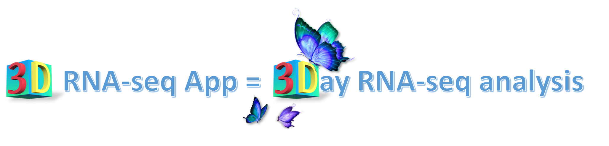

 <br> <br> <br>

Description
===========

This package provides an interactive graphical user interface (GUI) for RNA-seq data differential expression (DE), differential alternative splicing (DAS) and differential transcript usage (DTU) analyses based on two popular pipelines: limma and edgeR. The 3DRNAseq GUI is based on R shiny App and enables command-line-free analysis. To perform analysis, the first step is to generate transcript quantification from quantification tools, such as Salmon and Kallisto. Then users can do mouse click on the App to upload transcript read counts, perform DE and DAS analysis, and make beautiful plots, e.g. expression mean-variance trend plots, PCA plots, heatmap, GO annotation plots, etc. The GUI has steps of proper data pre-processing and false positive controls. These lead to robust DE DAS predictions. All the results and plots can be saved to a report in html, pdf or word format. The analysis pipeline has been successfully used in different RNA-seq studies from Arabidopsis, barley and potato.

Installation and loading
========================

Install ThreeDRNAseq package
----------------------------

``` r
#######################################################################################################
## use devtools R package to install ThreeDRNAseq from Github
###---> If devtools is not installed, please install
if(!'devtools' %in% installed.packages()[,"Package"])
  install.packages('devtools')
devtools::instasll_github('wyguo/ThreeDRNAseq')
```

Install dependency packages
---------------------------

``` r
#######################################################################################################
## Install packages of dependency
###---> Install packages from Cran
cran.package.list <- c('shiny','shinydashboard','shinydashboard','shinyFiles','plotly','eulerr',
                       'gridExtra','Gmisc')
for(i in cran.package.list){
   if(!requireNamespace(i, quietly = TRUE)){
     message('Installing package: ',i)
     install.packages(i,dependencies = T)
   } else next
}

###---> Install packages from Bioconductor
bioconductor.package.list <- c('tximport','edgeR','limma','RUVSeq','ComplexHeatmap')
for(i in bioconductor.package.list){
  if (!requireNamespace("BiocManager", quietly = TRUE))
    install.packages("BiocManager")
  if(!requireNamespace(i, quietly = TRUE)){
    message('Installing package: ',i)
    BiocManager::install("tximport", version = "3.8")
  } else next
}
```

Note: if any other R packages are missing from your PC, please install accordingly.
