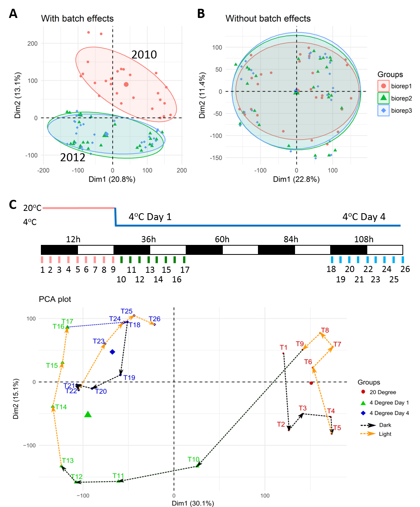

### PCA plots
PCA is a mathematical method to reduce expression data dimensionality while remaining most of the data variance. The reduction is performed by projecting the data to directions or principal components (PCs) from highest to lowest data variability. Therefore, the data main variance is accessible by investigate top few number of PCs rather than thousands of variables.  In Omic data analysis, the first two to four principal components are often used to visualise the similarities and differences of samples, thereby determining the grouping of samples. In the PCA scatter plot, the samples from the same condition often stay close, but far from the samples of other conditions. It can be used as evidence for data quality checking.

### Estimate batch effects
PCA plot also can be used to identify whether the RNA-seq data contain batch effects, which are caused by biological replications in different laboratory conditions. Compared with random noise, batch effects can be distinguished owning to the systematic biases of signals across replicates. For example, Figure A shows a PCA plot of transcript expression. The RNA-seq data has 3 biological replicates, of which bio-rep1 was harvested in year 2010 and bio-rep2 and bio-rep3 were harvested in year 2012. Therefore, the samples of bio-rep1 stay in a separate cluster to other two replicates in the PCA plot, which indicates a clear batch effect of the data. In this App, the <a href="https://bioconductor.org/packages/release/bioc/html/RUVSeq.html" target="_blank">RUVSeq</a> R package (Risso et al., 2014) is used to estimate the batch effects. The RUVSeq algorithm generates batch effect terms which can be incorporated in the design matrix of linear regression model for 3D analysis, i.e.

$$ \text{observed expression = baseline effects + batch effects + noise} $$

It also generates a pseudo read count matrix in which the batch effects have been removed from the data. To avoid data over-modification, this matrix is only used to make PCA plot, but not used for downstream 3D analysis. 

**Figure**: PCA plots of transcript level expression. The RNA-seq data is from Calixto et al. (2018), which is a study of Arabidopsis in response to cold. In the experiment, 5-week-old plants were firstly placed at $20^oC$, then transited to $4^oC$. Samples were taking very 3 hours at $20^oC$, $4^oC$ Day 1 of transition and $4^oC$ Day 4 of acclimation, yielding 26 time-points in total (Figure C). The experiments were repeated in three biological replicates (one biological replicate was harvested in 2010 and the other two were harvested in 2012). (A) and (B) are the PCA plots of 78 samples (26 time-points x 3 biological replicates). No adjustment of batch effects was applied to the dataset in (A) while the batch effects of biological replicates in (B) were removed from the data. (C) is the PCA plot of average expression across 26 time-points.

### References
Calixto,C.P.G., Guo,W., James,A.B., Tzioutziou,N.A., Entizne,J.C., Panter,P.E., Knight,H., Nimmo,H., Zhang,R., and Brown,J.W.S. (2018) Rapid and dynamic alternative splicing impacts the Arabidopsis cold response transcriptome. Plant Cell, tpc.00177.2018.

Risso,D., Ngai,J., Speed,T.P., and Dudoit,S. (2014) Normalization of RNA-seq data using factor analysis of control genes or samples. Nat. Biotechnol., 32, 896–902.

