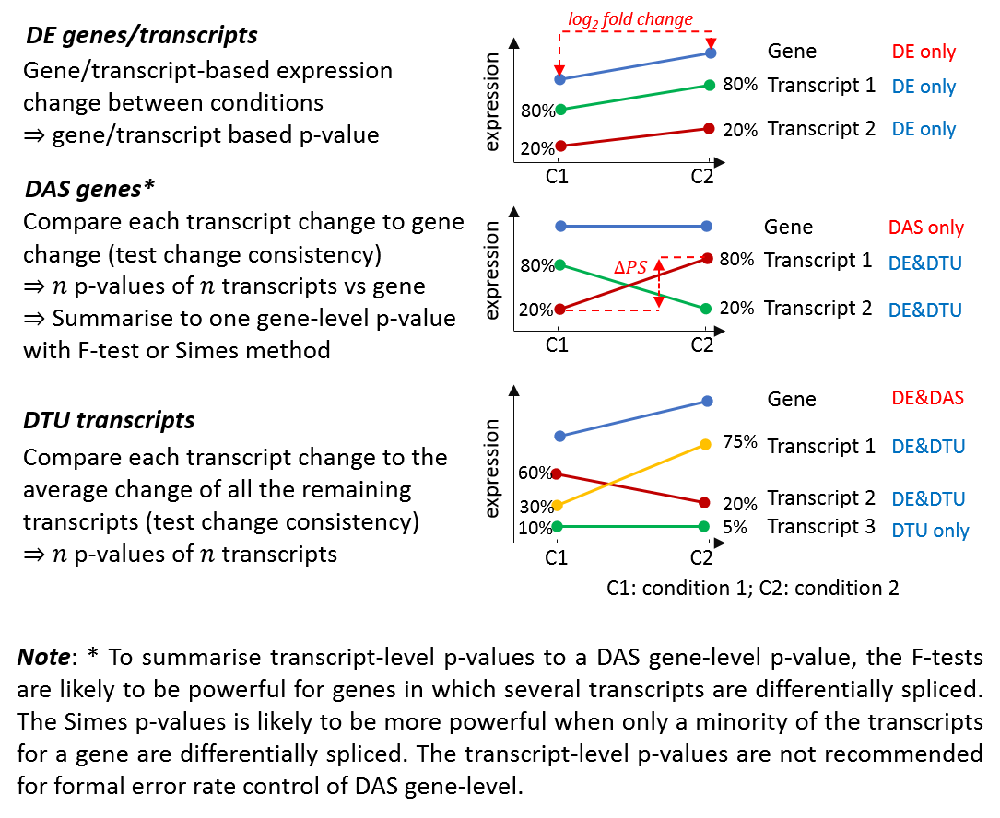

```{r setup, include=FALSE}
knitr::opts_chunk$set(echo = F,eval = T,error = T)
```

<div align="justify">

## Method
The 3D RNA-seq App was used for differential expression (DE), differential alternative splicing (DAS) gene and differential transcript usage (DTU) (3D) analysis (Calixto et al., 2018).

### RNA-seq datasets
The RNA-seq data had `r params$DDD.data$params_list$condition_n` conditions (`r paste0(unique(params$DDD.data$conditions),collapse = ', ')`) and each had `r params$DDD.data$params_list$brep_n` biological replicates `r ifelse(params$DDD.data$params_list$has_srep=='Yes',paste0(' and ',params$DDD.data$params_list$srep_n,' sequencing replicates'),'')` (`r params$DDD.data$params_list$samples_n` samples in total).

```{r experimental_design,eval=T,echo=F,fig.width=12}
if(file.exists('figure/experimental_design.png')){
  knitr::include_graphics("figure/experimental_design.png")
}
```

```{r,eval=T,echo=F,results='asis'}
if(file.exists('figure/experimental_design.png')){
  cat('**Figure**: Experimental design.')
}
```

### Data  pre-processing
Read counts and transcript per million reads (TPMs) were generated using tximport R package version 1.10.0 and `r params$DDD.data$params_list$tximport_method` method (Soneson et al., 2016) with inputs of transcript quantifications from tool `r params$DDD.data$params_list$quant_method` `r ifelse(params$DDD.data$params_list$quant_method=='salmon', '(Patro et al., 2017)','(Bray et al., 2016)')`. `r ifelse(params$DDD.data$params_list$has_srep=='Yes',paste0('Sequencing replicates were merged to increase the sequencing depth, remaing ',params$DDD.data$params_list$condition_n*params$DDD.data$params_list$brep_n,' samples.'),'')` Low expressed transcripts and genes were filtered based on analysing the data mean-variance trend. The expected decreasing trend between data mean and variance was observed when transcripts only had < `r params$DDD.data$params_list$cpm_samples_n` out of all `r params$DDD.data$params_list$condition_n*params$DDD.data$params_list$brep_n` samples with count per million reads (CPM) $\geq$ `r params$DDD.data$params_list$cpm_cut` were removed, which provided an optimal filter of low expression. A gene was expressed if any of its transcript was expressed. The `r params$DDD.data$params_list$norm_method` method was used to normalise the gene and transcript read counts to $log_2$-CPM (Bullard et al., 2010). The principal component analysis (PCA) plot showed the RNA-seq data `r ifelse(params$DDD.data$params_list$has_batcheffect=='Yes',paste0('had distinct batch effects between biological replicates. Thus, RUVSeq R package version 1.16.0 with approach ',params$DDD.data$params_list$RUVseq_method,' was used to estimate the batch effects (Risso et al., 2014).'),' did not have distinct batch effects. Downstream analysis can be directly proceeded.')`

### DE, DAS and DTU analysis
Limma R package version 3.38.3 was used for 3D expression comparison (Ritchie et al., 2015; Law et al., 2014). To compare the expression changes between conditions of interest, the contrast groups were set as `r paste0(params$DDD.data$params_list$contrast,collapse = ', ')`. For DE genes/transcripts, the $log_2$ fold change ($L_2FC$) of gene/transcript abundance were calculated based on contrast groups and significance of expression changes were determined using t-test. P-values of multiple testing were adjusted with `r params$DDD.data$params_list$pval_adj_method` to correct false discovery rate (FDR) (Benjamini and Yekutieli, 2001). A gene/transcript was significantly DE in a contrast group if it had adjusted p-value < `r params$DDD.data$params_list$pval_cut` and $L_2FC$ $\geq$ `r params$DDD.data$params_list$l2fc_cut`.

At alternative splicing level, DAS genes were determined by comparing each individual transcript $L_2FC$ to gene level $L_2FC$, which was calculated as the weighted average (weights were based on their standard deviation) of $L_2FCs$ of all transcripts of the gene. Then p-values of individual transcript comparison were summarised to a single gene level p-value with `r params$DDD.data$params_list$DAS_pval_method`. A gene was significantly DAS in a contrast group if it had adjusted p-value < `r params$DDD.data$params_list$pval_cut` and any of its transcript had $\Delta$PS $\geq$ `r params$DDD.data$params_list$deltaPS_cut`. For DTU transcripts, the $L_2FC$ of a transcript was compared to the weighted average of $L_2FCs$ of all remaining transcripts in the same gene. A transcript was determined as significant DTU if it had adjusted p-value < `r params$DDD.data$params_list$pval_cut` and $\Delta$PS $\geq$ `r params$DDD.data$params_list$deltaPS_cut`.

<!--  -->


**Figure 1**: Testing of DE genes, DAS genes, DE transcripts and DTU transcripts.

### Isoform switch analysis
Transcript isoform switches (ISs) occur when a pair of alternatively spliced isoforms reverse the order of their relative expression levels (Figure 2). In this analysis, `r ifelse(params$DDD.data$params_list$TSISorisokTSP=='isokTSP',paste0('Paire-Wise Isoform Switch (isokTSP) method was used to detect the isoform switch points between conditions of contrasts groups: ',paste0(params$DDD.data$contrast0,collapse = ', '), ' (Figure 2A)'),' Time-Series Isoform switch (TSIS) method was used to detect the isoform switch points along the sequencial time-points (Figure 2B).')` (Guo et al., 2017). The `r length(which(params$DDD.data$target_high$mapping_high$GENEID %in% unique(params$DDD.data$DAS_genes$target)))` expressed transcripts  of `r length(unique(params$DDD.data$DAS_genes$target))` DAS genes were used for the analysis. The method defined the ISs between any pair of transcripts within genes using `r params$DDD.data$params_list$TSIS_method_intersection` values of conditions. It described the significant ISs using five different features of metrics: 1) the probability of switch (i.e., the frequency of samples reversing their relative abundance at the switches) was set to > `r params$DDD.data$params_list$TSIS_prob_cut`; (2)  the sum of the average differences of the two isoforms in both intervals before and after the switch point were set at $\Delta$TPM > `r params$DDD.data$params_list$TSIS_diff_cut`; (3) the significance of the differences between the switched isoform abundances before and after the switch was set to BH adjusted p-value < `r params$DDD.data$params_list$TSIS_adj_pval_cut`; (4) both of the interval lengths before and after switch were set to `r params$DDD.data$params_list$TSIS_time_point_cut`; (5) Pearson correlation of two isoforms was set to >`r params$DDD.data$params_list$TSIS_cor_cut` (see the paper Guo et al., (2017) for methodology details).

<!--  -->


**Figure 2**: Isoform switch analysis methods. Expression data with 3 replicates for each condition/time-point is simulated for isoforms $iso_{i}$ and $iso_j$ (blue and red circles). The points in the plots represent data samples and the black lines connect the average of samples. (A) is the Pair-Wise Isoform Switch (isokTSP) method for comparisons of two conditions $c_1$ and $c_2$ (e.g. conditions in contrast groups of 3D RNA-seq analysis). The Time-Series Isoform Switch (TSIS) tool is designed for detection and characterization of isoform switches for time series data shown in (B). The time-series with 6 time-points is divided into 4 intervals by the intersection points of average expression. If the conditions/time-points on x-axis are not numeric, they will be converted to numeric coordinates 1, 2, 3, ... to fit the lines.

## Results
### RNA-seq data variation
Average expression of transcript and gene level log2-CPMs `r ifelse(params$DDD.data$params_list$has_batcheffect=='Yes','(batch effects were removed)','')` were used to make the Principal Component Analysis (PCA) plot to provide visualisation of RNA-seq data variation between conditions of interest.


Figure: Transcript level PCA plot of average expression`r ifelse(params$DDD.data$params_list$has_batcheffect=='Yes',' (after remove batch effects).','.')`

```{r,eval=T,echo=F,fig.width=12,message=F,warning=F}
if(!file.exists('figure/Transcript PCA average expression.png')){
  cat('Plot is not found in the figure folder')
} else {
  knitr::include_graphics("figure/Transcript PCA average expression.png")
}
``` 


Figure: Gene level PCA plot of average expression`r ifelse(params$DDD.data$params_list$has_batcheffect=='Yes',' (after remove batch effects).','.')`

```{r,eval=T,echo=F,fig.width=12,message=F,warning=F}
if(!file.exists('figure/Gene PCA average expression.png')){
  cat('Plot is not found in the figure folder')
} else {
  knitr::include_graphics("figure/Gene PCA average expression.png")
}
``` 


### Number of DE/DAS genes and DE/DTU transcripts

Table: RNA-seq sample information before and after data pre-processing. 

```{r Sample_information,eval=T,echo=F}
if(is.null(params$DDD.data$RNAseq_info)){
 cat('Plot is not found in the figure folder')
} else {
  knitr::kable(params$DDD.data$RNAseq_info,format = "markdown",align = 'l')
}
```

<br>

Table: Number of DE/DAS/DTU in different contrast groups. The intersection row is the number of consensus part of each column.

```{r 3D_number,eval=T,echo=F}
if(is.null(params$DDD.data$DDD_numbers)){
  cat('Plot is not found in the figure folder')
} else {
  knitr::kable(params$DDD.data$DDD_numbers,format = "markdown",align = 'l')
}
```

<br>

Table: Number of DE vs DAS genes. The intersection row is the number of consensus part of each column.

```{r DEvsDAS,eval=T,echo=F}
if(is.null(params$DDD.data$DDD_numbers)){
  cat('Plot is not found in the figure folder')
} else {
  knitr::kable(params$DDD.data$DEvsDAS_results,format = "markdown",align = 'l')
}
```

<br>

Table: Number of DE vs DTU transcripts. The intersection row is the number of consensus part of each column.

```{r DEvsDTU,eval=T,echo=F}
if(is.null(params$DDD.data$DDD_numbers)){
  cat('Plot is not found in the figure folder')
} else {
  knitr::kable(params$DDD.data$DEvsDTU_results,format = "markdown",align = 'l')
}
```

<br>

```{r Union_set_DEvsDAS,eval=T,echo=F,fig.width=12}
if(!file.exists('figure/Union set DE genes vs DAS genes.png')){
  cat('Plot is not found in the figure folder')
} else {
  knitr::include_graphics("figure/Union set DE genes vs DAS genes.png")
}

```

Figure: Number of transcriptional and alternative splicing regulated genes across all contrast groups.

<br>

```{r Union_set_DEvsDTU,eval=T,echo=F,fig.width=12}
if(!file.exists('figure/Union set DE transcripts vs DTU transcripts.png')){
  cat('Plot is not found in the figure folder')
} else {
  knitr::include_graphics("figure/Union set DE transcripts vs DTU transcripts.png")
} 

```

Figure: Number of transcriptional and alternative splicing regulated transcripts across all contrast groups.

### Up- and down-regulation

Figure: Up- and down-regulation numbers of DE genes, DAS genes, DE transcripts and DTU transcripts. The numbers are calculated based positive or negative signs on the $L_2FCs$ of genes/transcripts. 

```{r updown_DEgenes,eval=T,echo=F,fig.width=12}
if(!file.exists('figure/DE genes updown regulation numbers.png')){
  cat('Plot is not found in the figure folder')
} else {
  knitr::include_graphics("figure/DE genes updown regulation numbers.png")
}
```


```{r updown_DASgenes,eval=T,echo=F,fig.width=12}
if(!file.exists('figure/DAS genes updown regulation numbers.png')){
  cat('Plot is not found in the figure folder')
} else {
  knitr::include_graphics("figure/DAS genes updown regulation numbers.png")
}
```


```{r updown_DEtrans,eval=T,echo=F,fig.width=12}
if(!file.exists('figure/DE transcripts updown regulation numbers.png')){
  cat('Plot is not found in the figure folder')
} else {
  knitr::include_graphics("figure/DE transcripts updown regulation numbers.png")
}
```


```{r updown_DTUtrans,eval=T,echo=F,fig.width=12}
if(!file.exists('figure/DTU transcripts updown regulation numbers.png')){
  cat('Plot is not found in the figure folder')
} else {
  knitr::include_graphics("figure/DTU transcripts updown regulation numbers.png")
}
```

### Heatmap
Hierarchical clustering method was used to partition the DE genes into `r params$DDD.data$params_list$cluster_number` clusters with `r params$DDD.data$params_list$dist_method` distance and `r params$DDD.data$params_list$cluster_method` clustering algorithm (Saraçli et al., 2013). ComplexHeatmap R package version 1.20.0 was used to make the heat-maps.

Figure: Heatmap of DE genes. 

```{r Heatmap_DEgenes,eval=T,echo=F,fig.width=6,fig.height=8}
## DE genes
if(!file.exists('figure/Heatmap DE genes.png')){
  cat('Plot is not found in the figure folder')
} else {
  knitr::include_graphics('figure/Heatmap DE genes.png')
}
```


Figure: Heatmap of DAS genes. The genes of DAS only were removed since they only had significant alternative splicing changes, but did not have significant expression changes. 

```{r Heatmap_DASgenes,eval=T,echo=F,fig.width=6,fig.height=8}
## DAS genes
if(!file.exists('figure/Heatmap DAS genes.png')){
  cat('Plot is not found in the figure folder')
} else {
  knitr::include_graphics('figure/Heatmap DAS genes.png')
}
```


Figure: Heatmap of DE transcripts.

```{r Heatmap_DEtrans,eval=T,echo=F,fig.width=6,fig.height=8}
## DE transcripts
if(!file.exists('figure/Heatmap DE transcripts.png')){
  cat('Plot is not found in the figure folder')
} else {
  knitr::include_graphics('figure/Heatmap DE Transcripts.png')
}
```

Figure: Heatmap of DTU transcripts. The transcripts of DTU only were removed since they only had significant alternative splicing changes, but did not have significant expression changes.

```{r Heatmap_DTUtrans,eval=T,echo=F,fig.width=6,fig.height=8}
## DTU transcripts
if(!file.exists('figure/Heatmap DTU transcripts.png')){
  cat('Plot is not found in the figure folder')
} else {
  knitr::include_graphics('figure/Heatmap DTU transcripts.png')
}
```

### GO annotation plot

Figure: Significant GO enriched terms of DE genes.

```{r GO_DEgenes,eval=T,echo=F,fig.width=12}
if(!file.exists('figure/DE genes GO annotation plot.png')){
  cat('Plot is not found in the figure folder')
} else {
  knitr::include_graphics('figure/DE genes GO annotation plot.png')
}
```

<br>

Figure: Significant GO enriched terms of DAS genes.

```{r GO_DASgenes,eval=T,echo=F,fig.width=12}
if(!file.exists('figure/DAS genes GO annotation plot.png')){
  cat('Plot is not found in the figure folder')
} else {
  knitr::include_graphics('figure/DAS genes GO annotation plot.png')
}
```


### Significant isoform switches

Figure: Significant isoform switches between transcript isoforms.

```{r ISs,eval=T,echo=F,fig.width=12}
if(!file.exists('figure/Isoform switch number.png')){
  cat('Plot is not found in the figure folder')
} else {
  knitr::include_graphics('figure/Isoform switch number.png')
}

```


## Supplementary figures
### Mean-variance trend plot
The cut-offs to filter the transcripts were determined by the mean-variance trend plots (Law et al. 2014).

- An expressed transcript must have $\geq$ `r params$DDD.data$params_list$cpm_samples_n` out of 9 samples with CPM $\geq$ `r params$DDD.data$params_list$cpm_cut`.
- An expressed gene must have at least one expressed transcript.

Figure: Transcript level mean-variance trend plot

```{r,eval=T,echo=F,fig.width=12,message=F,warning=F}
if(!file.exists('figure/Transcript mean-variance trend.png')){
  cat('Plot is not found in the figure folder')
} else {
  knitr::include_graphics("figure/Transcript mean-variance trend.png")
}
```

Figure: Gene level mean-variance trend plot

```{r,eval=T,echo=F,fig.width=12,message=F,warning=F}
if(!file.exists('figure/Gene mean-variance trend.png')){
  cat('Plot is not found in the figure folder')
} else {
  knitr::include_graphics("figure/Gene mean-variance trend.png")
}
```

### PCA plot of all samples
The normalised $log_2$-CPM of all samples were used to make PCA plots. The PCA plot of all samples can be found in the figure folder.


### Sample distribution

Figure: Transcript level read counts and normalised $log_2$-CPM distribution across samples.

```{r,eval=T,echo=F,fig.width=12,message=F,warning=F}
if(!file.exists('figure/Transcript data distribution.png')){
  cat('Plot is not found in the figure folder')
} else {
  knitr::include_graphics("figure/Transcript data distribution.png")
}

```

Figure: Gene level read counts and normalised $log_2$-CPM distribution across samples.

```{r,eval=T,echo=F,fig.width=12,message=F,warning=F}
if(!file.exists('figure/Gene data distribution.png')){
  cat('Plot is not found in the figure folder')
} else {
  knitr::include_graphics("figure/Gene data distribution.png")
}
```

### Venn diagrams
Venn diagrams to compare significant DE genes, DAS genes, DE transcript and DTU transcripts in different contrast groups can be found in figure folder.

## Supplementary materials

### Files in data folder
Intermediate data in .RData for 3D RAN-seq analysis are saved in the data folder. There are three .RData objects: 1) txi_trans.RData and 2) txi_genes.RData are transcript and gene level read count and TPM outputs from the tximport R package (Soneson et al., 2016). All the intermediate data generated in the process of 3D analysis is saved in the list object intermediate_data.RData. R users can access to the data using command line. 

| List   object                   | Elements in list object | Element type | Description                                                                                                                                                                                                                                                                                          |
|---------------------------------|-------------------------|--------------|------------------------------------------------------------------------------------------------------------------------------------------------------------------------------------------------------------------------------------------------------------------------------------------------------|
| intermediate_data.RData         | conditions              | character    | Condition of interest                                                                                                                                                                                                                                                                                |
|                                 | contrast                | character    | Contrast groups                                                                                                                                                                                                                                                                                      |
|                                 | DAS_genes               | data.frame   | Statistics of significant DTU transcripts                                                                                                                                                                                                                                                            |
|                                 | DDD_numbers             | data.frame   | Number of DE/DAS/DTU genes/transcripts in contrast groups                                                                                                                                                                                                                                            |
|                                 | DE_genes                | data.frame   | Statistics of significant DE genes                                                                                                                                                                                                                                                                   |
|                                 | DE_trans                | data.frame   | Statistics of significant DE transcripts                                                                                                                                                                                                                                                             |
|                                 | deltaPS                 | data.frame   | Delta PS based on contrast groups                                                                                                                                                                                                                                                                    |
|                                 | DEvsDAS_results         | data.frame   | Number of DE vs DAS genes                                                                                                                                                                                                                                                                            |
|                                 | DEvsDTU_results         | data.frame   | Number of DE vs DTU transcripts                                                                                                                                                                                                                                                                      |
|                                 | DTU_trans               | data.frame   | Statistics of significant DTU transcripts                                                                                                                                                                                                                                                            |
|                                 | genes_3D_stat           | list         | All the raw results of linear regression and statistics of DE   genes                                                                                                                                                                                                                                |
|                                 | genes_batch             | list         | Estimated gene level batch effects, if exist. 1) W: matrix,   estimated batch effect term, which can be added to design matrix of linear   regression; 2) normalizedCounts: matrix, read counts where batch effects are   removed; 3) method: string, method used to estimate batch effects.         |
|                                 | genes_counts            | data.frame   | Read counts of genes. Seq-reps are merged if exist.                                                                                                                                                                                                                                                  |
|                                 | genes_log2FC            | matrix       | log2-CPM of genes                                                                                                                                                                                                                                                                                    |
|                                 | genes_TPM               | matrix       | TPMs of transcripts.                                                                                                                                                                                                                                                                                 |
|                                 | mapping                 | data.frame   | Transcript-gene mapping                                                                                                                                                                                                                                                                              |
|                                 | params_list             | list         | Parameters used for the 3D analysis                                                                                                                                                                                                                                                                  |
|                                 | PS                      | matrix       | Percent spliced (PS) of expressed transcripts                                                                                                                                                                                                                                                        |
|                                 | RNAseq_info             | data.frame   | RNA-seq data information before and after pre-processing                                                                                                                                                                                                                                             |
|                                 | samples                 | data.frame   | Sample information.                                                                                                                                                                                                                                                                                  |
|                                 | samples_new             | data.frame   | Sample information after merging sequencing replicates   (seq-reps, if exist).                                                                                                                                                                                                                       |
|                                 | scores                  | data.frame   | Statistics of isoform switches                                                                                                                                                                                                                                                                       |
|                                 | scores_filtered         | data.frame   | Statistics of significant isoform switches                                                                                                                                                                                                                                                           |
|                                 | target_high             | list         | 1) trans_high: character, expressed transcripts; 2)   genes_high: character, expressed genes; 3) mapping_high: data.frame,   expressed transcript-gene mapping                                                                                                                                       |
|                                 | trans_3D_stat           | list         | All the raw results of linear regression and statistics of DAS   genes, DE and DTU transcripts                                                                                                                                                                                                       |
|                                 | trans_batch             | list         | Estimated transcript level batch effects, if exist. 1) W:   matrix, estimated batch effect term, which can be added to design matrix of   linear regression; 2) normalizedCounts: matrix, read counts where batch   effects are removed; 3) method: string, method used to estimate batch   effects. |
|                                 | trans_counts            | data.frame   | Read counts of transcripts. Seq-reps are merged if exist.                                                                                                                                                                                                                                            |
|                                 | trans_log2FC            | matrix       | log2-CPM of transcripts.                                                                                                                                                                                                                                                                             |
|                                 | trans_TPM               | matrix       | TPMs of transcripts.                                                                                                                                                                                                                                                                                 |
|                                 | Other elements          |              | The list object may include other elements.                                                                                                                                                                                                                                                          |
| txi_genes.Rdata/txi_trans.Rdata | abundance               | matrix       | TPMs of genes/transcripts                                                                                                                                                                                                                                                                            |
|                                 | counts                  | matrix       | Read counts of genes/transcripts                                                                                                                                                                                                                                                                     |
|                                 | countsFromAbundance     | character    | Method used to generate read counts and TPMs                                                                                                                                                                                                                                                         |
|                                 | length                  | matrix       | Length of genes/transcripts                                                                                                                                                                                                                                                                          |                                                                                                                                                                                                                        |

### Files in figure folder

|File.names                                            |Description                                  |
|:-----------------------------------------------------|:--------------------------------------------|
|DAS genes GO annotation plot.png/.pdf                 |DAS genes GO annotation plot                 |
|DAS genes updown regulation numbers.png/.pdf          |DAS genes updown regulation numbers          |
|DE genes GO annotation plot.png/.pdf                  |DE genes GO annotation plot                  |
|DE genes updown regulation numbers.png/.pdf           |DE genes updown regulation numbers           |
|DE transcripts updown regulation numbers.png/.pdf     |DE transcripts updown regulation numbers     |
|DTU transcripts updown regulation numbers.png/.pdf    |DTU transcripts updown regulation numbers    |
|Gene data distribution.png/.pdf                       |Gene data distribution                       |
|Gene mean-variance trend.png/.pdf                     |Gene mean-variance trend                     |
|Gene PCA Average expression.png/.pdf                  |Gene PCA Average expression                  |
|Gene PCA batch effect removed Bio-reps.png/.pdf       |Gene PCA batch effect removed Bio-reps       |
|Gene PCA Bio-reps.png/.pdf                            |Gene PCA Bio-reps                            |
|Heatmap DAS genes.png/.pdf                            |Heatmap DAS genes                            |
|Heatmap DE genes.png/.pdf                             |Heatmap DE genes                             |
|Heatmap DE transcripts.png/.pdf                       |Heatmap DE transcripts                       |
|Heatmap DTU transcripts.png/.pdf                      |Heatmap DTU transcripts                      |
|Transcript data distribution.png/.pdf                 |Transcript data distribution                 |
|Transcript mean-variance trend.png/.pdf               |Transcript mean-variance trend               |
|Transcript PCA Average expression.png/.pdf            |Transcript PCA Average expression            |
|Transcript PCA batch effect removed Bio-reps.png/.pdf |Transcript PCA batch effect removed Bio-reps |
|Transcript PCA Bio-reps.png/.pdf                      |Transcript PCA Bio-reps                      |
|Union set DE genes vs DAS genes.png/.pdf              |Flow chart -Union set DE genes vs DAS genes              |
|Union set DE transcripts vs DTU transcripts.png/.pdf  |Flow chart -Union set DE transcripts vs DTU transcripts  |
|Isoform switch number.png/.pdf                        |Number of significant isoform switch numbers in contrast groups|

### Files in result folder
Important results are saved in csv (comma delimited) files.

| csv files                                                       | Description                                                                                                                                                              |   |
|-----------------------------------------------------------------|--------------------------------------------------------------------------------------------------------------------------------------------------------------------------|---|
| contrast.csv                                                    | Contrast groups used for 3D analysis                                                                                                                                     |   |
| DDD genes and transcript lists across all   contrast groups.csv | List of DE genes, DAS genes, DE transcripts and DTU transcripts, which   are the union sets across all contrast groups                                                   |   |
| DDD numbers.csv                                                 | DE/DAS/DTU genes/transcript numbers in each contrast group                                                                                                               |   |
| DEvsDAS results.csv                                             | Number of DE vs DAS genes                                                                                                                                                |   |
| DEvsDTU results.csv                                             | Number of DE vs DTU transcripts                                                                                                                                          |   |
| Gene read counts.csv                                            | Raw read counts of genes before data pre-processing                                                                                                                      |   |
| Gene TPM.csv                                                    | Raw TPM of genes before data pre-processing                                                                                                                              |   |
| RNAseq info.csv                                                 | RNA-seq data information before   and after pre-processing                                                                                                               |   |
| samples.csv                                                     | Sample information                                                                                                                                                       |   |
| Significant DE genes list and   statistics.csv                  | Statistics of significant DE genes                                                                                                                                       |   |
| Significant DE genes list and   statistics.csv                  | Statistics of significant DAS genes                                                                                                                                      |   |
| Significant DE transcripts list and   statistics.csv            | Statistics of significant DE transcripts                                                                                                                                 |   |
| Significant DTU transcripts list and   statistics.csv           | Statistics of significant DTU transcripts                                                                                                                                |   |
| Target in each cluster heatmap*DE   genes.csv                   | DE gene list in clusters of DE gene heatmap.                                                                                                                             |   |
| Target in each cluster heatmap*DE   trans.csv                   | DE&DTU transcript lists in clusters of DTU transcript heatmap. The   DTUonly transcripts are excluded since they have no significant abundance   changes across samples. |   |
| Target in each cluster heatmap*DE&DAS   genes.csv               | DE&DAS gene lists in clusters of DAS gene heatmap. The DASonly genes   are excluded since they have no significant abundance changes across samples.                     |   |
| Target in each cluster heatmap*DE&DTU   trans.csv               | DE transcript list in clusters of DE transcript heatmap.                                                                                                                 |   |
| Transcript read counts.csv                                      | Raw read counts of transcripts before data pre-processing                                                                                                                |   |
| Transcript TPM.csv                                              | Raw TPM of transcripts before data pre-processing                                                                                                                        |   |

### Files in report folder
Reports are saved in report folder.

| File name              | Description                                       |
|------------------------|---------------------------------------------------|
| 3D_report.pdf/html/doc | Report of 3D analysis in pdf, html and doc format |

## References
Benjamini,Y. and Yekutieli,D. (2001) The control of the false discovery rate in multiple testing under dependency. Ann. Stat., 29, 1165–1188.

Bray,N.L., Pimentel,H., Melsted,P., and Pachter,L. (2016) Near-optimal probabilistic RNA-seq quantification. Nat. Biotechnol., 34, 525–527.

Bullard,J.H., Purdom,E., Hansen,K.D., and Dudoit,S. (2010) Evaluation of statistical methods for normalization and differential expression in mRNA-Seq experiments. BMC Bioinformatics, 11, 94.

Calixto,C.P.G., Guo,W., James,A.B., Tzioutziou,N.A., Entizne,J.C., Panter,P.E., Knight,H., Nimmo,H., Zhang,R., and Brown,J.W.S. (2018) Rapid and dynamic alternative splicing impacts the Arabidopsis cold response transcriptome. Plant Cell, tpc.00177.2018.

Gu,Z., Eils,R., and Schlesner,M. (2016) Complex heatmaps reveal patterns and correlations in multidimensional genomic data. Bioinformatics, 32, 2847–2849.

Guo,W., Calixto,C.P.G., Brown,J.W.S., and Zhang,R. (2017) TSIS: An R package to infer alternative splicing isoform switches for time-series data. Bioinformatics, 33, 3308–3310.

Law,C.W., Chen,Y., Shi,W., and Smyth,G.K. (2014) voom: Precision weights unlock linear model analysis tools for RNA-seq read counts. Genome Biol, 15, R29.

Patro,R., Duggal,G., Love,M.I., Irizarry,R.A., and Kingsford,C. (2017) Salmon provides fast and bias-aware quantification of transcript expression. Nat. Methods, 14, 417–419.

Risso,D., Ngai,J., Speed,T.P., and Dudoit,S. (2014) Normalization of RNA-seq data using factor analysis of control genes or samples. Nat. Biotechnol., 32, 896–902.

Ritchie,M.E., Phipson,B., Wu,D., Hu,Y., Law,C.W., Shi,W., and Smyth,G.K. (2015) limma powers differential expression analyses for RNA-sequencing and microarray studies. Nucleic Acids Res, 43, e47.

Saraçli,S., Dogan,N., and Dogan,I. (2013) Comparison of hierarchical cluster analysis methods by cophenetic correlation. J. Inequalities Appl.

Soneson,C., Love,M.I., and Robinson,M.D. (2016) Differential analyses for RNA-seq: transcript-level estimates improve gene-level inferences. F1000Research, 4, 1521.


