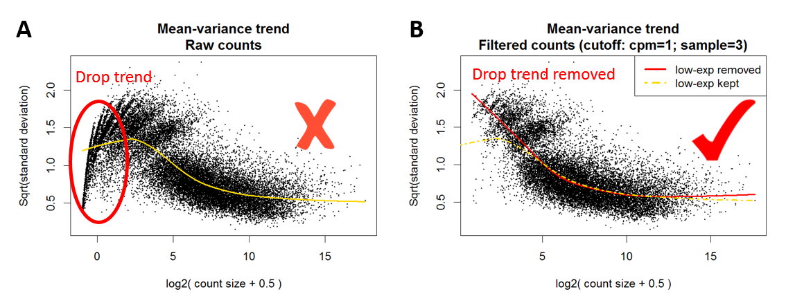

---
output:
  html_document: default
  word_document: default
---

The low expressed transcripts are filtered based on count per million (CPM) reads:
$$ CPM=\frac{X_i}{N}\times 10^6 $$
where $X_i$ is read count of transcript $i$ and $N$ is the library size of the sample. 

- An expressed transcript must have $\geq n$ samples with expression $\geq m$ CPM. 
- An expressed gene must have at least one expressed transcript.

The sample number cut-off $n$ and CPM cut-off $m$ are determined by the mean-variance trend plot. Read counts are assumed to follow a negative binomial distribution with mean-variance relation:
$$ Var(\log_2X)=\frac{1}{\mu}+\phi $$
where $X$ is read count, $\mu$ is the mean and $\phi$ is the overdispersion. The expression variance decreasing monotonically with the increasing of the mean. In real RNA-seq data, the low expressed transcripts confound with noise and the expression distribution is different to the expressed transcripts. In the mean-variance trend plot, the low expressed transcripts cause a drop trend in low expression region. Therefore, the cut-offs $n$ and $m$ to filter the low expression can be optimised until the drop trend in low expression region disappeared in the mean-variance trend plot.

<!---->

**Figure**: Filter low expressed transcripts based on mean-variance trend.  (A) And (B) are the mean-variance trend plots before and after filtering low expressed transcripts, respectively. In the plots, each black point represents a transcript. The red and yellow curves are the fitted trends of these points. The red circle in plot (A) highlights the drop trend of low expressed transcripts.
