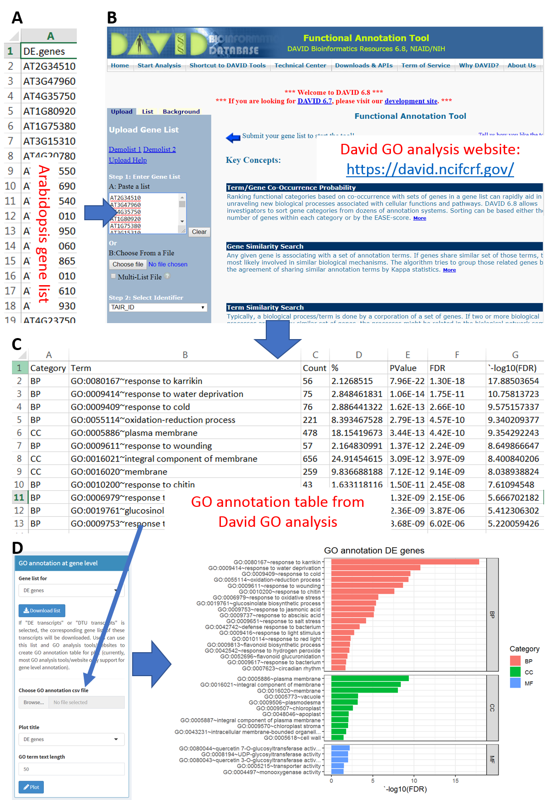

**Step 1**: Download gene lists of DE genes, DAS genes, DE transcripts and DTU transcripts (Figure A).

Note: The gene lists will be saved in csv file (comma delimited). Users can use these lists and GO analysis tools/websites to create GO annotation table for plot (currently, most GO analysis tools/website only support for gene level functional annotation).

**Step 2**: Upload the gene list to functional annotation tools/website for GO analysis (Figure B).

**Step 3**: Save the significantly enriched GO terms of genes to csv file (comma delimited; Figure C).

**Step 4**: Upload the csv file of GO terms to 3D RNA-seq App to make GO annotation plot (Figure D).

**Figure**: GO annotation in 3D RNA-seq App. In this example, the DE genes were from RNA-seq study of Arabidopsis in respond to cold (Calixto et al., 2018). (A) DE gene list in csv file (comma delimited). (B) The gene list was uploaded to the David functional analysis website:  <a href="https://david.ncifcrf.gov/" target="_blank">https://david.ncifcrf.gov/</a> (Dennis Jr. et al., 2003) to generate GO terms of enrichment of DE genes. The significantly enriched terms were saved to csv file (comma delimited) (C), which can be uploaded to 3D RNA-seq App to make plots (D).

### References
Dennis Jr.,G., Sherman,B.T., Hosack,D.A., Yang,J., Gao,W., Lane,H.C., Lempicki,R.A., Dennis  Jr.,G., Sherman,B.T., Hosack,D.A., Yang,J., Gao,W., Lane,H.C., and Lempicki,R.A. (2003) DAVID: Database for Annotation, Visualization, and Integrated Discovery. Genome Biol, 4, P3.