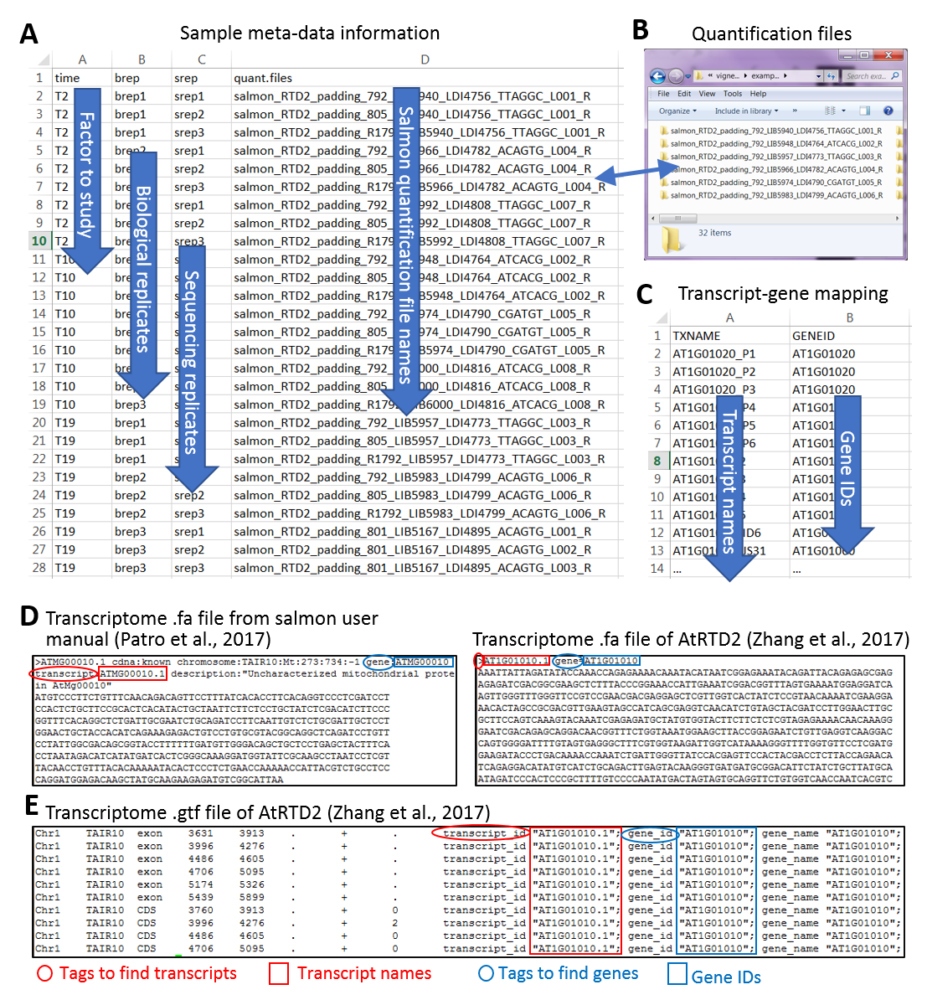

Three input data must be provided for 3D analysis: 

- Sample information in csv format (comma delimited; Figure A). The spreadsheet must inlcude 1) a column of single factor or multiple columns of multi-factors, which are relevant to the expression changes of experimental design; 2) a column to distinguish biological replicates (bio-reps) of samples; 3) a column to distinguish sequencing replicates (seq-reps) if exist and 4) a column of sample-based transcript quantification folder names from tool salmon/kallisto (Patro et al., 2017; Bray et al., 2016).
- Transcript-gene mapping in csv format (comma delimited; Figure B). The first column is transcript list and the second column is gene list. 
- The transcript quantification output from salmon/kallisto (Patro et al., 2017; Bray et al., 2016) (Figure C).

**Figure**: Example of input data for 3D RNA-seq analysis. The example is a subset from RNA-seq study of Arabidopsis in respond to cold (Calixto et al., 2018). The example has a single factor time-points, T2, T10 and T19. Each time-point has 3 bio-reps and each bio-rep has 3 seq-reps. The transcripts were quantified using salmon (Patro et al., 2017) and reference transcriptome AtRTD2 (Zhang et al., 2017). A) Sample information, B) transcript-gene mapping and C) sample-based folders of salmon-quantification output.

### References
Bray,N.L., Pimentel,H., Melsted,P., and Pachter,L. (2016) Near-optimal probabilistic RNA-seq quantification. Nat. Biotechnol., 34, 525–527.

Calixto,C.P.G., Guo,W., James,A.B., Tzioutziou,N.A., Entizne,J.C., Panter,P.E., Knight,H., Nimmo,H., Zhang,R., and Brown,J.W.S. (2018) Rapid and dynamic alternative splicing impacts the Arabidopsis cold response transcriptome. Plant Cell, tpc.00177.2018.

Patro,R., Duggal,G., Love,M.I., Irizarry,R.A., and Kingsford,C. (2017) Salmon provides fast and bias-aware quantification of transcript expression. Nat. Methods, 14, 417–419.

Zhang,R., Calixto,C.P.G., Marquez,Y., Venhuizen,P., Tzioutziou,N.A., Guo,W., Spensley,M., Entizne,J.C., Lewandowska,D., Have,S. Ten, Frey,N.F., Hirt,H., James,A.B., Nimmo,H.G., Barta,A., Kalyna,M., and Brown,J.W.S. (2017) A high quality Arabidopsis transcriptome for accurate transcript-level analysis of alternative splicing. Nucleic Acids Res., 45, 5061–5073.