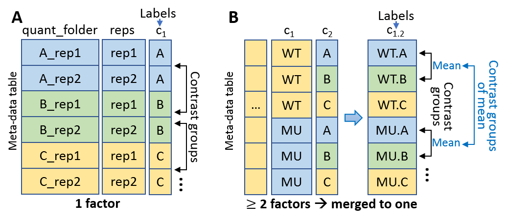

### Select factors of samples
Once the csv spreadsheet of sample information is uploaded, users can select columns of factors to distinguish the categories of different samples. The columns of following information must be selected:

- One or more factors relevant to experimental design of expression changes (Figure A and B). 
- Biological replicates (bio-reps).
- Sequencing replicates (seq-reps) if exist.
- Sample-based folder name of salmon/kallisto quantification ("quant_folder" column in Figure A).

New columns will be created to distinguish samples:

- condition: condition of interest. If two or more factor columns are selected, they will be merged to one column. For example, samples were taken from wild-type (WT) and mutant (MU) groups (one column) and each group have 3 treatment A, B and C (another column). Condition of interest will be set as WT.A, WT.B, WT.C, MU.A, MU.B and MU.C (Figure B).
- sample.name: sample names will be set as condition.bio-reps.seq-reps (if seq-reps exist; Figure A).

### Set contrast groups
Based on condition of interest, any contrast group can be set to study expression changes between conditions. For example, the contrast groups in Figure B can be set as: WT.B-WT.A (WT.B vs WT.A) and MU.B-MU.A (MU.B vs MU.A). Contrast group settings of pair-wise conditions suit to most experimental design in RNA-seq studies. In addition, users can set contrast group (MU.B-MU.A)-(WT.B-WT.A), which is called as interaction term and compares how the treatments respond differently in MU and in WT group.

**Note**: for time-series RNA-seq study, the time-points can be treated as different conditions to set contrast groups. 

**Figure**: Samples and factors to distinguish sample categories. Conditions of interest are relevant to (A) one factor and (B) two or more than two factors. 
