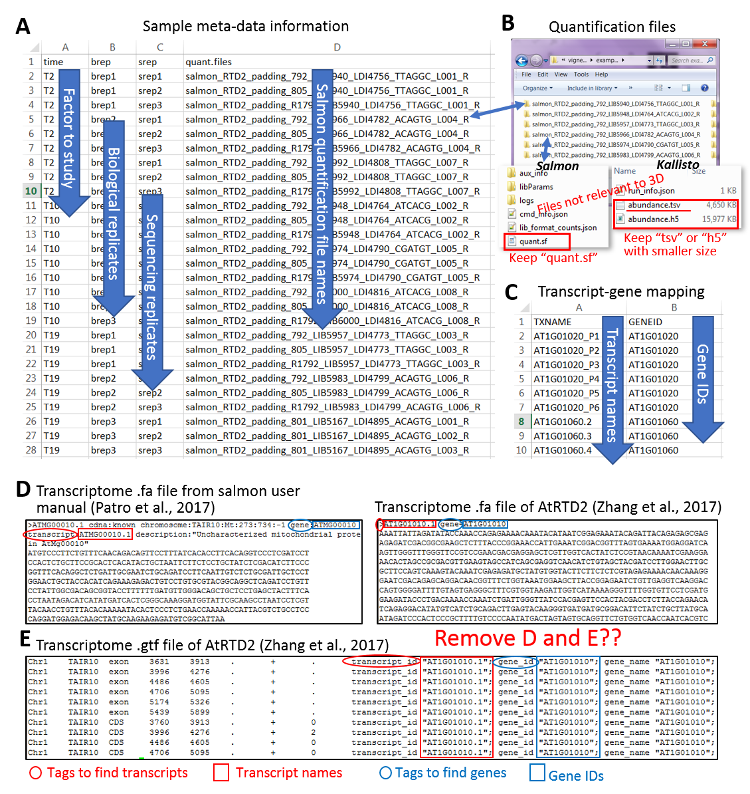
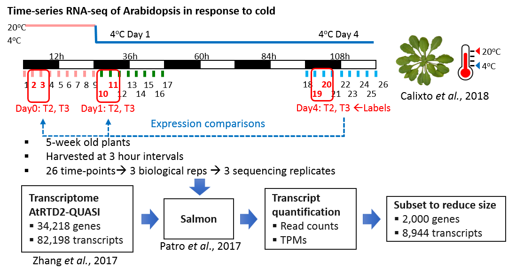
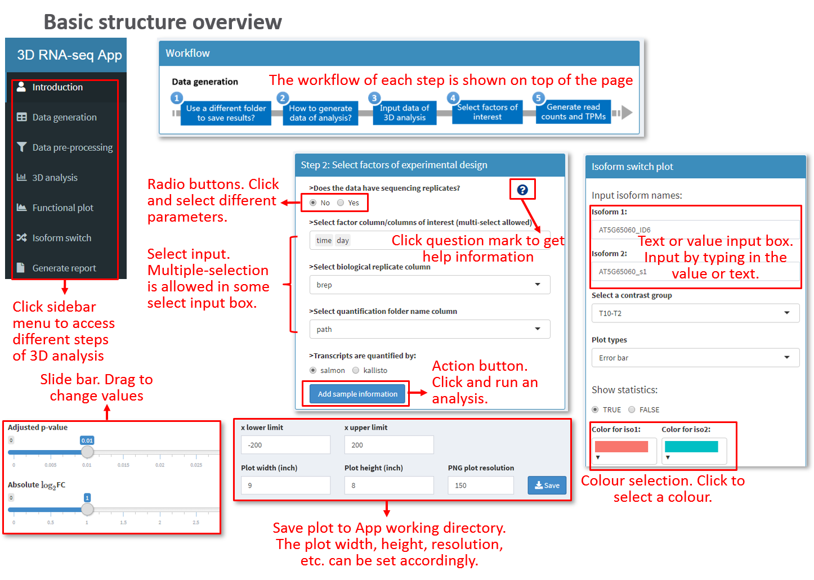
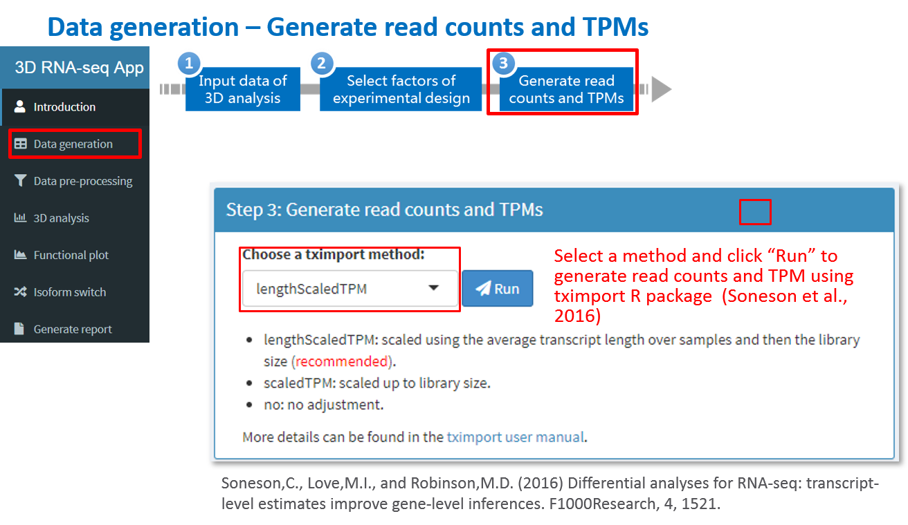
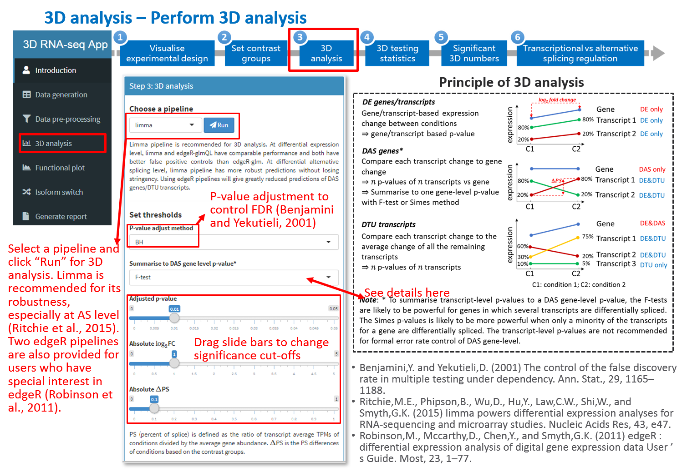
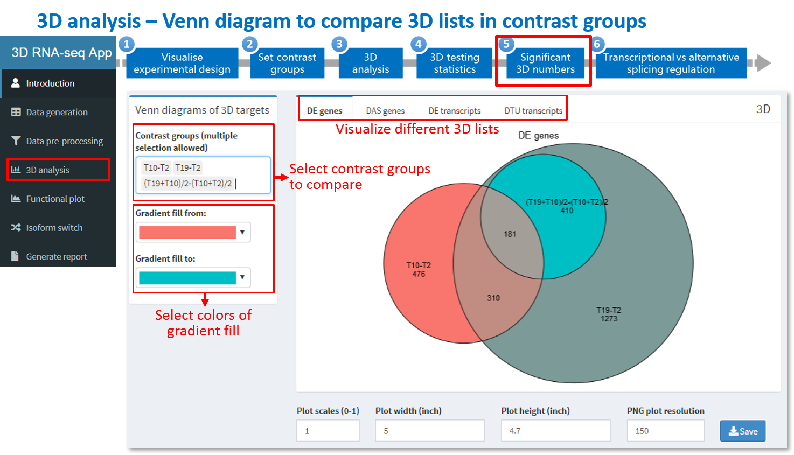
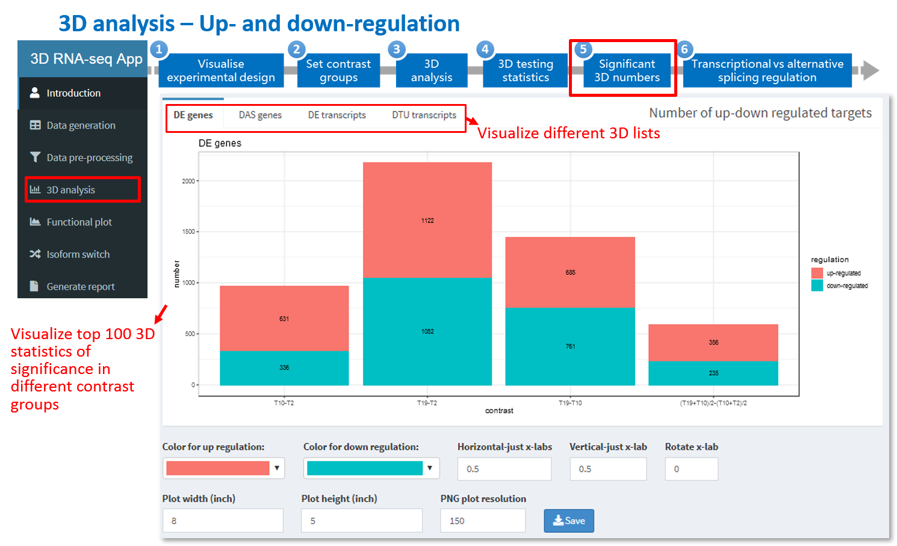
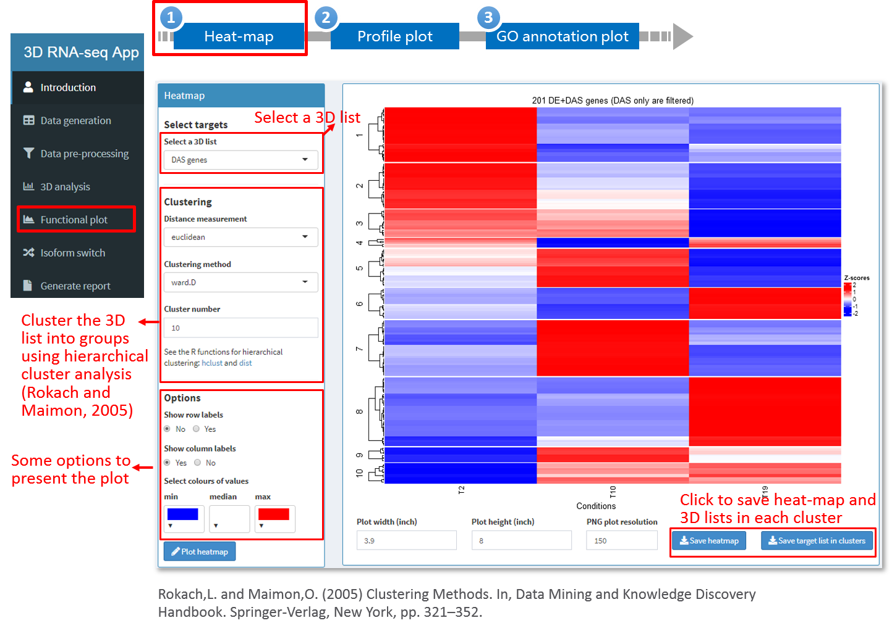
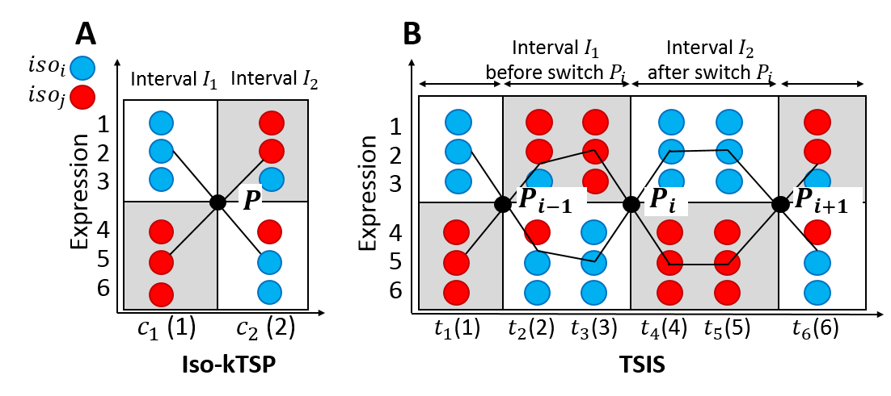
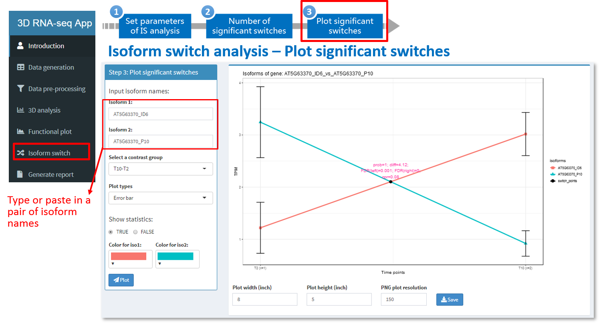

```{r setup, include=FALSE,eval=T}
knitr::opts_chunk$set(echo = T,eval = F,warning = F,message = F)
options(stringsAsFactors = F)
```

<div align="justify">
<p id='table-of-contents'>

## Introduction 
The ThreeDRNAseq (3D RNA-seq) R package is designed for use by biologists to analyze their own RNA-seq data. It provides an interactive graphical user interface (GUI) for differential expression (DE), differential alternative splicing (DAS) and differential transcript usage (DTU) (3D) analyses of RNA-seq data based on the popular pipeline limma (Ritchie et al., 2015). It also integrated transcript isoform switch tools, such as IsoKtsp (Sebestyen et al., 2015) and TSIS (Guo et al., 2017) for an enhanced alternative splicing analysis. The 3D RNA-seq removes all the unnecessary complexities associated with differential expression analysis and enables a complete RNA-seq analysis to be done quickly (3 Days, thus 3D). It allows complex experimental designs such as time-series, developmental series and multiple conditions. It employs state-of-the-art methods/statistics and generates 3D results quickly and accurately.

**3D analysis pipeline**


<br>
The 3D RNA-seq App was developed by Dr. Wenbin Guo from research into the analysis of time-series RNA-seq data (Calixto et al., 2018) with help from Dr. Cristiane Calixto and Dr. Nikoleta Tzioutziou and guidance from Prof. John W.S. Brown and Dr. Runxuan Zhang from the University of Dundee - School of Life Sciences and the James Hutton Institute - Information and Computational Sciences. We acknowledge Dr. Iain Milne and Gordon Stephen for technical support. To use our pipeline in your work, please cite:

- <mark style="background-color: yellow;">BioXiv paper: Add link xxxxx</mark>
- Calixto,C.P.G., Guo,W., James,A.B., Tzioutziou,N.A., Entizne,J.C., Panter,P.E., Knight,H., Nimmo,H.G., Zhang,R., and Brown,J.W.S. (2018) Rapid and Dynamic Alternative Splicing Impacts the Arabidopsis Cold Response Transcriptome. Plant Cell, 30, 1424–1444.

<a href='#table-of-contents'>Go back to Table of contents</a>

## How to get help
### User manuals
3D RNA-seq App "easy-to-use" manual (These links will be updated when the latest version is uploaded to Github):

<mark style="background-color: yellow;">This is an old link. Update later</mark>

<a href="https://github.com/wyguo/ThreeDRNAseq/blob/master/vignettes/user_manuals/3D_RNA-seq_App_manual.md" target="_blank">https://github.com/wyguo/ThreeDRNAseq/blob/master/vignettes/user_manuals/3D_RNA-seq_App_manual.md </a>


3D RNA-seq App underlying code for R users:

<a href="https://github.com/wyguo/ThreeDRNAseq/blob/master/vignettes/user_manuals/Command_line_based_manul.md" target="_blank">https://github.com/wyguo/ThreeDRNAseq/blob/master/vignettes/user_manuals/Command_line_based_manul.md </a>

### Tooltips
In the GUI, users can click tooltips  in specific steps for help information.

### Contact us
3D RNA-seq App is developed and maintained by Dr. Wenbin Guo from the Plant Sciences Division, School of Life Sciences, University of Dundee. If you have any questions and suggestions, please contact:

- Dr. Wenbin Guo: wenbin.guo@hutton.ac.uk 
- Dr. Runxuan Zhang: runxuan.zhang@hutton.ac.uk

## Run 3D RNA-seq App
The 3D RNA-seq App docker image is hosted by the James Hutton Institute server. Open the App by this link: <a href="http://ics.hutton.ac.uk/3drnaseq" target="_blank">http://ics.hutton.ac.uk/3drnaseq </a>

To perform 3D analysis, users need to upload input data to our server. All results, reports, figures and intermediate data will be zipped and downloaded in the final step.

<a href='#table-of-contents'>Go back to Table of contents</a>

## Input files
(1) Gather the meta-data of the experimental design in a csv spreadsheet, the columns of which must include the following information (<a href='#fig_input_csv'>Figure 1A</a>):

- A column of the factor or multiple columns of the factors of the experimental design.
- A column of the biological replicate labels.
- A column of the sequencing replicate labels if they exist.
- A column of the file names of transcript quantifications.


(2) A folder that contains the transcript quantification files. Each file contains transcript quantification data of a single sample. Read counts and TPMs for 3D analysis will be generated from the "quant.sf" objects if these files are generated by Salmon (Patro et al., 2017) and the "abundance.h5"/"abundance.tsv" objects if these files are generated by Kallisto (Bray et al., 2016) (<a href='#fig_input_csv'>Figure 1B</a>).

(3)	Transcript-gene mapping file in one of the following formats:

- "csv" spreadsheet with first column of transcript IDs and second column of gene IDs (<a href='#fig_input_csv'>Figure 1C</a>).
- Or a "fa" file of the transcriptome for quantification. Transcript names and gene IDs will be extracted from the "transcript" (if it exists) or ">" tags and "gene" tags in the description lines of sequences, respectively (<a href='#fig_input_csv'>Figure 1D</a>).
- Or a "gtf" file of the transcriptome for quantification. Transcript names and gene IDs will be extracted from the "transcript_id" and "gene_id" tags in the last column, respectively (<a href='#fig_input_csv'>Figure 1E</a>). 


**Note**: 

(1) Transcript-gene mapping in "csv" file is recommended. Depending on the size, it may take a while to generate the table from a "fa" or a "gtf" file and any missing tags for transcript name and gene ID extraction in these files may lead to errors.

(2) The 3D analysis is executable in a computer with normal memory and CPU size. If the App is running on docker image, it is recommended to reduce the data size to upload to our server. Users can exclude all the files in sub-folders of transcript quantifications, except the files of "quant.sf" from Salmon. If the transcript quantifications are generated using Kallisto, users can keep either "abundance.h5" or "abundance.tsv" in the sub-folders with smaller size (<a href='#fig_input_csv'>Figure 1B</a>). 



<p id='fig_input_csv'><strong>Figure 1:</strong> Input files of 3D RNA-seq App. The example is from a RNA-seq study of Arabidopsis in respond to cold (Calixto et al., 2018). (A) Meta-data table of sample information in csv file. (B) The folder contains transcript quantifications. The input of transcript-gene mapping information can be a "csv" spreadsheet with first column of transcript names and second column of gene IDs (C), a ".fa" file (D) or a ".gtf" file (E) of the transcriptome. If a ".fa" or a ".gtf" file is provided, the App will extract transcript-gene association information with specific tags.</p>

<a href='#table-of-contents'>Go back to Table of contents</a>

## Output files
The results of the 3D RNA-seq analysis are saved in the App working direcotry in four folders:

(1)	"report" folder: the final report in html, pdf and word formats will be saved in the "report" folder.
(2)	"result" folder: the gene lists generated from DE, DAS and DTU analysis will be saved as csv files in the "result" folder.
(3)	"figure" folder: the figures generated and saves through the analysis will be saved in the "figure" folder.
(4)	"data" folder: the intermediate datasets of the analysis will be saved in the "data" folder in R data format (.RData). R users can open and process these objects in R software for a further personalized analysis.
The detailed descriptions of saved files can be found in "Appendix" at the end of the document.

## Example data
**Download link**:
https://www.dropbox.com/s/q2n1pbreqwswt1b/3D%20RNA-seq%20App%20example%20data.zip?dl=0

**Description**:
This example is a sub-dataset from a time-series study of Arabidopsis plants exposed to cold (Calixto et al., 2018). RNA-seq data of 6 time-points were extracted from the whole dataset. The time-points are 3 and 6 hours after dusk at $20^oC$, the first day of transition to $4^oC$ and the fourth day of acclimation to $4^oC$ (red boxes in Figure 2). Each time-point has 3 biological replicates and each biological replicate has 3 sequencing replicates. Transcript quantifications were generated using Salmon (Patro et al., 2017) and AtRTD2-QUASI (Zhang et al., 2017) as the reference transcriptome. To further reduce the data size, the expression of  8,944 transcripts (from 2,000 genes  ) were extracted from the Salmon quantification to identify the cold response genes and transcripts at both transcriptional and AS level.



<p id='fig_example_exp'><strong>Figure 2:</strong> Experimental design of time-series RNA-seq data from study of Arabidopsis cold response. For this example, a subset of samples, genes and transcripts were extracted from the whole dataset to reduce data size.</p>

## Run analysis on 3D App
### Basic Workflow
3D RNA-seq App is made of control widgets that users can interact with and send messages to the underlying R code to perform analysis by simple clicking/dragging of the mouse (<a href='#fig_basic_structure'>Figure 3</a>). 


<p id='fig_basic_structure.png'><strong>Figure 3:</strong> Basic widgets of 3D RNA-seq App. </a>

Running 3D RNA-seq just requires users to follow the steps from Tab panel 1 to 7. 

### Tab panel 1: Data generation
Users can upload input files and experimental design metafile in this tab panel. Transcript level and gene level read counts and TPMs (transcript per million reads) are generated by using the tximport R package (Soneson et al., 2016).

<u><strong>Step 1: Upload input files to 3D RNA-seq App.</strong></u>


<br>
<u><strong>Step 2: Select the columns of factors, labels of replicates and quantification file names from meta-data table for 3D analysis.</strong></u>


<br>
<u><strong>Step 3: Generate gene and transcript read counts and TPMs.</strong></u>



When the button "Run" is clicked, the process currently running will be shown at the lower right corner of the web browser. Once it is done, you can move to Tab panel 2 using the navigation menu on the left and make sure you roll your page to the very top. 

### Tab panel 2: Data pre-processing
Once the read counts and TPMs are generated, the data will go through a number of pre-processing steps . In each step, quality control plots are generated to optimise the parameters for pre-processing. If the RNA-seq data has sequencing replicates (seq-reps), they will be merged before 3D analysis according to the seq-rep labels selected by users in the meta-data table to increase sequencing depth, because seq-reps are generated by sequencing the same biological replicate multiple times (e.g. on different sequencing lanes), but they do not add much variability to the biological replicates. 

<u><strong>Step 4: Filter low expressed transcripts and genes based on expression mean-variance trend.</u></strong>


<br>
<u><strong>Step 5: PCA plot and removing batch effects.</u></strong>

The PCA plot can also be used to identify whether the RNA-seq data contains batch effects, which are caused by biological replications being prepared in different, for example, laboratory conditions

In this panel, users can select and visualise different PCs based on transcript level or gene level expression of all samples or the average expression of biological replicates. The scatter points can be grouped and coloured according to different factors. Ellipses or polygons can be added to the plots to highlight the grouped clusters.


<u><strong>Step 6: Data normalisation.</u></strong>

For unbiased comparisons across samples, read counts must be normalised. Normalisation methods such as Trimmed Mean of M-values (TMM), Relative Log Expression (RLE) and upper-quartile can be used to reduce the effect from the systematic technical biases across samples (Bullard et al., 2010). Box plots are used to visualise the expression distribution of raw read counts and normalised expression across samples.


Once the normalization is done as shown at the lower right corner on the browser, please proceed to Tab panel 3. 

### Tab panel 3: 3D analysis
<u><strong>Step 7:  Set contrast groups and perform 3D analysis.</u></strong>

A contrast group is a user-defined comparison between two samples or two groups of samples:

(1)	Pair-wise comparison of samples: e.g. B-A compares group B to group A; C-B compares group C to group B (Figure A).
(2)	Compare mean of multiple samples: e.g. (WT.A+WT.B)/2-(MU.A+MU.B)/2 compares the mean of group WT.A and WT.B to the mean of group MU.A and MU.B (Figure B).
(3)	Compare difference of two differences (interactions): e.g. (WT.A-WT.B)-(MU.A-MU.B) compares the difference ($L_2FC$) of group WT.A and WT.B to the difference ($L_2FC$) of group MU.A and MU.B (Figure B).


**NOTE**: if the experimental design involves multiple factor levels, e.g. condition A, B and C are performed in wildtype (WT) and mutant (MU), respectively, these factors will be combined to generate group labels 

<br>
<u><strong>Step 8: Set statistical parameters and perform 3D analysis </u></strong>



**Significant result summary**

After the  the 3D analysis, the following information is summarized and will appear at the bottom of the page:

(1) The test statistics in different contrast groups, e.g. adjusted p-value and $L_2FC$.
(2) The number of genes and transcripts with significant expression changes in contrast groups.
(3) The number of up- and down-regulated DE genes and transcripts.
(4) The numbers of genes/transcripts regulated only by transcription (DE), only by alternative splicing (DAS/DTU) and by both transcription and alternative splicing (DE+DAS/DE+DTU).

These summaries can be filtered, customized and the figures can be saved with specified formats and sizes.







### Tab panel 4: Functional plot
<u><strong>Step 9: Generating heat-maps.</u></strong>

Users can make heat-maps of significant DE genes, DAS genes, DE transcripts and DTU transcripts identified from the analysis. The heat-maps and the gene/transcript list in each cluster of the heat-maps can be saved to local folder.



<br>
<u><strong>Step 10: Generating profiles and percent spliced plots.</u></strong>

Gene and transcript expression profiles (TPMs or read counts) and PS (percent spliced) can be visualised by typing a gene id. Users can also generate a number of plots by providing a gene list and all the plots can be saved to "figure" folder of the App working directory.


<u><strong>Step 11: Generating GO enrichment plot.</u></strong>

Users can generate gene lists of DE genes, DAS genes, DE transcripts and DTU transcripts by clicking "Download gene list" button. These gene lists can be uploaded to Gene Ontology (GO) analysis tools/databases (e.g. DAVID and agriGO) to generate GO annotation. A csv file with GO annotation information is required to generate the annotation plot. The file includes a column of "Category" of CC (cellular component), BP (biological process) and MF (molecular function), a column of "Term" of GO annotation and the rest columns of statistics to report the annotation enrichment, e.g. count, -log10(FDR), etc.


### Tab panel 5: Isoform switch
Transcript isoform switches (ISs) occur when within a gen a pair of alternatively spliced isoforms reverse the order of their relative expression levels. **IsokTSP** is a method to detect transcript ISs between pair-wise conditions (Sebestyen et al., 2015) while **TSIS** (time-series IS) is used to identify ISs in time-series data (Guo et al., 2017).



<br>
<u><strong>Step 12: Perform isoform switch analysis.</u></strong>


<br>
After the analysis is done, a number of plots will be generated automatically to visualize the results.




### Tab panel 5: Generate report

<u><strong>Step 12: generate report and download all the results.</u></strong>

Publication-quality reports will generated and together with figures, results and statistics of significance can be downloaded in a zipped file.


## Appendix
<p id='supplementary_materials'>
### Files in report folder
Reports are saved in report folder.

| File name              | Description                                       |
|------------------------|---------------------------------------------------|
| 3D_report.pdf/html/doc | Report of 3D analysis in pdf, html and doc format |


### Files in figure folder

| File names   (alphabetical)                                 | Description                                                                    |
|-------------------------------------------------------------|--------------------------------------------------------------------------------|
| DAS genes euler plot across   contrast*.pdf/.png            | Euler diagram to compare DAS genes in different contrast groups                |
| DAS genes GO annotation plot.pdf/.png                       | DAS genes GO annotation plot                                                   |
| DE genes euler plot across   contrast*.pdf/.png             | Euler diagram to compare DE genes in different contrast groups                 |
| DE genes GO annotation plot.pdf/.png                        | DE genes GO annotation plot                                                    |
| DE genes up and down regulation   numbers.pdf/.png          | DE genes up and down regulation numbers                                        |
| DE transcripts euler plot across   contrast*.pdf/.png       | Euler diagram to compare DE transcripts in different contrast groups           |
| DE transcripts up and down regulation   numbers.pdf/.png    | DE transcripts up and down regulation numbers                                  |
| DE vs DAS gene euler plot in   contrast*.pdf/.png           | Euler diagram to compare DE and DAS genes in different contrast groups         |
| DE vs DTU transcript euler plot in   contrast*.pdf/.png     | Euler diagram to compare DE and DTU transcripts in different contrast   groups |
| DTU transcripts euler plot across   contrast*.pdf/.png      | Euler diagram to compare DTU transcripts in different contrast groups          |
| Gene expression distribution.pdf/.png                       | Gene expression distribution                                                   |
| Gene mean-variance trend.pdf/.png                           | Gene mean-variance trend plot                                                  |
| Gene PCA all samples*.pdf/.png                              | Gene PCA plot of all samples                                                   |
| Gene PCA average expression.pdf/.png                        | Gene PCA plot of average expression                                            |
| Gene PCA batch effect removed all   samples*.pdf/.png       | Gene PCA plot of all samples after removing batch effects                      |
| Heatmap DAS genes.pdf/.png                                  | Heat-map of DAS genes                                                          |
| Heatmap DE genes.pdf/.png                                   | Heat-map of DE genes                                                           |
| Heatmap DE transcripts.pdf/.png                             | Heat-map of DE transcripts                                                     |
| Heatmap DTU transcripts.pdf/.png                            | Heat-map of DTU transcripts                                                    |
| Isoform   switch number.png/.pdf                            | Number of   significant isoform switch numbers                                 |
| Profile/Abundance/PS plots                                  | Folders contain gene/transcript profile plots                                  |
| Transcript expression   distribution.pdf/.png               | Transcript expression distribution                                             |
| Transcript mean-variance trend.pdf/.png                     | Transcript mean-variance trend plot                                            |
| Transcript PCA all samples*.pdf/.png                        | Transcript PCA plot of all samples                                             |
| Transcript PCA average   expression.pdf/.png                | Transcript PCA plot of average expression                                      |
| Transcript PCA batch effect removed all   samples*.pdf/.png | Transcript PCA plot of all samples after removing batch   effects              |
| Union set DE genes vs DAS genes.pdf/.png                    | Flow chart -Union set DE genes vs DAS genes                                    |
| Union set DE transcripts vs DTU   transcripts.pdf/.png      | Flow chart -Union set DE transcripts vs DTU transcripts                        |

### Files in result folder
Important results are saved in csv (comma delimited) files.

| File names (alphabetical)                                                 | Description                                                                                                                                                               |
|---------------------------------------------------------------------------|---------------------------------------------------------------------------------------------------------------------------------------------------------------------------|
| contrast.csv                                                              | Contrast   groups used for 3D analysis.                                                                                                                                   |
| DDD genes and   transcript lists across all contrast groups.csv           | List of DE genes, DAS genes, DE   transcripts and DTU transcripts, which are the union sets across all contrast   groups.                                                 |
| DDD numbers.csv                                                           | DE/DAS/DTU   genes/transcript numbers in each contrast group.                                                                                                             |
| DEvsDAS   results.csv                                                     | Number of DE vs DAS genes.                                                                                                                                                |
| DEvsDTU results.csv                                                       | Number   of DE vs DTU transcripts.                                                                                                                                        |
| Gene read   counts.csv                                                    | Raw read counts of genes before data   pre-processing.                                                                                                                    |
| Gene TPM.csv                                                              | Raw   TPM of genes before data pre-processing.                                                                                                                            |
| Raw isoform   switch scores.csv                                           | Statistics   of all possible isoform switches.                                                                                                                            |
| RNAseq info.csv                                                           | RNA-seq   data information before and after pre-processing.                                                                                                               |
| samples.csv                                                               | Meta-data table of sample information.                                                                                                                                    |
| Significant DAS and not DAS genes list and   statistics.csv               | DAS gene test statistics of all genes.                                                                                                                                    |
| Significant DAS   genes list and statistics.csv                           | DAS gene test statistics of significant   genes. Not DAS genes are removed from the table.                                                                                |
| Significant DE and not DE genes list and   statistics.csv                 | DE   gene test statistics of all genes.                                                                                                                                   |
| Significant DE   and not DE transcripts list and statistics.csv           | DE   transcript test statistics of all transcripts.                                                                                                                       |
| Significant DE genes list and statistics.csv                              | DE gene test statistics of significant   genes. Not DE genes are removed from the table.                                                                                  |
| Significant DE   transcripts list and statistics.csv                      | DE transcript test statistics of   significant transcripts. Not DE transcripts are removed from the table.                                                                |
| Significant DTU and not DTU transcripts list and   statistics.csv         | DTU   transcript test statistics of all transcripts.                                                                                                                      |
| Significant DTU   transcripts list and statistics.csv                     | DTU   transcript test statistics of significant transcripts. Not DTU transcripts   are removed from the table.                                                            |
| Significant isoform switch scores.csv                                     | Statistics   of significant isoform switches.                                                                                                                             |
| Target in each   cluster heatmap *(DAS only are filtered).csv             | DE gene lists in clusters of DE gene   heatmap.                                                                                                                           |
| Target in each cluster heatmap *DE genes.csv                              | DE+DAS gene lists in clusters of DAS gene   heatmap. The DAS only genes are excluded since they have no significant   abundance changes across samples.                   |
| Target in each   cluster heatmap *DE transcripts.csv                      | DE transcript lists in clusters of DE   transcript heatmap                                                                                                                |
| Target in each cluster heatmap *transcripts (DTU   only are filtered).csv | DE+DTU transcript lists in clusters of   DTU transcript heatmap. The DTU only transcripts are excluded since they have   no significant abundance changes across samples. |
| Transcript and   gene mapping.csv                                         | Transcript-gene mapping table.                                                                                                                                            |
| Transcript read counts.csv                                                | Raw   read counts of transcripts before data pre-processing.                                                                                                              |
| Transcript   TPM.csv                                                      | Raw TPM of transcripts before data   pre-processing.                                                                                                                      |

### Files in data folder
Intermediate data in .RData for 3D RAN-seq analysis are saved in the data folder. There are three .RData objects: 1) txi_trans.RData and 2) txi_genes.RData are transcript and gene level read count and TPM outputs from the tximport R package (Soneson et al., 2016). All the intermediate data generated in the process of 3D analysis is saved in the list object intermediate_data.RData. R users can access to the data using command line. 

| List   object                       | Elements in list object | Element type | Description                                                                                                                                                                                                                                                                                               |
|-------------------------------------|-------------------------|--------------|-----------------------------------------------------------------------------------------------------------------------------------------------------------------------------------------------------------------------------------------------------------------------------------------------------------|
| intermediate_data.RData             | conditions              | character    | Labels of   conditions to study                                                                                                                                                                                                                                                                           |
|                                     | contrast                | character    | Contrast   groups                                                                                                                                                                                                                                                                                         |
|                                     | DAS_genes               | data.frame   | Statistics of   significant DTU transcripts                                                                                                                                                                                                                                                               |
|                                     | DDD_numbers             | data.frame   | Number of   DE/DAS/DTU genes/transcripts in contrast groups                                                                                                                                                                                                                                               |
|                                     | DE_genes                | data.frame   | Statistics of   significant DE genes                                                                                                                                                                                                                                                                      |
|                                     | DE_trans                | data.frame   | Statistics of   significant DE transcripts                                                                                                                                                                                                                                                                |
|                                     | deltaPS                 | data.frame   | Delta PS   based on contrast groups                                                                                                                                                                                                                                                                       |
|                                     | DEvsDAS_results         | data.frame   | Number of DE   vs DAS genes                                                                                                                                                                                                                                                                               |
|                                     | DEvsDTU_results         | data.frame   | Number of DE   vs DTU transcripts                                                                                                                                                                                                                                                                         |
|                                     | DTU_trans               | data.frame   | Statistics of   significant DTU transcripts                                                                                                                                                                                                                                                               |
|                                     | genes_3D_stat           | list         | All the raw   results of linear regression and statistics of DE genes                                                                                                                                                                                                                                     |
|                                     | genes_batch             | list         | Estimated   gene level batch effects, if they exist. 1) W: matrix, estimated batch effect   term, which can be added to design matrix of linear regression; 2)   normalizedCounts: matrix, read counts where batch effects are removed; 3)   method: a string, method used to estimate batch effects.     |
|                                     | genes_counts            | data.frame   | Read counts   of genes. Seq-reps are merged if exist.                                                                                                                                                                                                                                                     |
|                                     | genes_log2FC            | matrix       | log2-CPM of   genes                                                                                                                                                                                                                                                                                       |
|                                     | genes_TPM               | matrix       | TPMs of genes                                                                                                                                                                                                                                                                                             |
|                                     | mapping                 | data.frame   | Transcript-gene   mapping                                                                                                                                                                                                                                                                                 |
|                                     | params_list             | list         | Parameters   used for the 3D analysis                                                                                                                                                                                                                                                                     |
|                                     | PS                      | matrix       | Percent   spliced (PS) of expressed transcripts                                                                                                                                                                                                                                                           |
|                                     | RNAseq_info             | data.frame   | RNA-seq data   information before and after pre-processing                                                                                                                                                                                                                                                |
|                                     | samples                 | data.frame   | Sample   information.                                                                                                                                                                                                                                                                                     |
|                                     | samples_new             | data.frame   | Sample   information after merging sequencing replicates (seq-reps, if exist).                                                                                                                                                                                                                            |
|                                     | scores                  | data.frame   | Statistics of   isoform switches                                                                                                                                                                                                                                                                          |
|                                     | scores_filtered         | data.frame   | Statistics of   significant isoform switches                                                                                                                                                                                                                                                              |
|                                     | target_high             | list         | 1)   trans_high: character, expressed transcripts; 2) genes_high: character,   expressed genes; 3) mapping_high: data.frame, expressed transcript-gene   mapping                                                                                                                                          |
|                                     | trans_3D_stat           | list         | All the raw   results of linear regression and statistics of DAS genes, DE and DTU   transcripts                                                                                                                                                                                                          |
|                                     | trans_batch             | list         | Estimated   transcript level batch effects, if they exist. 1) W: matrix, estimated batch   effect term, which can be added to design matrix of linear regression; 2)   normalizedCounts: matrix, read counts where batch effects are removed; 3)   method: string, method used to estimate batch effects. |
|                                     | trans_counts            | data.frame   | Read counts   of transcripts. Seq-reps are merged if exist.                                                                                                                                                                                                                                               |
|                                     | trans_log2FC            | matrix       | log2-CPM of   transcripts.                                                                                                                                                                                                                                                                                |
|                                     | trans_TPM               | matrix       | TPMs of   transcripts.                                                                                                                                                                                                                                                                                    |
|                                     | Other   elements        |              | The list   object may include other elements.                                                                                                                                                                                                                                                             |
| txi_genes.Rdata and txi_trans.Rdata | abundance               | matrix       | TPMs of   genes/transcripts                                                                                                                                                                                                                                                                               |
|                                     | counts                  | matrix       | Read counts   of genes/transcripts                                                                                                                                                                                                                                                                        |
|                                     | countsFromAbundance     | character    | Method used   to generate read counts and TPMs                                                                                                                                                                                                                                                            |
|                                     | length                  | matrix       | Length of   genes/transcripts                                                                                                                                                                                                                                                                             |


## References
Benjamini,Y. and Yekutieli,D. (2001) The control of the false discovery rate in multiple testing under dependency. Ann. Stat., 29, 1165–1188.

Bray,N.L., Pimentel,H., Melsted,P., and Pachter,L. (2016) Near-optimal probabilistic RNA-seq quantification. Nat. Biotechnol., 34, 525–527.

Bullard,J.H., Purdom,E., Hansen,K.D., and Dudoit,S. (2010) Evaluation of statistical methods for normalization and differential expression in mRNA-Seq experiments. BMC Bioinformatics, 11, 94.

Calixto,C.P.G., Guo,W., James,A.B., Tzioutziou,N.A., Entizne,J.C., Panter,P.E., Knight,H., Nimmo,H., Zhang,R., and Brown,J.W.S. (2018) Rapid and dynamic alternative splicing impacts the Arabidopsis cold response transcriptome. Plant Cell, tpc.00177.2018.

Gu,Z., Eils,R., and Schlesner,M. (2016) Complex heatmaps reveal patterns and correlations in multidimensional genomic data. Bioinformatics, 32, 2847–2849.

Guo,W., Calixto,C.P.G., Brown,J.W.S., and Zhang,R. (2017) TSIS: An R package to infer alternative splicing isoform switches for time-series data. Bioinformatics, 33, 3308–3310.

Law,C.W., Chen,Y., Shi,W., and Smyth,G.K. (2014) voom: Precision weights unlock linear model analysis tools for RNA-seq read counts. Genome Biol, 15, R29.

Patro,R., Duggal,G., Love,M.I., Irizarry,R.A., and Kingsford,C. (2017) Salmon provides fast and bias-aware quantification of transcript expression. Nat. Methods, 14, 417–419.

Risso,D., Ngai,J., Speed,T.P., and Dudoit,S. (2014) Normalization of RNA-seq data using factor analysis of control genes or samples. Nat. Biotechnol., 32, 896–902.

Ritchie,M.E., Phipson,B., Wu,D., Hu,Y., Law,C.W., Shi,W., and Smyth,G.K. (2015) limma powers differential expression analyses for RNA-sequencing and microarray studies. Nucleic Acids Res, 43, e47.

Rokach,L. and Maimon,O. (2005) Clustering Methods. In, Data Mining and Knowledge Discovery Handbook. Springer-Verlag, New York, pp. 321–352.

Saracli,S., Dogan,N., and Dogan,I. (2013) Comparison of hierarchical cluster analysis methods by cophenetic correlation. J. Inequalities Appl.

Soneson,C., Love,M.I., and Robinson,M.D. (2016) Differential analyses for RNA-seq: transcript-level estimates improve gene-level inferences. F1000Research, 4, 1521.

Zhang,R., Calixto,C.P.G., Marquez,Y., Venhuizen,P., Tzioutziou,N.A., Guo,W., Spensley,M., Entizne,J.C., Lewandowska,D., Have,S. Ten, Frey,N.F., Hirt,H., James,A.B., Nimmo,H.G., Barta,A., Kalyna,M., and Brown,J.W.S. (2017) A high quality Arabidopsis transcriptome for accurate transcript-level analysis of alternative splicing. Nucleic Acids Res., 45, 5061-5073.

## Session information

```{r,echo=F,eval=TRUE}
sessionInfo()
```

</div>
