```{r setup, include=FALSE,eval=T}
knitr::opts_chunk$set(echo = T,eval = F,warning = F,message = F)
options(stringsAsFactors = F)
```

<div align="justify">
<p id='table-of-contents'>

## Introduction 

<strong>The ThreeDRNAseq (3D RNA-seq)</strong> R package provides an interactive graphical user interface (GUI) for RNA-seq data differential expression (DE), differential alternative splicing (DAS) and differential transcript usage (DTU) (3D) analyses based on two popular pipelines: <a href="https://bioconductor.org/packages/release/bioc/html/limma.html" target="_blank">limma</a> (Ritchie et al., 2015) and <a href="https://bioconductor.org/packages/release/bioc/html/edgeR.html" target="_blank">edgeR</a> (Robinson et al., 2010). The 3D RNA-seq GUI is based on R <a href="https://shiny.rstudio.com/" target="_blank">shiny</a> App and enables a complete RNA-seq analysis to be done within only <strong>3 Days (3D)</strong>. The input required by 3D RNA-seq is a folder containing transcript quantifications. Therefore, to perform 3D analysis,

- The first step is to generate transcript quantifications from tools such as <a href="https://combine-lab.github.io/salmon/" target="_blank">Salmon</a> (Patro et al., 2017) and <a href="https://pachterlab.github.io/kallisto/" target="_blank">Kallisto</a> (Bray et al., 2016). Depending on the size of the dataset, the transcript quantification procedure often takes <strong>1-2 Days</strong>.
- The second step is to upload transcript read counts and perform 3D analysis on the App. The 3D RNA-seq analysis pipeline starts with a number of steps to pre-process the data and reduce noise (e.g. low expression filters based on expression mean-variance trend, visualise data variation, batch effect estimation, data normalisation, etc.). The optimal parameters for each step are determined by quality control plots (e.g. mean-variance trend plots, PCA plots, data distribution plots, etc.). Stringent filters are applied to the testing statistics of 3D genes/transcripts to control false positives. After the analysis, publication quality plots (e.g. expression profile plots, heatmap, GO annotation plots, etc.) and reports can be generated. The entire 3D RNA-seq analysis takes only <strong>1 Day or less</strong> and all actions are performed by simple mouse clicks on the App.

The 3D RNA-seq App is designed for use by biologists to analyse their own RNA-seq data or for bioinformaticians with little experience of gene/transcript expression analysis. It handles simple pair-wise analyses and complex experimental designs such as time-series, developmental series and multiple conditions. It employs the state-of-the-art methods/statistics and generate 3D results quickly and accurately.

The 3D RAN-seq App was developed by Dr. Wenbin Guo from research into the analysis of time-series RNA-seq data (Calixto et al., 2018) with help from Dr. Cristiane Calixto and Nikoleta Tzioutziou and guidance from Prof. John W.S. Brown and Dr. Runxuan Zhang from the University of Dundee - School of Life Sciences and the James Hutton Institute -  Information and Computational Sciences. We acknowledge Dr. Iain Milne and Gordon Stephen for technical support. To use our pipeline in your work, please cite:

<p><a href="http://www.plantcell.org/content/30/7/1424" target="_blank">Calixto,C.P.G., Guo,W., James,A.B., Tzioutziou,N.A., Entizne,J.C., Panter,P.E., Knight,H., Nimmo,H., Zhang,R., and Brown,J.W.S. (2018) Rapid and dynamic alternative splicing impacts the Arabidopsis cold response transcriptome. Plant Cell.</a></p>


## How to get help

### User manuals
3D RNA-seq App "easy-to-use" manual:

<a href="https://github.com/wyguo/ThreeDRNAseq/blob/master/vignettes/user_manuals/3D_RNA-seq_App_manual.md" target="_blank">https://github.com/wyguo/ThreeDRNAseq/blob/master/vignettes/user_manuals/3D_RNA-seq_App_manual.md</a>

3D RNA-seq App underlying code for R users:

<a href="https://github.com/wyguo/ThreeDRNAseq/blob/master/vignettes/user_manuals/Command_line_based_manul.md" target="_blank">https://github.com/wyguo/ThreeDRNAseq/blob/master/vignettes/user_manuals/Command_line_based_manul.md</a>

### Tooltips
In the GUI, users can click tooltips <i style="color: #08088A;" class="fa fa-question-circle fa-lg"></i> in specific steps for help information.

### Contact us
3D RNA-seq App is developed and maintained by Dr. Wenbin Guo from Plant Sciences Division, School of Life Sciences, University of Dundee.
If you have any questions and suggestions, please contact:
<ul>
<li> Dr. Wenbin Guo: wenbin.guo@hutton.ac.uk</li>
<li> Dr. Runxuan Zhang: runxuan.zhang@hutton.ac.uk</li>
</ul>


## Run 3D RNA-seq App

### Method 1: 3D RNA-seq App docker image
The 3D RNA-seq App docker image is hosted by xxx server: https://xxx. To perform 3D analysis, users need to upload input data to our server. All results, reports, figures and intermediate data can be zipped and downloaded in the final step.

### Method 2: ThreeDRNAseq R package
For R users, the 3D RNA-seq App also can be run through RStudio on a local PC. Users do not need to upload the data to our server and all the outputs will be directly saved to the App working directory. Please run the following command to install ThreeDRNAseq R package and the packages of dependencies.


**Install dependency packages**

``` {r}
#####################################################################################
## Install packages of dependency
###---> Install packages from Cran
cran.package.list <- c("shiny","shinydashboard","rhandsontable","shinyFiles",
                       "shinyjs","shinyBS","shinyhelper","shinyWidgets",
                       "magrittr","DT","plotly","ggplot2","eulerr",
                       "gridExtra","grid","fastcluster","rmarkdown")
for(i in cran.package.list){
   if(!(i %in% rownames(installed.packages()))){
     message('Installing package: ',i)
     install.packages(i,dependencies = T)
   } else next
}

###---> Install packages from Bioconductor
bioconductor.package.list <- c('tximport','edgeR','limma','RUVSeq',
                               'ComplexHeatmap','rhdf5')
for(i in bioconductor.package.list){
  if (!requireNamespace("BiocManager", quietly = TRUE))
    install.packages("BiocManager")
  if(!(i %in% rownames(installed.packages()))){
    message('Installing package: ',i)
    BiocManager::install(i, version = "3.8",dependencies = T)
  } else next
}
```
Note: if any other denpendency R packages are missing from your PC, please install them. 

**Install ThreeDRNAseq R package**

ThreeDRNAseq R package can be installed from Github by using <a href='https://cran.r-project.org/web/packages/devtools/index.html' target='_blank'>devtools</a> R package

``` {r}
##################################################################################################
## use devtools R package to install ThreeDRNAseq from Github
###---> If devtools is not installed, please install
if(!requireNamespace("devtools", quietly = TRUE))
  install.packages('devtools',dependencies = TRUE)

###---> Install ThreeDRNAseq
if(!requireNamespace("ThreeDRNAseq", quietly = TRUE))
  devtools::install_github('wyguo/ThreeDRNAseq')
```

**Run 3D RNA-seq App**

```{r}
library(ThreeDRNAseq)
run3DApp()
```


<a href='#table-of-contents'>Go back to Table of contents</a>

## Input files

(1). Meta-data spreadsheet of experimental design in csv format, the columns of which must include the following information (<a href='#fig.input_files'>Figure 1A</a>):

  - A column of factor or multiple columns of factors of experimental design.
  - A column of biological replicate labels.
  - A column of sequencing replicate labels if they exist.
  - A column of file names of transcript quantifications. 
  
(2). Transcript-gene mapping file in either format of (<a href='#fig.input_files'>Figure 1B</a>):
  
  - csv spreadsheet with first column of transcript names and second column of gene ids.
  - gtf file used for transcript quantification. Transcript-gene mapping table will be extracted from the last column of gtf file. Depending on the size, it may take a while to generate the table.

(3). A folder contains transcript quantification files. Each file contains transcript quantification of a single sample. Read counts and TPMs for 3D analysis will be generated from the "quant.sf" objects if these files are generated by salmon (Patro et al., 2017) and the "abundance.h5" objects if these files are generated by kallisto (Bray et al., 2016) (<a href='#fig.input_files'>Figure 1C</a>).


<p id='fig.input_files'><strong>Figure 1:</strong> Input files of 3D RNA-seq App.  (A) Meta-data table of sample information in csv file. (B) Transcript-gene mapping table in csv file. (C) The folder contains transcript quantifications. </p>

## Output files

Four folders will be created in the App working directory to save the analysis results:

- report folder: the final report in html, pdf and word formats will be saved in the "report" folder.
- result folder: the DE, DAS and DTU results will be saved as csv files in the "result" folder.
- figure folder: the figures will be saved in the "figure" folder.
- data folder: the intermediate datasets in the analysis will be saved in the "data" folder in R data format (.RData). R users can open and process these objects in R software. 

The detailed descriptions of saved files can be found in Section <a href='#supplementary_materials'>"Supplementary materials"</a>.

**NOTE:** The csv files mentioned in this manual are comma delimited.

## Example data

### Single factor
<p id='section:single_factor'>
The single factor RNA-seq data example is a sub-dataset from time-series study of Arabidopsis in response to cold (Calixto et al., 2018). To reduce the data size, RNA-seq data of three time-points, which were 3 hours after sunset in $20^oC$, $4^oC$ Day 1 of transition and $4^oC$ Day 4 of acclimation (red circles in <a href='#fig.single_factor'>Figure 2</a>), were extracted from the whole dataset. Each time-point has 3 biological replicates and each biological replicate has 3 sequencing replicates. Transcript quantifications were generated by using [Salmon](https://combine-lab.github.io/salmon/){target="_blank"} (Patro et al., 2017) and [AtRTD2-QUASI](https://www.ncbi.nlm.nih.gov/pubmed/28402429){target="_blank"} (Zhang et al., 2017) as reference transcriptome.  Expression comparisons were designed to identify the cold response genes and transcripts at both transcriptional and AS level.

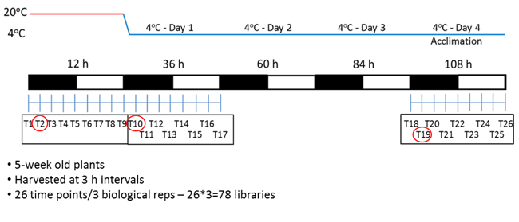

|Time-points |Description                                                        |
|:-----------|:------------------------------------------------------------------|
|T2          |Second time-point of Day 0, temperature $20^oC$                    |
|T10         |Second time-point of Day 1, temperature $4^oC$ of cold transition  |
|T19         |Second time-point of Day 4, temperature $4^oC$ of cold acclimation |
<p id='fig.single_factor'><strong>Figure 2:</strong> Experimental design of single factor RNA-seq data.</p>

Example data can be downloaded from Dropbox link: 

<a href="https://drive.google.com/open?id=1VFxWwi6q3Lv1o79RlKDtk1q-BJXa81wD" target="_blank">https://drive.google.com/open?id=1VFxWwi6q3Lv1o79RlKDtk1q-BJXa81wD</a>


<a href='#table-of-contents'>Go back to Table of contents</a>

### Multiple factors
xxx

## Run analysis on 3D App

### 3D analysis pipeline

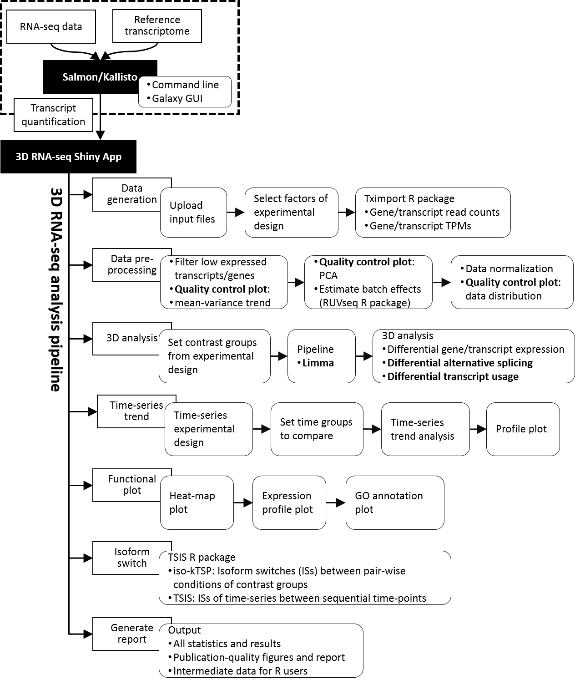
<figcaption id='pipeline'> <strong>Figure 3:</strong> 3D RNA-seq analysis pipeline. </figcaption>

### Basic widgets
3D RNA-seq App is made of control widgets that users can interact with and send messages to the underlying R code to perform analysis by clicking/dragging mouse (<a href='#basic_structure'>Figure 4</a>). 

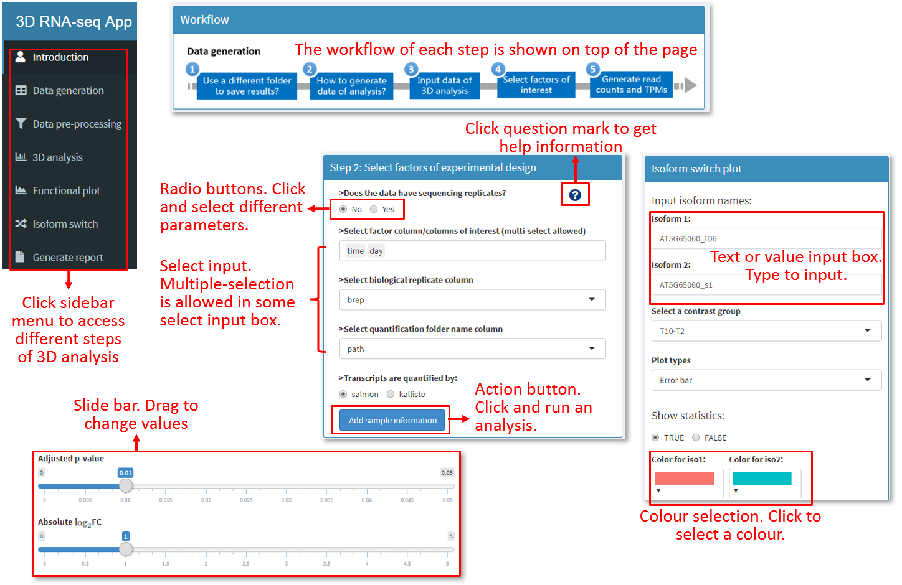
<figcaption id='basic_structure'> <strong>Figure 4:</strong> Basic widgets of 3D RNA-seq App. </figcaption>

### Tab panel 1: Data generation
Users can upload input files and set experimental design in this tab panel. Transcript level and gene level read counts and TPMs (transcript per million reads) are generated by using the [tximport](https://bioconductor.org/packages/release/bioc/html/tximport.html){target="_blank"} R package (Soneson et al., 2016).


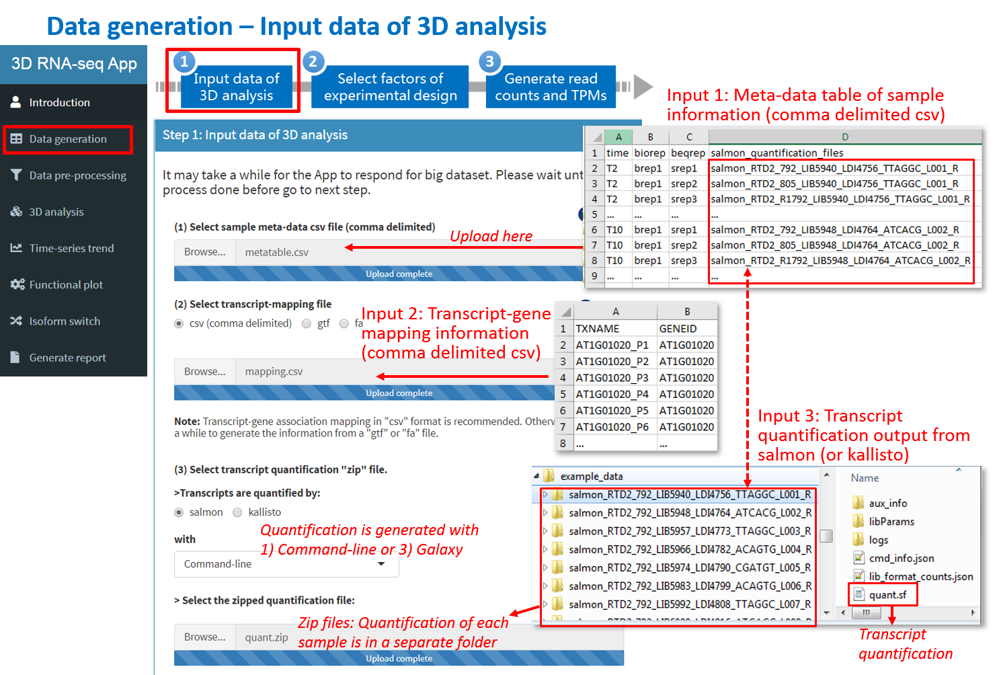
<figcaption id='data_generation_upload'> <strong>Figure 5:</strong> Upload input files to 3D RNA-seq App. </figcaption>

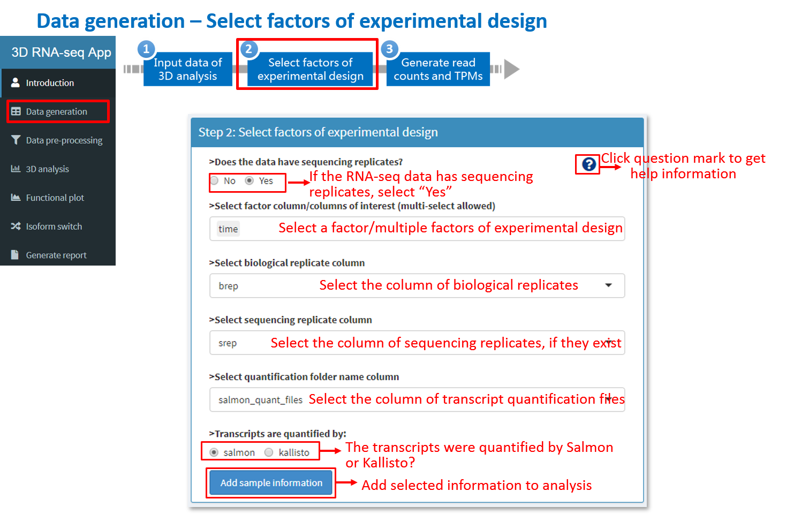
<figcaption id='data_generation_step2'> <strong>Figure 6:</strong> Select the columns of factors, labels of replicates and quantification file names from meta-data table for 3D analysis. </figcaption>


<figcaption id='data_generation_step3'> <strong>Figure 7:</strong> Generate gene and transcript read counts and TPMs. </figcaption>

### Tab panel 2: Data pre-processing
Once the read counts and TPMs are generated, the data is pre-processed in various steps to reduce noise (e.g. low expressed genes and transcripts) and unwanted variance (e.g. batch effects). In each step, quality control plots are generated to optimise the parameters for pre-processing.

(1). **Merge sequencing replicates.** 
Sequencing replicates (seq-reps) are generated by sequencing the same biological replicate multiple times, which do not add too much information to the biological variation. If the RNA-seq data has seq-reps, they will be merged according to the seq-rep labels in the meta-data table to increase sequencing depth.

(2). **Filter low expressed transcripts and genes.**
The low expressed transcripts are filtered based on count per million (CPM) reads:
$$ CPM=\frac{\text{Read count of transcript } i}{\text{Library size of sample }}\times 10^6 $$
An expressed transcript must have a certain number of samples with expression $\geq$cut-off CPM and an expressed gene must have at least one expressed transcript.

To determine the optimal cut-offs of filters, expression mean-variance trend plot is used for quality control. Read counts are assumed to be negative binomial distributed of which the mean and variance has a relation (Law et al., 2014):
$$ Var(\log_2X)=\frac{1}{\mu}+\phi $$
where $X$ is read count, $\mu$ is the mean and $\phi$ is the overdispersion. The expression variance decreasing monotonically with the increasing of the mean. In real RNA-seq data, the low expressed transcripts confound with noise and the expression distribution is different to the expressed transcripts. In the mean-variance trend plot, the low expressed transcripts cause a drop trend in low expression region (<a href='#data_preprocessing_step1'>Figure 8</a>). Therefore, the cut-offs to filter the low expression can be optimised until the drop trend in low expression region disappeared in the mean-variance trend plot.

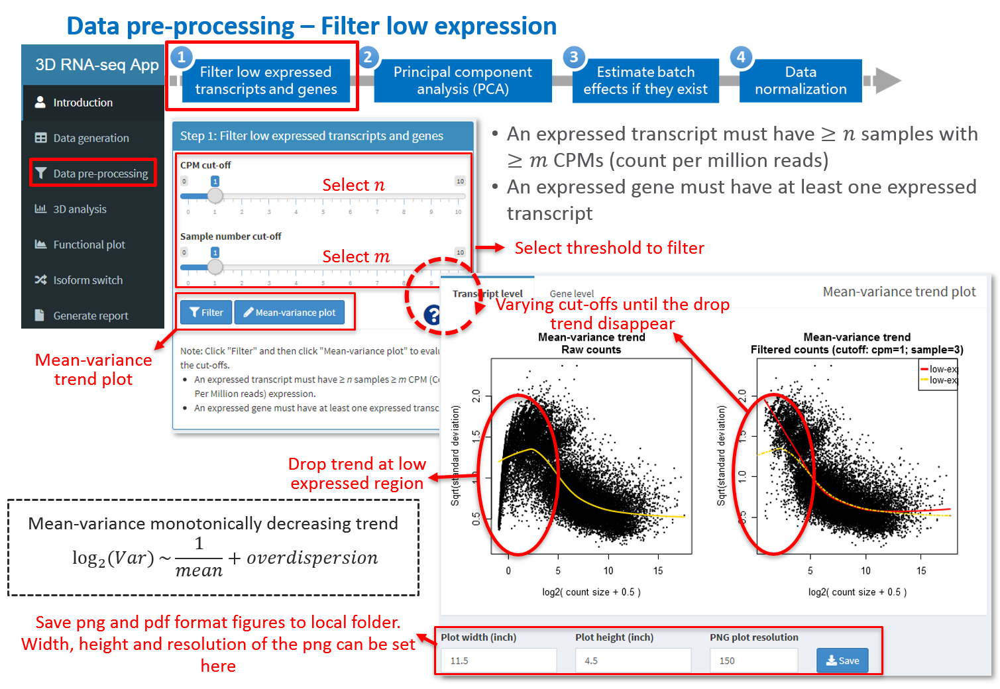
<figcaption id='data_preprocessing_step1'> <strong>Figure 8: </strong>Filter low expressed transcripts and genes based on expression mean-variance trend. </figcaption>

<br>
(3). **Principal component analysis (PCA) and batch effect estimation.**
PCA is a mathematical method to reduce expression data dimensionality while remaining most of the data variance. The reduction is performed by projecting the data to directions or principal components (PCs) from highest to lowest data variability. Therefore, the data main variance is accessible by investigate top few numbers of PCs rather than thousands of variables.  In Omic data analysis, the first two to four principal components are often used to visualise the similarities and differences of samples, thereby determining the grouping of samples. In the PCA scatter plot, the samples from the same condition often stay close, but far from the samples of other conditions. It can be used as evidence for data quality checking.

PCA plot also can be used to identify whether the RNA-seq data contain batch effects, which are caused by biological replications in different laboratory conditions. Compared with random noise, batch effects can be distinguished owning to the systematic biases of signals across replicates. For example, PCA plot in <a href='#data_preprocessing_step2_1'>Figure 9</a> shows biological replicate 1 (brep1; samples were harvested in year 2010) of the single factor example (RNA-seq data in Section <a href='#section:single_factor'>"Single factor"</a>) stays in a separate cluster to other two replicates (samples were harvested in year 2012), which indicates a clear batch effect of the data. The [RUVSeq](https://bioconductor.org/packages/release/bioc/html/RUVSeq.html){target="_blank"} R package (Risso et al., 2014) is used to estimate the batch effects. The RUVSeq algorithm generates batch effect terms which can be incorporated in the design matrix of linear regression model for 3D analysis, i.e.

$$ \text{observed expression = baseline factors + batch effects + noise} $$

It also generates a pseudo read count matrix in which the batch effects have been removed from the data. To avoid data over-modification, this matrix is only used to make PCA plot, but not used for downstream 3D analysis (<a href='#data_preprocessing_step3'>Figure 10</a>). 

In this panel, users can select and visualise different PCs based on transcript level or gene level expression of all samples (<a href='#data_preprocessing_step2_1'>Figure 9</a> and <a href='#data_preprocessing_step3'>Figure 10</a>), or the average expression of biological replicates (<a href='#data_preprocessing_step2_2'>Figure 11</a>). The scatter points can be grouped and coloured according to different factors. Ellipses or polygons can be added to the plots to highlight the grouped clusters.

**NOTE:** Batch effect estimation step is only executed when there are distinct bath effects in the data:

- The biological replicates of the same conditions stay in separate clusters in the PCA plot.
- There is experimental explanation of this separation (e.g. bio-reps in different time/labs).

Otherwise skip this step to avoid data over-modification.


<figcaption id='data_preprocessing_step2_1'> <strong>Figure 9: </strong>PCA plot before removing batch effects. </figcaption>

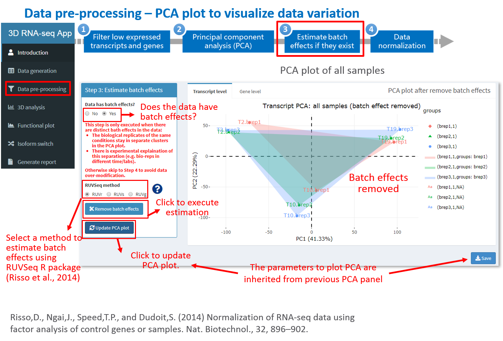
<figcaption id='data_preprocessing_step3'> <strong>Figure 10: </strong>PCA plot after removing batch effects. </figcaption>

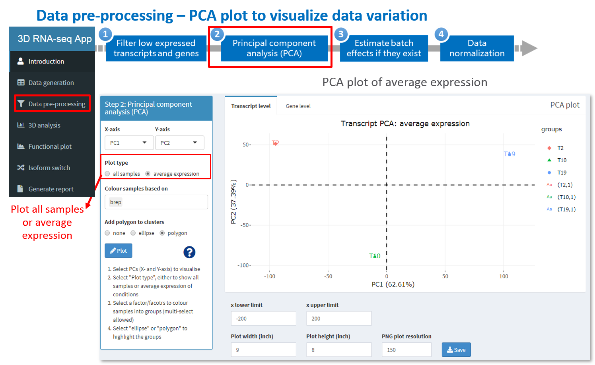
<figcaption id='data_preprocessing_step2_2'> <strong>Figure 11:</strong> PCA plot of average expression. </figcaption>

<br>
(4). **Data normalisation.**
For unbiased comparisons across samples, read counts must be normalised based on sequencing depths. Normalisation methods Trimmed Mean of M-values (TMM), Relative Log Expression (RLE) and upper-quartile can be used to reduce the effects from the systematic technical biases across samples (Bullard et al., 2010). Box plots are used to visualise the expression distribution of raw read counts and normalised expression across samples (<a href='#data_preprocessing_step4'>Figure 12</a>).


<figcaption id='data_preprocessing_step4'> <strong>Figure 12:</strong> Data normalisation. </figcaption>


### Tab panel 3: 3D analysis
#### Definition
**Statistics:**

- Contrast groups: refer to the factor levels to compare in the experimental design, e.g. "C2-C1" compares condition "C2" to condition "C1" (<a href='#DDD_definition'>Figure 13</a>).
- Adjusted p-value: in the expression comparative analysis, each gene/transcript is fitted with a statistical model, reporting a p-value. However, the testing is performed over a substantial number of genes/transcripts and each testing has a probability of making errors. Hence, all p-values in the analysis are adjusted to control the false discovery rate (FDR) (Benjamini and Yekutieli, 2001). 
- $L_2FC$: $\log_2$ fold change of expression based on contrast groups.
- $\Delta PS$: Transcript level PS (percent of spliced) is defined as the ratio of transcript average TPMs of factor levels divided by the average gene TPMs. $\Delta PS$ is the PS differences of conditions based on the contrast groups.

**DE gene/transcript analysis:**

A gene/transcript is identified as DE in a contrast group if $L_2FC$ of expression $\geq$ cut-off and with adjusted p-value < cut-off (<a href='#DDD_definition'>Figure 13</a>).

**DAS gene and DTU transcript analysis:**

At differential alternative splicing (AS) level, the gene expression is compared to transcript expression in the contrast groups (Ritchie et al., 2015).  To identify DAS genes, the expression of each transcript is compared to the weighted average expression of all the transcripts for the same gene (weight on transcript expression variance; the average expression can be treated as gene level expression). P-value of each test is converted to gene-wise p-value by using F-test or Simes method. To identify DTU transcript, each transcript is compared to the weighted average of all the other transcripts for the same gene (<a href='#DDD_definition'>Figure 13</a>).   A gene is DAS in a contrast group if adjusted p-value < cut-off and at least one transcript of the gene with $\Delta PS \geq$ cut-off. A transcript is DTU if adjusted p-value < cut-off and $\Delta PS \geq$ cut-off.

**NOTE:** Two pipelines are provided for DE analysis: <a target="_blank" href="https://genomebiology.biomedcentral.com/articles/10.1186/gb-2014-15-2-r29">"limma-voom"</a>  (Ritchie et al., 2015)(**recommended**)
and <a target="_blank" href="https://www.ncbi.nlm.nih.gov/pmc/articles/PMC2796818/">"edgeR"</a> (Robinson et al., 2011)(for cross-validation and users who have special interest in edgeR). The <a target="_blank" href="https://www.ncbi.nlm.nih.gov/pmc/articles/PMC2796818/">"edgeR"</a> pipeline includes two methods: <a target="_blank" href="https://www.rdocumentation.org/packages/edgeR/versions/3.14.0/topics/glmQLFit">"glmQL"</a> (Genewise Negative Binomial Generalized Linear Models with Quasi-likelihood Tests) and <a target="_blank" href="https://www.rdocumentation.org/packages/edgeR/versions/3.14.0/topics/glmFit">"glm"</a> (Genewise Negative Binomial Generalized Linear Models). In limma pipeline, $L_2FCs$ are calculated based count on per million reads (CPMs) while in edgeR, $L_2FCs$ are based on read counts. At gene level analysis, high consensus is achieved between <a target="_blank" href="https://genomebiology.biomedcentral.com/articles/10.1186/gb-2014-15-2-r29">"limma-voom"</a> and <a target="_blank" href="https://www.rdocumentation.org/packages/edgeR/versions/3.14.0/topics/glmQLFit">"glmQL"</a> (>90%) and they have more stringent controls of false discovery rate than the <a target="_blank" href="https://www.rdocumentation.org/packages/edgeR/versions/3.14.0/topics/glmFit">"glm"</a> method. At differential alternative splicing level, limma pipeline has more robust predictions without losing stringency. Using edgeR pipelines will give greatly reduced predictions of DAS genes/DTU transcripts.


<figcaption id='DDD_definition'> <strong>Figure 13:</strong> Principle of 3D analysis. </figcaption>

#### Set contrast groups and perform 3D analysis
(1). Pair-wise comparison of groups:  e.g. B-A compares group B to group A; C-B compares group C to group B (<a href='#DDD_definition'>DDD_analysis_set_contrast 14A</a>).
(2). Compare mean of multiple groups:  e.g. (WT.A+WT.B)/2-(MU.A+MU.B)/2 compares the mean of group WT.A and WT.B to the mean of group MU.A and MU.B (<a href='#DDD_definition'>DDD_analysis_set_contrast 14B</a>). 
NOTE: if the experimental design involves multiple factor levels, e.g. condition A, B and C are performed in wildtype (WT) and mutant (MU), respectively, these factors will be merged to generate group labels (<a href='#DDD_definition'>DDD_analysis_set_contrast 14B</a>).


<figcaption id='DDD_analysis_set_contrast'> <strong>Figure 14:</strong> Set contrast groups. </figcaption>


<figcaption id='DDD_analysis_perform_analysis'> <strong>Figure 15:</strong> Set parameters and perform 3D analysis. </figcaption>

#### Significant result summary
The following information is summarised:

- The test statistics in different contrast groups, e.g. adjusted p-value and $L_2FC$.
- The number of genes and transcripts with significant expression changes in contrast groups. 
- The number of up- and down-regulated DE genes and transcripts.
- The numbers of genes/transcripts regulated only by transcription (DE), only by alternative splicing (DAS/DTU) and by both transcription and alternative splicing (DE+DAS/DE+DTU).  

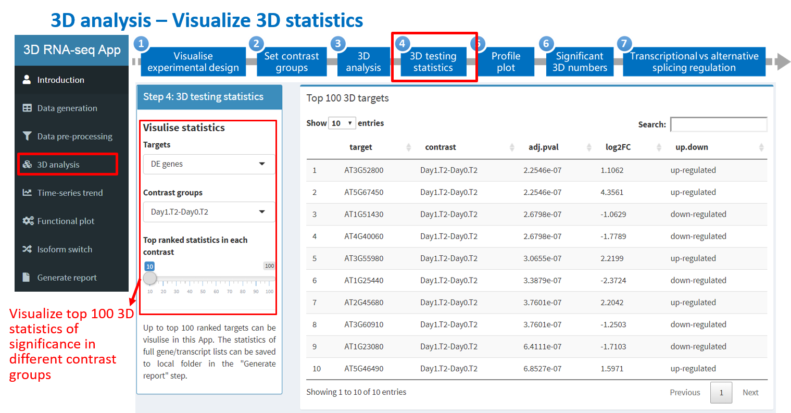
<figcaption id='DDD_analysis_significant_statistics'> <strong>Figure 16:</strong> Statistics of significance. </figcaption>

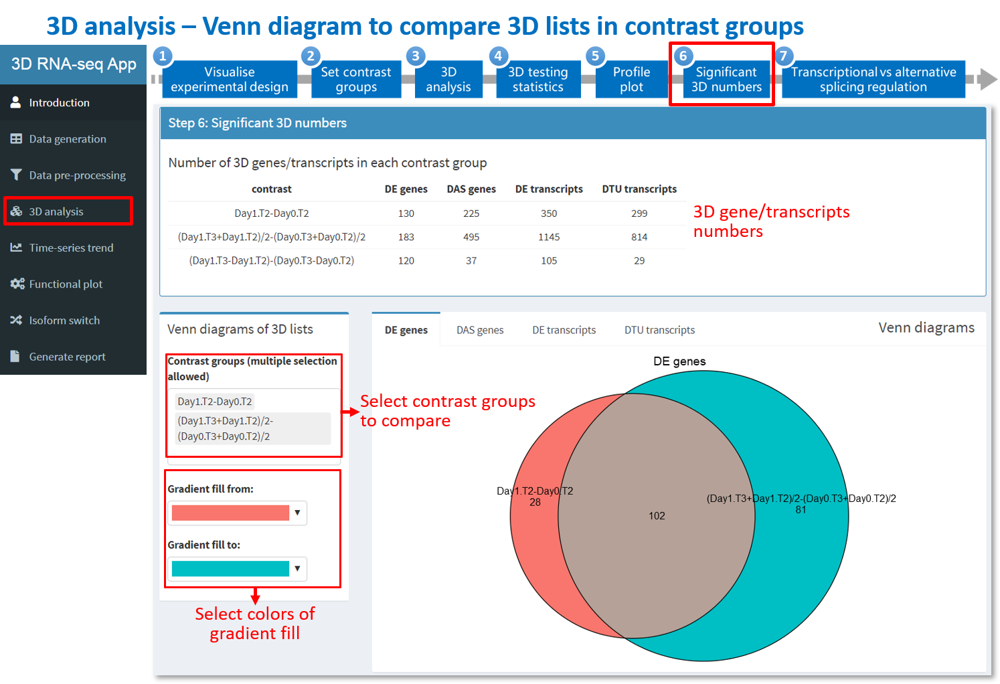
<figcaption id='DDD_analysis_venn_number'><strong>Figure 16:</strong> Venn diagrams of 3D genes/transcripts in contrast groups. </figcaption>

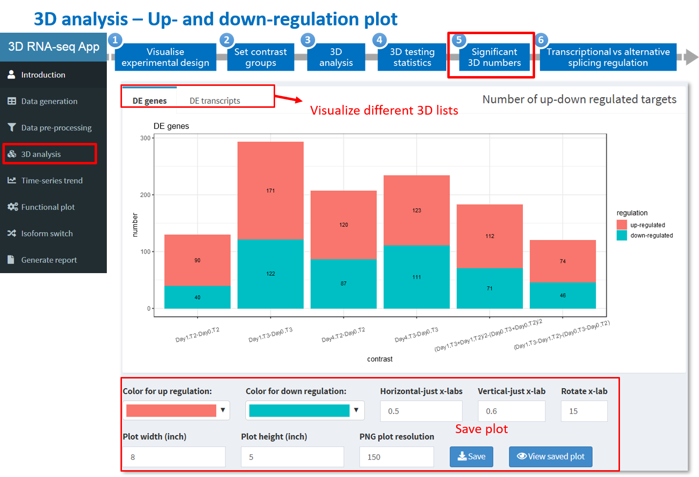
<figcaption id='DDD_analysis_updown'> <strong>Figure 17:</strong> Up- and down-regulated DE genes and DE transcripts. </figcaption>

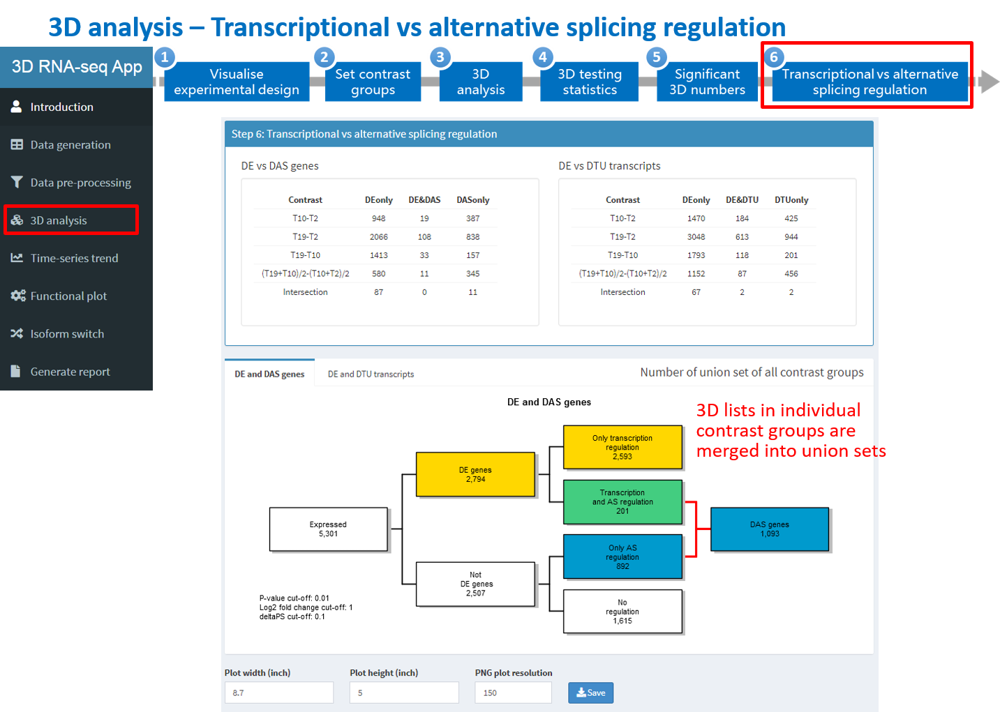
<figcaption id='DDD_analysis_DEvsDAS'> <strong>Figure 18:</strong> Transcription regulation vs alternative splicing regulation. </figcaption>

### Tab panel 4: Functional plot

#### Heatmap
Users can make heat-maps of significant DE genes, DAS genes, DE transcripts and DTU transcripts identified from the analysis. The average TPMs of genes/transcripts are standardized into z-scores to plot the heat-maps. The <a href='https://stat.ethz.ch/R-manual/R-devel/library/stats/html/dist.html' target='_blank'>dist</a> and <a href='https://stat.ethz.ch/R-manual/R-devel/library/stats/html/hclust.html' target='_blank'>hclust</a> R functions are used to perform the hierarchical clustering analysis (Rokach and Maimon, 2005). The heat-maps and the gene/transcript list in each cluster of the heat-maps can be saved to local folder.

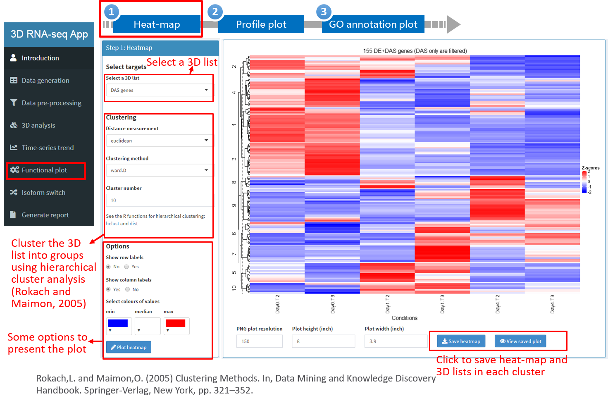
<figcaption id='functional_heatmap'> <strong>Figure 19:</strong> Heat-maps. </figcaption>

#### Profile plot
Gene and transcript expression profiles (TPMs or read counts) and PS (percent spliced) can be visualised by typing a gene id. Users also can generate a number of plots by provides a gene list and all the plots will be saved to "figure" folder of App working directory.

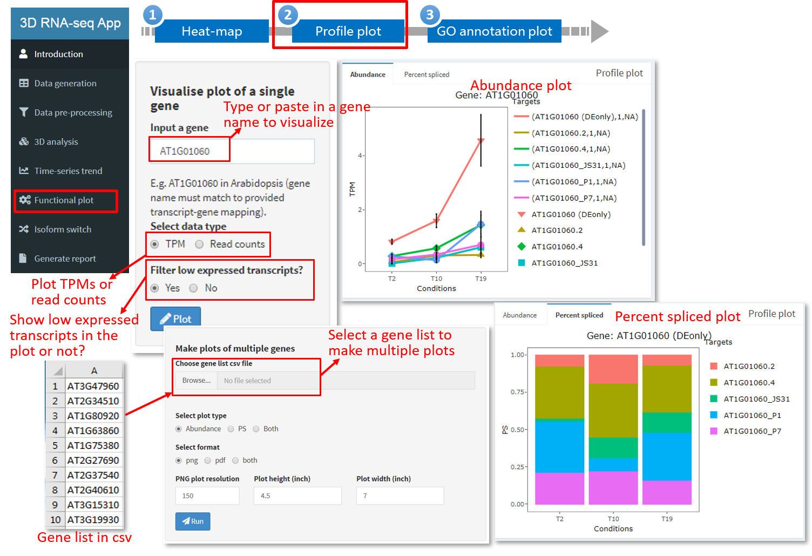
<figcaption id='functional_profile'> <strong>Figure 20:</strong> Profiles and percent spliced plots. </figcaption>

#### GO annotation plot

Users can generate gene lists of DE genes, DAS genes, DE transcripts and DTU transcripts by clicking "Download gene list" button. These gene lists can be uploaded to Gene Ontology (GO) analysis tools/databases (e.g. <a href='https://david.ncifcrf.gov/' target='_blank'>DAVID</a> and <a href='http://bioinfo.cau.edu.cn/agriGO/' target='_blank'>agriGO</a>) to generate GO annotation. A csv file with GO annotation information is required to generate the annotation plot. The file includes a column of "Category" of CC (cellular component), BP (biological process) and MF (molecular function), a column of "Term" of GO annotation and columns of statistics to report the annotation enrichment, e.g. count, -log10(FDR), etc. 

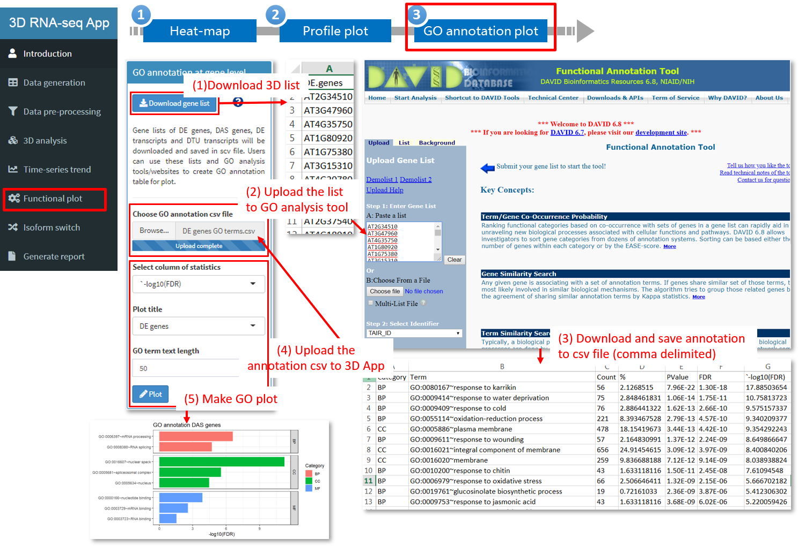
<figcaption id='functional_go'> <strong>Figure 21:</strong> GO annotation plots. </figcaption>

### Tab panel 5: Isoform switch

#### Definition
Transcript isoform switches (ISs) occur when a pair of alternatively spliced isoforms reverse the order of their relative expression levels as shown in Figure xxx. **IsokTSP** is a method to detect transcript ISs between pair-wise conditions (Sebestyen et al., 2015) (Figure 1A) while **TSIS** (time-series IS) is used to identify ISs in time-series data (Figure 1B). To have robust results, isokTSP and TSIS characterize the transcript switch by 1) defining the isoform switch conditions/time-points for any pair of transcript isoforms within a gene, 2) describing the switch using five different features or metrics, 3) filtering the results with user provided specifications and 4) visualizing the results using different plots for the user to examine further details of the switches (see details in our publication Guo et al., 2017). 

**IsokTSP:** In 3D RNA-seq analysis, isokTSP is used to identify ISs between pair-wise conditions that make up contrast groups of expression comparisons. To find IS point, the average TPMs of isoforms are treated as y-axis coordinates and 1 and 2 are used as x-axis coordinates at pair-wise conditions (Figure 1A). Then two lines, which represent two isoforms, can be fitted based on these coordinates. 
The interaction (if exists) of two lines is defined as the IS point.                      

**TSIS:** To find all IS points in time-series expression, average TPMs or spline fitted values of TPMs (i.e. smoothing the time-series with spline method to reduce noise)  are used as y-axis coordinates and integers, 1, 2, 3, ..., are x-axis coordinates. Lines of isoforms are fitted between each pair of consecutive time-points. The IS points can be identified from interactions of lines.


<figcaption id='TSIS_definition'> <strong>Figure 22:</strong> Isoform switch analysis methods. Expression data with 3 replicates for each condition/time-point is simulated for isoforms $iso_i$ and $iso_j$ (blue and red circles). The points in the plots represent samples and the black lines connect the average of samples. (A) is the iso-kTSP method for comparisons of two conditions $c_1$ and $c_2$. The Time-Series Isoform Switch (TSIS) tool is designed for detection and characterization of isoform switches for time series data shown in (B). The time-series with 6 time-points is divided into 4 intervals by the intersection points of average expression.. </figcaption>

#### Set parameters and perform analysis
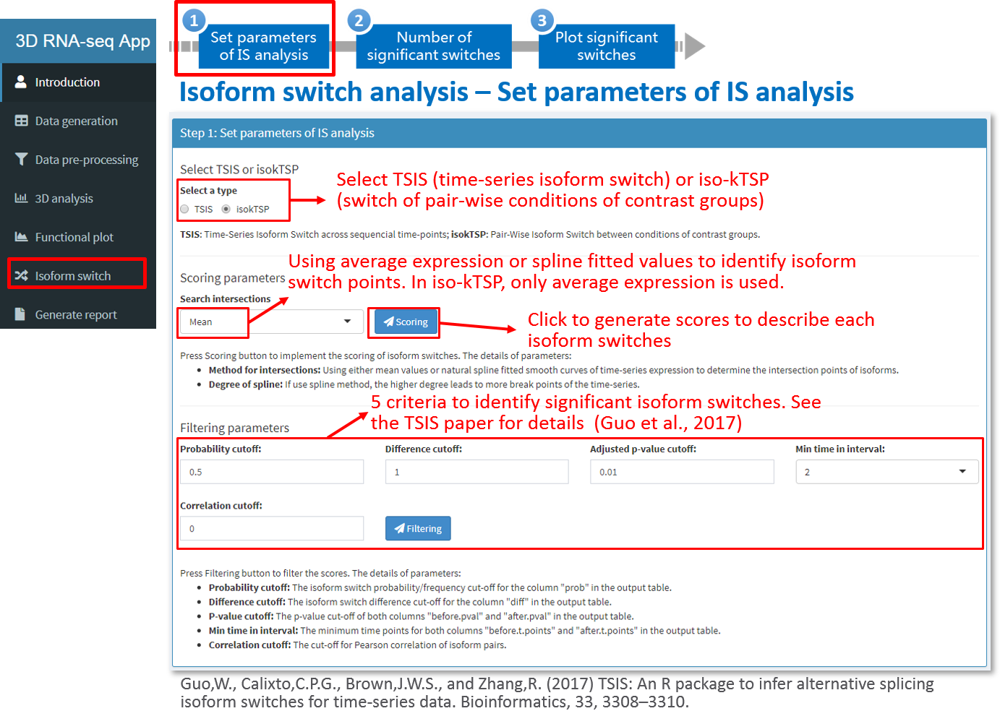
<figcaption id='tsis_parameter'> <strong>Figure 23:</strong> Set parameters for isoform switch analysis. </figcaption>

#### Visualise isoform switches
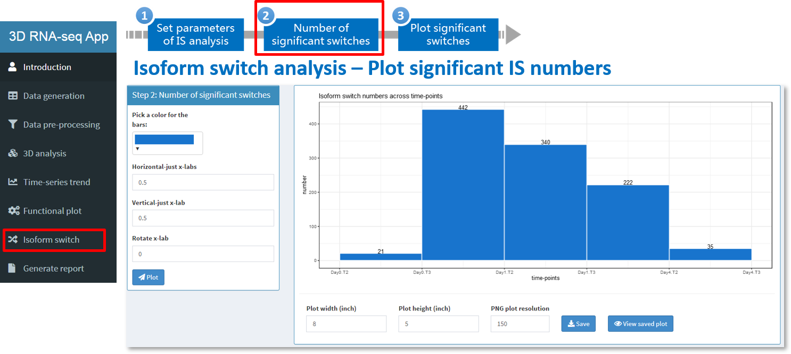

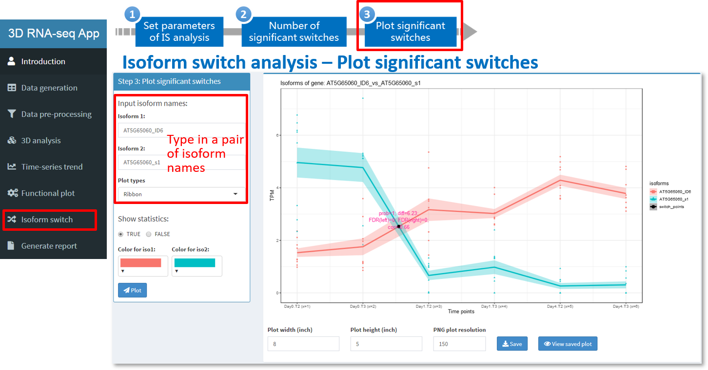
<figcaption id='tsis_plotswitch'> <strong>Figure 24:</strong> Visualise isoform switches. </figcaption>

### Tab panel 5: Generate report
<p id='section:generate_report'>
Publication-quality reports and figures, results and statistics of significance and intermediate dataset in ".RData" object for R users can be saved to the App working directory. 

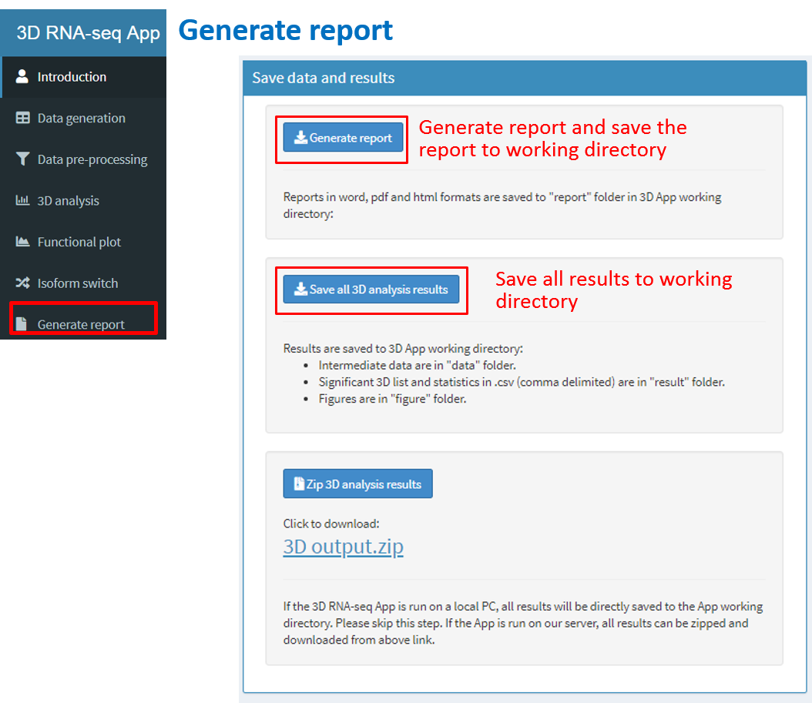
<figcaption id='generate_report'> <strong>Figure 25:</strong> Generate report. </figcaption>

## Supplementary materials
<p id='supplementary_materials'>
### Files in report folder
Reports are saved in report folder.

| File name              | Description                                       |
|------------------------|---------------------------------------------------|
| 3D_report.pdf/html/doc | Report of 3D analysis in pdf, html and doc format |


### Files in figure folder

| File names   (alphabetical)                                 | Description                                                                    |
|-------------------------------------------------------------|--------------------------------------------------------------------------------|
| DAS genes euler plot across   contrast*.pdf/.png            | Euler diagram to compare DAS genes in different contrast groups                |
| DAS genes GO annotation plot.pdf/.png                       | DAS genes GO annotation plot                                                   |
| DE genes euler plot across   contrast*.pdf/.png             | Euler diagram to compare DE genes in different contrast groups                 |
| DE genes GO annotation plot.pdf/.png                        | DE genes GO annotation plot                                                    |
| DE genes up and down regulation   numbers.pdf/.png          | DE genes up and down regulation numbers                                        |
| DE transcripts euler plot across   contrast*.pdf/.png       | Euler diagram to compare DE transcripts in different contrast groups           |
| DE transcripts up and down regulation   numbers.pdf/.png    | DE transcripts up and down regulation numbers                                  |
| DE vs DAS gene euler plot in   contrast*.pdf/.png           | Euler diagram to compare DE and DAS genes in different contrast groups         |
| DE vs DTU transcript euler plot in   contrast*.pdf/.png     | Euler diagram to compare DE and DTU transcripts in different contrast   groups |
| DTU transcripts euler plot across   contrast*.pdf/.png      | Euler diagram to compare DTU transcripts in different contrast groups          |
| Gene expression distribution.pdf/.png                       | Gene expression distribution                                                   |
| Gene mean-variance trend.pdf/.png                           | Gene mean-variance trend plot                                                  |
| Gene PCA all samples*.pdf/.png                              | Gene PCA plot of all samples                                                   |
| Gene PCA average expression.pdf/.png                        | Gene PCA plot of average expression                                            |
| Gene PCA batch effect removed all   samples*.pdf/.png       | Gene PCA plot of all samples after removing batch effects                      |
| Heatmap DAS genes.pdf/.png                                  | Heat-map of DAS genes                                                          |
| Heatmap DE genes.pdf/.png                                   | Heat-map of DE genes                                                           |
| Heatmap DE transcripts.pdf/.png                             | Heat-map of DE transcripts                                                     |
| Heatmap DTU transcripts.pdf/.png                            | Heat-map of DTU transcripts                                                    |
| Isoform   switch number.png/.pdf                            | Number of   significant isoform switch numbers                                 |
| Profile/Abundance/PS plots                                  | Folders contain gene/transcript profile plots                                  |
| Transcript expression   distribution.pdf/.png               | Transcript expression distribution                                             |
| Transcript mean-variance trend.pdf/.png                     | Transcript mean-variance trend plot                                            |
| Transcript PCA all samples*.pdf/.png                        | Transcript PCA plot of all samples                                             |
| Transcript PCA average   expression.pdf/.png                | Transcript PCA plot of average expression                                      |
| Transcript PCA batch effect removed all   samples*.pdf/.png | Transcript PCA plot of all samples after removing batch   effects              |
| Union set DE genes vs DAS genes.pdf/.png                    | Flow chart -Union set DE genes vs DAS genes                                    |
| Union set DE transcripts vs DTU   transcripts.pdf/.png      | Flow chart -Union set DE transcripts vs DTU transcripts                        |

### Files in result folder
Important results are saved in csv (comma delimited) files.

| File names (alphabetical)                                                 | Description                                                                                                                                                               |
|---------------------------------------------------------------------------|---------------------------------------------------------------------------------------------------------------------------------------------------------------------------|
| contrast.csv                                                              | Contrast   groups used for 3D analysis.                                                                                                                                   |
| DDD genes and   transcript lists across all contrast groups.csv           | List of DE genes, DAS genes, DE   transcripts and DTU transcripts, which are the union sets across all contrast   groups.                                                 |
| DDD numbers.csv                                                           | DE/DAS/DTU   genes/transcript numbers in each contrast group.                                                                                                             |
| DEvsDAS   results.csv                                                     | Number of DE vs DAS genes.                                                                                                                                                |
| DEvsDTU results.csv                                                       | Number   of DE vs DTU transcripts.                                                                                                                                        |
| Gene read   counts.csv                                                    | Raw read counts of genes before data   pre-processing.                                                                                                                    |
| Gene TPM.csv                                                              | Raw   TPM of genes before data pre-processing.                                                                                                                            |
| Raw isoform   switch scores.csv                                           | Statistics   of all possible isoform switches.                                                                                                                            |
| RNAseq info.csv                                                           | RNA-seq   data information before and after pre-processing.                                                                                                               |
| samples.csv                                                               | Meta-data table of sample information.                                                                                                                                    |
| Significant DAS and not DAS genes list and   statistics.csv               | DAS gene test statistics of all genes.                                                                                                                                    |
| Significant DAS   genes list and statistics.csv                           | DAS gene test statistics of significant   genes. Not DAS genes are removed from the table.                                                                                |
| Significant DE and not DE genes list and   statistics.csv                 | DE   gene test statistics of all genes.                                                                                                                                   |
| Significant DE   and not DE transcripts list and statistics.csv           | DE   transcript test statistics of all transcripts.                                                                                                                       |
| Significant DE genes list and statistics.csv                              | DE gene test statistics of significant   genes. Not DE genes are removed from the table.                                                                                  |
| Significant DE   transcripts list and statistics.csv                      | DE transcript test statistics of   significant transcripts. Not DE transcripts are removed from the table.                                                                |
| Significant DTU and not DTU transcripts list and   statistics.csv         | DTU   transcript test statistics of all transcripts.                                                                                                                      |
| Significant DTU   transcripts list and statistics.csv                     | DTU   transcript test statistics of significant transcripts. Not DTU transcripts   are removed from the table.                                                            |
| Significant isoform switch scores.csv                                     | Statistics   of significant isoform switches.                                                                                                                             |
| Target in each   cluster heatmap *(DAS only are filtered).csv             | DE gene lists in clusters of DE gene   heatmap.                                                                                                                           |
| Target in each cluster heatmap *DE genes.csv                              | DE+DAS gene lists in clusters of DAS gene   heatmap. The DAS only genes are excluded since they have no significant   abundance changes across samples.                   |
| Target in each   cluster heatmap *DE transcripts.csv                      | DE transcript lists in clusters of DE   transcript heatmap                                                                                                                |
| Target in each cluster heatmap *transcripts (DTU   only are filtered).csv | DE+DTU transcript lists in clusters of   DTU transcript heatmap. The DTU only transcripts are excluded since they have   no significant abundance changes across samples. |
| Transcript and   gene mapping.csv                                         | Transcript-gene mapping table.                                                                                                                                            |
| Transcript read counts.csv                                                | Raw   read counts of transcripts before data pre-processing.                                                                                                              |
| Transcript   TPM.csv                                                      | Raw TPM of transcripts before data   pre-processing.                                                                                                                      |

### Files in data folder
Intermediate data in .RData for 3D RAN-seq analysis are saved in the data folder. There are three .RData objects: 1) txi_trans.RData and 2) txi_genes.RData are transcript and gene level read count and TPM outputs from the tximport R package (Soneson et al., 2016). All the intermediate data generated in the process of 3D analysis is saved in the list object intermediate_data.RData. R users can access to the data using command line. 

| List   object                       | Elements in list object | Element type | Description                                                                                                                                                                                                                                                                                               |
|-------------------------------------|-------------------------|--------------|-----------------------------------------------------------------------------------------------------------------------------------------------------------------------------------------------------------------------------------------------------------------------------------------------------------|
| intermediate_data.RData             | conditions              | character    | Labels of   conditions to study                                                                                                                                                                                                                                                                           |
|                                     | contrast                | character    | Contrast   groups                                                                                                                                                                                                                                                                                         |
|                                     | DAS_genes               | data.frame   | Statistics of   significant DTU transcripts                                                                                                                                                                                                                                                               |
|                                     | DDD_numbers             | data.frame   | Number of   DE/DAS/DTU genes/transcripts in contrast groups                                                                                                                                                                                                                                               |
|                                     | DE_genes                | data.frame   | Statistics of   significant DE genes                                                                                                                                                                                                                                                                      |
|                                     | DE_trans                | data.frame   | Statistics of   significant DE transcripts                                                                                                                                                                                                                                                                |
|                                     | deltaPS                 | data.frame   | Delta PS   based on contrast groups                                                                                                                                                                                                                                                                       |
|                                     | DEvsDAS_results         | data.frame   | Number of DE   vs DAS genes                                                                                                                                                                                                                                                                               |
|                                     | DEvsDTU_results         | data.frame   | Number of DE   vs DTU transcripts                                                                                                                                                                                                                                                                         |
|                                     | DTU_trans               | data.frame   | Statistics of   significant DTU transcripts                                                                                                                                                                                                                                                               |
|                                     | genes_3D_stat           | list         | All the raw   results of linear regression and statistics of DE genes                                                                                                                                                                                                                                     |
|                                     | genes_batch             | list         | Estimated   gene level batch effects, if they exist. 1) W: matrix, estimated batch effect   term, which can be added to design matrix of linear regression; 2)   normalizedCounts: matrix, read counts where batch effects are removed; 3)   method: a string, method used to estimate batch effects.     |
|                                     | genes_counts            | data.frame   | Read counts   of genes. Seq-reps are merged if exist.                                                                                                                                                                                                                                                     |
|                                     | genes_log2FC            | matrix       | log2-CPM of   genes                                                                                                                                                                                                                                                                                       |
|                                     | genes_TPM               | matrix       | TPMs of genes                                                                                                                                                                                                                                                                                             |
|                                     | mapping                 | data.frame   | Transcript-gene   mapping                                                                                                                                                                                                                                                                                 |
|                                     | params_list             | list         | Parameters   used for the 3D analysis                                                                                                                                                                                                                                                                     |
|                                     | PS                      | matrix       | Percent   spliced (PS) of expressed transcripts                                                                                                                                                                                                                                                           |
|                                     | RNAseq_info             | data.frame   | RNA-seq data   information before and after pre-processing                                                                                                                                                                                                                                                |
|                                     | samples                 | data.frame   | Sample   information.                                                                                                                                                                                                                                                                                     |
|                                     | samples_new             | data.frame   | Sample   information after merging sequencing replicates (seq-reps, if exist).                                                                                                                                                                                                                            |
|                                     | scores                  | data.frame   | Statistics of   isoform switches                                                                                                                                                                                                                                                                          |
|                                     | scores_filtered         | data.frame   | Statistics of   significant isoform switches                                                                                                                                                                                                                                                              |
|                                     | target_high             | list         | 1)   trans_high: character, expressed transcripts; 2) genes_high: character,   expressed genes; 3) mapping_high: data.frame, expressed transcript-gene   mapping                                                                                                                                          |
|                                     | trans_3D_stat           | list         | All the raw   results of linear regression and statistics of DAS genes, DE and DTU   transcripts                                                                                                                                                                                                          |
|                                     | trans_batch             | list         | Estimated   transcript level batch effects, if they exist. 1) W: matrix, estimated batch   effect term, which can be added to design matrix of linear regression; 2)   normalizedCounts: matrix, read counts where batch effects are removed; 3)   method: string, method used to estimate batch effects. |
|                                     | trans_counts            | data.frame   | Read counts   of transcripts. Seq-reps are merged if exist.                                                                                                                                                                                                                                               |
|                                     | trans_log2FC            | matrix       | log2-CPM of   transcripts.                                                                                                                                                                                                                                                                                |
|                                     | trans_TPM               | matrix       | TPMs of   transcripts.                                                                                                                                                                                                                                                                                    |
|                                     | Other   elements        |              | The list   object may include other elements.                                                                                                                                                                                                                                                             |
| txi_genes.Rdata and txi_trans.Rdata | abundance               | matrix       | TPMs of   genes/transcripts                                                                                                                                                                                                                                                                               |
|                                     | counts                  | matrix       | Read counts   of genes/transcripts                                                                                                                                                                                                                                                                        |
|                                     | countsFromAbundance     | character    | Method used   to generate read counts and TPMs                                                                                                                                                                                                                                                            |
|                                     | length                  | matrix       | Length of   genes/transcripts                                                                                                                                                                                                                                                                             |


## References
Benjamini,Y. and Yekutieli,D. (2001) The control of the false discovery rate in multiple testing under dependency. Ann. Stat., 29, 1165–1188.

Bray,N.L., Pimentel,H., Melsted,P., and Pachter,L. (2016) Near-optimal probabilistic RNA-seq quantification. Nat. Biotechnol., 34, 525–527.

Bullard,J.H., Purdom,E., Hansen,K.D., and Dudoit,S. (2010) Evaluation of statistical methods for normalization and differential expression in mRNA-Seq experiments. BMC Bioinformatics, 11, 94.

Calixto,C.P.G., Guo,W., James,A.B., Tzioutziou,N.A., Entizne,J.C., Panter,P.E., Knight,H., Nimmo,H., Zhang,R., and Brown,J.W.S. (2018) Rapid and dynamic alternative splicing impacts the Arabidopsis cold response transcriptome. Plant Cell, tpc.00177.2018.

Gu,Z., Eils,R., and Schlesner,M. (2016) Complex heatmaps reveal patterns and correlations in multidimensional genomic data. Bioinformatics, 32, 2847–2849.

Guo,W., Calixto,C.P.G., Brown,J.W.S., and Zhang,R. (2017) TSIS: An R package to infer alternative splicing isoform switches for time-series data. Bioinformatics, 33, 3308–3310.

Law,C.W., Chen,Y., Shi,W., and Smyth,G.K. (2014) voom: Precision weights unlock linear model analysis tools for RNA-seq read counts. Genome Biol, 15, R29.

Patro,R., Duggal,G., Love,M.I., Irizarry,R.A., and Kingsford,C. (2017) Salmon provides fast and bias-aware quantification of transcript expression. Nat. Methods, 14, 417–419.

Risso,D., Ngai,J., Speed,T.P., and Dudoit,S. (2014) Normalization of RNA-seq data using factor analysis of control genes or samples. Nat. Biotechnol., 32, 896–902.

Ritchie,M.E., Phipson,B., Wu,D., Hu,Y., Law,C.W., Shi,W., and Smyth,G.K. (2015) limma powers differential expression analyses for RNA-sequencing and microarray studies. Nucleic Acids Res, 43, e47.

Rokach,L. and Maimon,O. (2005) Clustering Methods. In, Data Mining and Knowledge Discovery Handbook. Springer-Verlag, New York, pp. 321–352.

Saracli,S., Dogan,N., and Dogan,I. (2013) Comparison of hierarchical cluster analysis methods by cophenetic correlation. J. Inequalities Appl.

Soneson,C., Love,M.I., and Robinson,M.D. (2016) Differential analyses for RNA-seq: transcript-level estimates improve gene-level inferences. F1000Research, 4, 1521.

Zhang,R., Calixto,C.P.G., Marquez,Y., Venhuizen,P., Tzioutziou,N.A., Guo,W., Spensley,M., Entizne,J.C., Lewandowska,D., Have,S. Ten, Frey,N.F., Hirt,H., James,A.B., Nimmo,H.G., Barta,A., Kalyna,M., and Brown,J.W.S. (2017) A high quality Arabidopsis transcriptome for accurate transcript-level analysis of alternative splicing. Nucleic Acids Res., 45, 5061-5073.

## Session information

```{r,echo=F,eval=TRUE}
sessionInfo()
```

</div>
