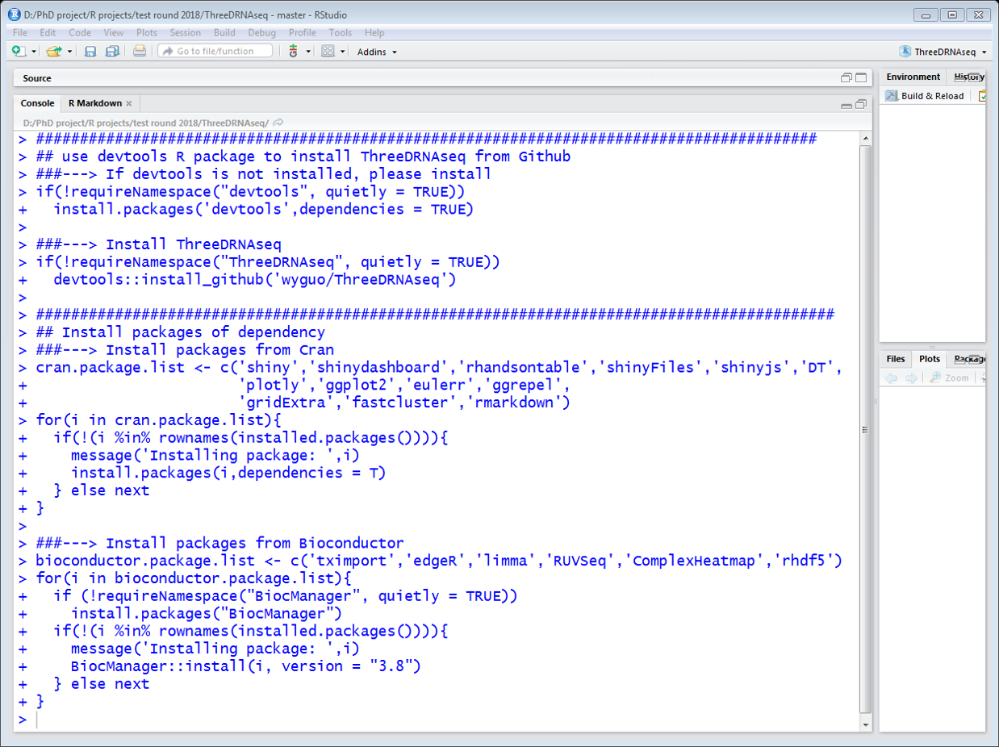

```{r setup, include=FALSE,eval=T}
knitr::opts_chunk$set(echo = T,eval = F,warning = F,message = F)
options(stringsAsFactors = F)
```

<div align="justify">
<p id='table-of-contents'></p>

## How to use this manual

The 3D RNA-seq App includes complex steps of

- Gene and transcript expression (read counts and TPMs) generation.
- Data pre-processing (filter low expressed genes/transcripts, PCA plot to check data variation, batch effect estimation, data normalisation, etc.).
- 3D analysis of differential expressed (DE) genes/transcripts, differential alternative spliced (DAS) genes and differential transcript usage (DTU) transcripts.
- Significant 3D result summary.
- Advanced plot (heatmap, profile, GO enrichment plots of 3D genes/transcripts).
- One click to generate report with publication-quality results and figures.

This manual provides step-by-step instructions to use the 3D RNA-seq App. To use this App in your work, please cite: 

[Calixto,C.P.G., Guo,W., James,A.B., Tzioutziou,N.A., Entizne,J.C., Panter,P.E., Knight,H., Nimmo,H., Zhang,R., and Brown,J.W.S. (2018) Rapid and dynamic alternative splicing impacts the Arabidopsis cold response transcriptome. Plant Cell.](http://www.plantcell.org/content/30/7/1424){target="_blank"}


## How to launch the App


There are three ways to use ThreeDRNAseq pipeline:

- Command-line free (for all users): the App is hold by our server. Users can directly open the App on your default browser by click the link: xxxx (In preparation).
- Minor command-line (for basic R users): users can access the 3D RNA-seq App through RStudio. Please go to Section <a href='#Section_installation_and_Run'>"Installation and Run"</a> for details
- Command-line based (for advanced R users): Instead of 3D RNA-seq App, users can use command line to do the analysis for more flexible control of intemediate results and figures. The command-line-based user manual: <a href="https://github.com/wyguo/ThreeDRNAseq/tree/master/vignettes/user_manuals" target="_blank">https://github.com/wyguo/ThreeDRNAseq/tree/master/vignettes/user_manuals</a>

<p id='Section_installation_and_Run'></p>

## Installation and Run
ThreeDRNAseq R package can be installed from Github by using <a href='https://cran.r-project.org/web/packages/devtools/index.html' target='_blank'>devtools</a> R package

### Install ThreeDRNAseq package
In the RStudio, please run the following command to install ThreeDRNAseq R package and the packates of dependencies.
``` {r}
##################################################################################################
## use devtools R package to install ThreeDRNAseq from Github
###---> If devtools is not installed, please install
if(!requireNamespace("devtools", quietly = TRUE))
  install.packages('devtools',dependencies = TRUE)

###---> Install ThreeDRNAseq
if(!requireNamespace("ThreeDRNAseq", quietly = TRUE))
  devtools::install_github('wyguo/ThreeDRNAseq')
```

### Install dependency packages

``` {r}
#######################################################################################################
## Install packages of dependency
###---> Install packages from Cran
cran.package.list <- c('shiny','shinydashboard','rhandsontable','shinyFiles','shinyjs','DT',
                       'plotly','ggplot2','eulerr','ggrepel','statmod',
                       'gridExtra','fastcluster','rmarkdown')
for(i in cran.package.list){
   if(!(i %in% rownames(installed.packages()))){
     message('Installing package: ',i)
     install.packages(i,dependencies = T)
   } else next
}

###---> Install packages from Bioconductor
bioconductor.package.list <- c('tximport','edgeR','limma','RUVSeq','ComplexHeatmap','rhdf5')
for(i in bioconductor.package.list){
  if (!requireNamespace("BiocManager", quietly = TRUE))
    install.packages("BiocManager")
  if(!(i %in% rownames(installed.packages()))){
    message('Installing package: ',i)
    BiocManager::install(i, version = "3.8",dependencies = T)
  } else next
}
```



### Run 3D RNA-seq App
Please type the following command in your RStudio to launch the App in the default web browser (Google Chrome is recommended for image visualisation issues).

Launch the App from ThreeDRNAseq R package
```{r}
library(ThreeDRNAseq)
ThreeDRNAseq.app()
```

Alternatively, users can launch the App from Github page
```{r}
library(shiny)
runGitHub("ThreeDRNAseq", "wyguo",subdir = "vignettes")

```

|Usage                   |Package        |Link                                                                    |
|:-----------------------|:--------------|:-----------------------------------------------------------------------|
|Make the shiny app      |shiny          |https://shiny.rstudio.com/                                              |
|                        |shinydashboard |https://rstudio.github.io/shinydashboard/                               |
|                        |rhandsontable  |https://jrowen.github.io/rhandsontable/                                 |
|                        |shinyFiles     |https://cran.r-project.org/web/packages/shinyFiles/index.html           |
|                        |shinyjs        |https://cran.r-project.org/web/packages/shinyjs/index.html              |
|                        |DT             |https://cran.r-project.org/web/packages/DT/index.html                   |
|Read csv file           |readr          |https://cran.r-project.org/web/packages/readr/index.html                |
|Expression generator    |tximport       |http://bioconductor.org/packages/release/bioc/html/tximport.html        |
|Batch effect estimation |RUVSeq         |https://bioconductor.org/packages/release/bioc/html/RUVSeq.html         |
|3D analysis             |limma          |https://bioconductor.org/packages/release/bioc/html/limma.html          |
|                        |edgeR          |https://bioconductor.org/packages/release/bioc/html/edgeR.html          |
|Heatmap                 |ComplexHeatmap |https://bioconductor.org/packages/release/bioc/html/ComplexHeatmap.html |
|Cluster of heatmap      |fastcluster    |https://cran.r-project.org/web/packages/fastcluster/index.html          |
|Euler plots             |eulerr         |https://cran.r-project.org/web/packages/eulerr/index.html               |
|Other plots             |ggplot2        |https://cran.r-project.org/web/packages/ggplot2/index.html              |
|                        |plotly         |https://cran.r-project.org/web/packages/plotly/index.html               |
|                        |gridExtra      |https://cran.r-project.org/web/packages/gridExtra/index.html            |
|                        |grid           |https://cran.r-project.org/web/packages/grid/index.html                 |
|Generate report         |rmarkdown      |https://cran.r-project.org/web/packages/rmarkdown/index.html            |

Table: This take shows the main R packages used in the 3D RNA-seq analysis. If any other R packages are missing from your PC, please install accordingly.

<a href='#table-of-contents'>Go back to Table of contents</a>

## Example data
Example data can be downloaded from Google drive: 

<a href="https://drive.google.com/open?id=1VFxWwi6q3Lv1o79RlKDtk1q-BJXa81wD" target="_blank">https://drive.google.com/open?id=1VFxWwi6q3Lv1o79RlKDtk1q-BJXa81wD</a>

The example RNA-seq data is a subset from study of Arabidopsis in response to cold (Calixto et al., 2018). Datasets of three time-points (red circles) were extracted from the whole study:

<center></center>
<br>

|Time-points |Description                                                        |
|:-----------|:------------------------------------------------------------------|
|T2          |Second time-point of Day 0, temperature $20^oC$                    |
|T10         |Second time-point of Day 1, temperature $4^oC$ of cold transition  |
|T19         |Second time-point of Day 4, temperature $4^oC$ of cold acclimation |

Each time-point has 3 biological replicates and each biological replicate has 3 sequencing replicates. Transcript quantification was generated by using [Salmon](https://combine-lab.github.io/salmon/){target="_blank"} (Patro et al., 2017) and [AtRTD2-QUASI](https://www.ncbi.nlm.nih.gov/pubmed/28402429){target="_blank"} (Zhang et al., 2017) as transcriptome reference. Expression comparisons were designed as "T10 vs T2" and "T19 vs T2" to identify the cold response genes and transcripts at both transcriptional and AS level.


## Prepare input data

The following datasets are required in the pipeline (<a href='#Figure1'>Figure 1</a>; also see the example datasets):

- Gene-transcript mapping information in a csv file **"mapping.csv"** (<a href='#Figure1'>Figure 1A</a>). In the spreadsheet, the first column is the transcript list with column name "TXNAME" and the second column is the gene list with column name "GENEID".
- Sample information in a csv file **"samples.csv"** (<a href='#Figure1'>Figure 1B</a>). The spreadsheet must include columns (highlighted in read colour):
    + brep: biological replicates are labelled as "brep1", "brep2", "brep3",... to distinguish the samples.
    + srep: if there are sequencing replicates (the same biological replicate is sequenced multiple times) in the dataset, they must labelled as "srep1", 'srep2', 'srep3',..., otherwise, labelled as "srep1","srep1", "srep1",... for all the samples.
    + condition: conditions of the samples.
    + path: the complete path of transcript quantification, e.g. the "quant.sf" files of [Salmon](https://combine-lab.github.io/salmon/){target="_blank"} (Patro et al., 2017) and "abundance.h5" files of [Kallisto](https://pachterlab.github.io/kallisto/about){target="_blank"} (Bray et al., 2016)
- The **transcript quantification outputs**. The folder names of the quantification outputs must match to the path information in the "samples.csv" files. For example, <a href='#Figure1'>Figure 1C</a> shows the [Salmon](https://combine-lab.github.io/salmon/){target="_blank"} (Patro et al., 2017) quantification output files.
- Contrast groups for expression comparison in a csv file **"contrast.csv"** (<a href='#Figure1'>Figure 1D</a>). In the spreadsheet, the first column is the treatment conditions with column name "Treatment" and the second column is the control conditions with column name "Control".

**Note:** the analysis will read information according to the column names in the spreadsheets. Please use the same column names as in examples.


<p id='Figure1'><strong>Figure 1:</strong> User provided datasets.</p>

<p id='Section_output_data'></p>
<br>

## Output data

Four folders will be created in the working directory to save the analysis results:

- data folder: the intermediate datasets in the analysis will be saved in the "data" folder in R data format (.RData). Advanced R users can open and process these objects in R software. For basic R users, please keep in mind these ".RData" objects are used to store the intermediate datasets. 
- result folder: the DE, DAS and DTU results will be saved as csv files in the "result" folder.
- figure folder: the figures/plots will be saved in the "figure" folder.
- report folder: the final report in html, pdf and word formats generated from the App will be saved in the "report" folder.

The detailed descriptions of files saved in the above folders can be found in Section <a href='#Section_saved_files'>"Saved files in local directory"</a>.

<a href='#table-of-contents'>Go back to Table of contents</a>

## 3D RNA-seq App: Step-by-step manual

When the 3D RNA-seq App is launched, users can see 7 pages in the sidebar menu: Introduction, Data generation, Data pre-processing, DE DAS and DTU analysis, Result summary, Advanced plot and Generate report.
<center>
{align="middle"}
</center>
<br>

### Data generation
Firstly, transcript level and gene level read counts and TPMs (transcript per million reads) are generated by using the [tximport](https://bioconductor.org/packages/release/bioc/html/tximport.html){target="_blank"} R package (Soneson et al., 2016).

#### Set directory and load datasets

To begin with, users can choose a working directory and click "Create folders to save results" to create the output data, result and figure and report folders.


**Figure 2**: Choose working directory. Please click the "triangles" in the left-side "Directories" box to access and select sub-folders. The click and select in the right-side "Content" box is invalid.

The whole pipeline has a number of steps and each step is related to several intermediate datasets (see Section <a href="#Section_output_data">"Output data"</a>). This table summarise the generation and usage steps of these datasets and whether (True or False) they have been loaded in workspace ready for use. To avoid running the pipeline from very beginning every time the App get refreshed, the following options are provided:

  - If all/part of the required datasets (in .RData format) do not exist in the "data" folder of working directory (see Section: <a href='#Section_saved_files'>"Saved files in local directory"</a>), users can generate these datasets from corresponding steps.
  - If all/part of the required datasets (in .RData format) already exist in the "data" folder, users can click "Load all" button to load them. 
  - To perform analysis or visualise results in a specific step, users also can load the required
    datasets for individual steps.


    

**Figure 3**: Data information for the analysis. The columns:

  - Data -- the .RData file names in the "data" folder.
  - In data folder -- logical, whether the required datasets exist in the "data" folder.
  - In workspace -- logical, whether the required datasets have been uploaded for analysis.
  - Description -- description of the datasets.
  - Generate from -- the steps to generate the required datasets.
  - Use in -- the steps to use the datasets.

#### Generate gene and transcript expression

The csv files "mapping.csv" and "samples.csv" (see <a href='#Figure1'> Figure 1A</a> and <a href='#Figure1'>B</a>) are loaded (<a href='#Figure4'>Figure 4A</a>) and visualised (<a href='#Figure4'>Figure 4C</a>) in this step. The [tximport](https://bioconductor.org/packages/release/bioc/html/tximport.html){target="_blank"} R package (Soneson et al., 2016) is used to generate gene and transcript expression of read counts and TPMs (transcript per million reads) based on three options: "no" (default), "scaledTPM" and "lengthScaledTPM". The "lengthScaledTPM" is recommended since it scales the expression using the transcript length and then the library size over samples (see the [tximport](https://bioconductor.org/packages/release/bioc/html/tximport.html){target="_blank"} documentation for details). The generated gene and transcript expression will be save as R data object txi_genes.RData and txi_trans.RData in the "data" folder, respectively. If "txi_genes.RData" and "txi_trans.RData" are already in "data" folder, users can load them directly and skip the data generation step to save time. Spreadsheets of read counts and TPMs will be saved as csv files in the "result" folder.


<p id='Figure4'><strong>Figure 4:</strong> Generate gene and transcript expression.</p>
<br>

### Data pre-processing

Once the read counts and TPMs are generated, the data is pre-processed with steps: Merge sequencing replicates (if exist), Remove low expressed transcripts/genes, Estimate batch effects (if exist) and Data normalisation. In each step, quality control plots are generated to optimise the parameters for pre-processing (<a href='#Figure5'>Figure 5</a>).


<p id='Figure5'><strong>Figure 5:</strong> Data pre-processing. The figures were generated based on the RNA-seq data from study of Arabidopsis in response to cold (Calixto et al., 2018). </p>
<br>

#### Merge sequencing replicates

The sequencing replicates are generated by sequencing the same biological replicate multiple times, which do not add too much information to the technical variation. Sequencing replicates from the same biological replicate are often added to increase the depth. In the panel of <a href='#Figure6'>Figure 6A</a>, the sequencing replicate information will be extracted from the "srep" column of the "samples.csv" file (<a href='#Figure1'> Figure 1B</a>) to indicate whether to merge the sequencing replicates.

#### Filter low expression

The low expressed transcripts are filtered based on count per million (CPM) reads:
$$ CPM=\frac{X_i}{N}\times 10^6 $$
where $X_i$ is read count of transcript $i$ and $N$ is the library size of the sample. 

- An expressed transcript must have $\geq n$ samples with expression $\geq m$ CPM. 
- An expressed gene must have at least one expressed transcript.

The sample number cut-off $n$ and CPM cut-off $m$ are determined by the mean-variance trend plot (<a href='#Figure6'>Figure 6B</a> and <a href='#Figure6'>Figure 6C</a>). Read counts are assumed to be negative binomial distributed of which the mean and variance has a relation:
$$ Var(\log_2X)=\frac{1}{\mu}+\phi $$
where $X$ is read count, $\mu$ is the mean and $\phi$ is the overdispersion. The expression variance decreasing monotonically with the increasing of the mean. In real RNA-seq data, the low expressed transcripts confound with noise and the expression distribution is different to the expressed transcripts. In the mean-variance trend plot, the low expressed transcripts cause a drop trend in low expression region (<a href='#Figure5'>Figure 5</a> and <a href='#Figure6'>Figure 6C</a>). Therefore, the cut-offs $n$ and $m$ to filter the low expression can be optimised until the drop trend in low expression region disappeared in the mean-variance trend plot.


<p id='Figure6'><strong>Figure 6:</strong> Merge sequencing replicates and filter low expressed genes/transcripts. (D) is the scatter plot of mean-variance trends before and after filtering the low expressed transcripts. The fitted lines of the trends are also presented (Yellow line: before filtering; Red line: after filtering).<p>
<br>

#### Principal component analysis (PCA) and batch effect estimation

PCA is a mathematical method to reduce expression data dimensionality while remaining most of the data variance. The reduction is performed by projecting the data to directions or principal components (PCs) from highest to lowest data variability. Therefore, the data main variance is accessible by investigate top few number of PCs rather than thousands of variables.  In Omic data analysis, the first two to four principal components are often used to visualise the similarities and differences of samples, thereby determining the grouping of samples. In the PCA scatter plot, the samples from the same condition often stay close, but far from the samples of other conditions. It can be used as evidence for data quality checking.

PCA plot also can be used to identify whether the RNA-seq data contain batch effects, which are caused by biological replications in different laboratory conditions. Compared with random noise, batch effects can be distinguished owning to the systematic biases of signals across replicates. For example, <a href='#Figure7'>Figure 7A</a> shows the PCA plot (PC1 vs PC2) of a RNA-seq data with 3 time-points T2, T10 and T19. Each time-point has 3 biological replicates. It can be seen that the first biological replicate (brep1) stays in a separate cluster to other two replicates, which indicates a clear batch effect of the data. In this pipeline, the [RUVSeq](https://bioconductor.org/packages/release/bioc/html/RUVSeq.html){target="_blank"} R package (Risso et al., 2014) is used to estimate the batch effects. The RUVSeq algorithm generates batch effect terms which can be incorporated in the design matrix of linear regression model for 3D analysis, i.e.

$$ \text{observed expression = baseline effects + batch effects + noise} $$

It also generates a pseudo read count matrix in which the batch effects have been removed from the data. To avoid data over-modification, this matrix is only used to make PCA plot, but not used for downstream 3D analysis (<a href='#Figure7'>Figure 7B</a>). 

In this panel (<a href='#Figure7'>Figure 7</a>), users can select and visualise different PCs based on transcript level or gene level expression, or the average expression of biological replicates. The scatter points can be grouped and coloured according to biological replicates or conditions. Ellipses or polygons can be added to the plots to highlight the grouped clusters. Three options, RUVr, RUVs and RUVg, in the [RUVSeq](https://bioconductor.org/packages/release/bioc/html/RUVSeq.html){target="_blank"} R package are provided to estimate the batch effects (see the package [documentation](https://bioconductor.org/packages/release/bioc/html/RUVSeq.html) for details). Users can "Update PCA plot" to visualise whether the batch effects are removed properly. **If there are no clear batch effects in the PCA plot, please skip this step.**


<p id='Figure7'><strong>Figure 7:</strong> PCA plot before (A) and after (B) remove batch effects.<p>
<br>

#### Data normalisation

To enable unbiased comparisons across samples, read counts must be normalised on the basis of sequencing depths. Normalisation methods Trimmed Mean of M-values (TMM), Relative Log Expression (RLE) and upper-quartile can be used to reduce the effects from the systematic technical biases across samples (Bullard et al., 2010). Box plots are used to visualise the expression distribution of raw read counts and normalised expression across samples.


Figure 8: Data normalisation.
<br>

## 3D RNA-seq analysis

### Definition of 3D in this pipeline


<br>

### Statistics 

- Contrast groups: refer to the conditions to compare, e.g. "B-A" and "C-A" compares the conditions "B" and "C" to condition "A".
- Adjusted p-value: in the expression comparative analysis, each gene/transcript is fitted with a statistical model, reporting a p-value. However, the testing is performed over a substantial number of genes/transcripts and each testing has a probability of making errors. Hence, all p-values in the analysis are adjusted to control the false discovery rate (FDR). Please see the R function <a href='https://stat.ethz.ch/R-manual/R-devel/library/stats/html/p.adjust.html',target='_blank'>p.adjust</a> for details.
- $L_2FC$: $\log_2$ fold change of expression based on contrast groups.
- $\Delta PS$: Transcript level PS (percent of splice) is defined as the ratio of transcript average abundance of conditions divided by the average gene abundance. $\Delta PS$ is the PS differences of conditions based on the contrast groups. We recommend to use TPMs to calculate PS values. The option to generate PS from read counts is also provided (<a href='#Figure9'>Figure 9C</a>). 

### DE gene/transcript analysis

A gene/transcript is identified as DE in a contrast group if $L_2FC$ of expression $\geq$ cut-off and with adjusted p-value < cut-off.

Two pipelines are provided for DE analysis: <a target="_blank" href="https://genomebiology.biomedcentral.com/articles/10.1186/gb-2014-15-2-r29">"limma-voom"</a> 
and <a target="_blank" href="https://www.ncbi.nlm.nih.gov/pmc/articles/PMC2796818/">"edgeR"</a>. The <a target="_blank" href="https://www.ncbi.nlm.nih.gov/pmc/articles/PMC2796818/">"edgeR"</a> pipeline includes two methods: <a target="_blank" href="https://www.rdocumentation.org/packages/edgeR/versions/3.14.0/topics/glmQLFit">"glmQL"</a> (Genewise Negative Binomial Generalized Linear Models with Quasi-likelihood Tests) and <a target="_blank" href="https://www.rdocumentation.org/packages/edgeR/versions/3.14.0/topics/glmFit">"glm"</a> (Genewise Negative Binomial Generalized Linear Models). In limma pipeline, $L_2FCs$ are calculated based count per million reads (CPMs) while in edgeR, $L_2FCs$ are based on read counts. From several real RNA-seq data analyses, high consensus is achieved between <a target="_blank" href="https://genomebiology.biomedcentral.com/articles/10.1186/gb-2014-15-2-r29">"limma-voom"</a> and <a target="_blank" href="https://www.rdocumentation.org/packages/edgeR/versions/3.14.0/topics/glmQLFit">"glmQL"</a> (>90%) and they have more stringent controls of false discovery rate than the <a target="_blank" href="https://www.rdocumentation.org/packages/edgeR/versions/3.14.0/topics/glmFit">"glm"</a> method.

### DAS gene and DTU transcript analysis

To test differential alternative splicing (AS), the gene level expression is compared to transcript level expression in the contrast groups. A gene is DAS in a contrast group if adjusted p-value < cut-off and at least one transcript of the gene with $\Delta PS \geq$ cut-off. A transcript is DTU if adjusted p-value < cut-off and $\Delta PS \geq$ cut-off.  

**Two pipelines for AS analysis:** 

- *limma pipeline*: To identify DAS genes, the expression of each transcript is compared to the weighted average expression of all the transcripts for the same gene (weight on transcript expression variance; the average expression can be treated as gene level expression). P-value of each test is converted to genewise p-value by using F-test or Simes method. To identify DTU transcript, each transcript is compared to the weighted average of all the other transcripts for the same gene. See the <a href='http://web.mit.edu/~r/current/arch/i386_linux26/lib/R/library/limma/html/diffSplice.html' target='_blank'>diffSplice</a> function in <a href='https://bioconductor.org/packages/release/bioc/html/limma.html' target='_blank'>limma</a> package  (Ritchie et al., 2015) for details. 
- *edgeR pipeline*: To identify DTU transcripts, log-fold-change of each transcript is compared to log-fold-change of entire gene (sum of all transcripts). The DTU transcript test p-values are summarised to genewise p-value by using F-test or Simes method to report DAS genes. See <a href='https://www.rdocumentation.org/packages/edgeR/versions/3.14.0/topics/diffSpliceDGE' target='_blank'>diffSpliceDGE</a> function in <a target="_blank" href="https://www.ncbi.nlm.nih.gov/pmc/articles/PMC2796818/">"edgeR"</a> R package (Robinson et al., 2011) for details.

To perform the analysis, the contrast groups in csv file (<a href='#Figure1'>Figure 1D</a>) can be loaded in panel <a href='#Figure9'>Figure 9A</a>. 3D analysis pipeline, $\Delta PS$ and cut-offs of test statistics can be selected/generated in panels <a href='#Figure9'>Figure 9B</a> and <a href='#Figure9'>C</a>. Subset of $\Delta PS$ can be visualised in panel <a href='#Figure9'>Figure 9D</a>.


<p id='Figure9'><strong>Figure 9:</strong> 3D RNA-seq analysis panels.<p>
<br>

## Result summary

This page includes panels to show the 3D analysis results (<a href='#Figure10'>Figure 10</a>-<a href='#Figure10'>12</a>):

- The test statistics in different contrast groups, e.g. adjusted p-value and $L_2FC$.
- The number of genes and transcripts with significant expression changes in contrast groups. The numbers of DE only genes, DAS only genes, both DE and DAS genes, DE only transcripts, DTU only transcripts and both DE and DTU transcripts. The numbers and their comparisons are present as Euler diagrams and flow charts.  
- Up- and down-regulation gene and transcript numbers are shown as bar plots.
- All the tables and plots can be saved to local folder in the working directory (see Section: <a href='#Section_saved_files'>"Saved files in local directory"</a>).


<p id='Figure10'><strong>Figure 10:</strong> Number of DE genes, DAS genes, DE transcripts and DTU transcripts, and bar plots of up-down regulation numbers.<p>


<p id='Figure11'><strong>Figure 11:</strong> Euler diagram of numbers between contrast groups (A) and numbers to compare DE vs DAS genes and DT vs DTU transcripts (B). <p>


<p id='Figure12'><strong>Figure 12:</strong> Flow charts to show numbers of DE and/or DAS genes and DE and/or DTU transcripts. <p>
<br>

## Advanced plot

### Heatmap

Users can make heatmap for DE genes, DAS genes, DE transcripts and DTU transcripts identified from the analysis (<a href='#Figure13'>Figure 13A</a>). Users can also upload a gene or transcript list in csv file to make heatmap for specific list (<a href='#Figure13'>Figure 13B</a>). To make the heatmap, the average TPMs of conditions for the targets are standardized into z-scores. In corresponding plots, the DAS only genes or DTU only transcripts are excluded since they only have AS changes rather than significant abundance changes. The <a href='https://stat.ethz.ch/R-manual/R-devel/library/stats/html/dist.html' target='_blank'>dist</a> and <a href='https://stat.ethz.ch/R-manual/R-devel/library/stats/html/hclust.html' target='_blank'>hclust</a> R functions are used to perform the hierarchical clustering analysis. The heatmaps and the target list in each cluster of the heatmaps can be saved to local folder.


<p id='Figure13'><strong>Figure 13:</strong> Heatmap panel (A) and example of user provided gene list in csv file to make heatmap (B). To avoid confliction, if the radio button "Select target" is selected, the "Or Choose target list csv file" function is enabled; If the radio button "Upload target list" is selected, the "Select targets" function is enabled.<p>
<br>

### Profile plot

Gene and transcript expression profiles (TPMs or read counts) and PS (percent spliced) can be visualised by typing a gene name (<a href='#Figure14'>Figure 14A</a>). Users can also generate a number of plots by provides a gene list (<a href='#Figure13'>Figure 13B</a>) and all the plots will be saved to "Multiple profile plot" folder in the "figure" folder of working directory (<a href='#Figure14'>Figure 14B</a>).


<p id='Figure14'><strong>Figure 14:</strong> Plot of expression profiles and PS across conditions <p>
<br>

### GO annotation plot

Users can generate DE and DAS gene list by click "Generate" button (<a href='#Figure15'>Figure 15B</a>). These gene lists can be loaded to Gene Ontology (GO) analysis tools/databases (e.g. <a href='https://david.ncifcrf.gov/' target='_blank'>DAVID</a> and <a href='http://bioinfo.cau.edu.cn/agriGO/' target='_blank'>agriGO</a>) to generate GO annotation. A csv file with GO annotation information is required to generate the annotation plot (<a href='#Figure15'>Figure 15B</a>). The file includes a "Category" column of CC (cellular component), BP (biological process) and MF (molecular function), a column of "Term" of GO annotation and columns of statistics to report the annotation enrichment, e.g. count, FDR, -log10(FDR), etc. (<a href='#Figure15'>Figure 15A</a>). In the panel, users can select different statistics to visualise. The selected gene list type will present in the plot title to distinguish whether the provided gene list is DE or DAS genes.


<p id='Figure15'><strong>Figure 15:</strong> GO annotation plot panel. <p>
<br>

## Generate report

The table in this page lists the parameters for 3D analysis and the locations of saved files, which will be used to generate the report. If the information is wrong, users can double click the cells in the table to correct to values. Based on this information, reports in three formats, word, pdf and html, will be generated and saved in the "report" folder of working directory.


<p id='Figure16'><strong>Figure 16:</strong> Generate report panel. <p>

<p id='Section_saved_files'></p>
<br>

## Downstream analysis
### Transcript isoform switch analysis
Transcript isoform switches occur when a pair of alternatively spliced isoforms reverse the order of their relative expression levels as shown

## Saved files in local directory

### Saved files in the "data" folder

|File names          |Description                                                                                                                                                                        |
  |:-------------------|:----------------------------------------------------------------------------------------------------------------------------------------------------------------------------------|
  |contrast.RData      |Contrast group                                                                                                                                                                     |
  |DAS_genes.RData     |Testing statistics of DAS genes.                                                                                                                                                   |
  |DE_genes.RData      |Testing statistics of DE genes.                                                                                                                                                    |
  |DE_trans.RData      |Testing statistics of DE transcripts.                                                                                                                                              |
  |deltaPS.RData       |Matrix of deltaPS values.                                                                                                                                                          |
  |DTU_trans.RData     |Testing statistics of DTU transcripts.                                                                                                                                             |
  |genes_3D_stat.RData |The returned object of DE gene analysis by using limma.pipeline/edgeR.pipeline functions in ThreeDRNAseq R package.                                                                    |
  |genes_batch.RData   |The returned object of gene level batch effect estimation by using RUVSeq R package.                                                                                                   |
  |genes_dge.RData     |The returned object of gene expression normalization by using calcNormFactors function in edgeR.                                                                                   |
  |mapping.RData       |Matrix of transcript-gene mapping.                                                                                                                                                  |
  |PS.RData            |Matrix of transcript percent spliced (PS), which is used to generate deltaPS based on contrast groups.                                                                             |
  |samples.RData       |The sample information before merging sequencing replicates.                                                                                                                       |
  |samples_new.RData   |The sample information after merging sequencing replicates. If there are no sequencing replicates, the "sample_new" object has the same number of rows with the "samples" object. |
  |target_high.RData   |A list object with two element: expressed transcripts (trans_high) and expressed genes (genes_high).                                                                               |
  |trans_3D_stat.RData |The returned object of DAS gene, DE and DTU transcripts analysis by using limma.pipeline/edgeR.pipeline functions in ThreeDRNAseq R package.                                           |
  |trans_batch.RData   |The returned object of transcript level batch effect estimation by using RUVSeq R package..                                                                                            |
  |trans_dge.RData     |The returned object of transcript expression normalization by using calcNormFactors function in edgeR.                                                                             |
  |txi_genes.RData     |The returned object of gene expression by using tximport R package.                                                                                                            |
  |txi_trans.RData     |The returned object of transcript expression by using tximport R package.  
  
Table: The intermediate datasets in ".RData" format are saved in the "data" folder. Advanced R users can access these ".RData" objects by R command line. For the returned objects from R functions/packages, please go to corresponding documentations for details.

### Saved files in the "result" folder

|File.names                                          |Description                                                                                                                                                          |
|:---------------------------------------------------|:--------------------------------------------------------------------------------------------------------------------------------------------------------------------|
|counts_genes.csv                                    |Gene level raw read counts                                                                                                                                           |
|counts_trans.csv                                    |Transcript level raw read counts                                                                                                                                     |
|DAS genes.csv                                       |Testing statistics of DAS genes.                                                                                                                                     |
|data.info.csv                                       |Data information during data pre-processing.                                                                                                                         |
|DE DAS DTU numbers.csv                              |Numbers of 3D genes/transcripts in contrast groups.                                                                                                                  |
|DE genes.csv                                        |Testing statistics of DE genes.                                                                                                                                      |
|DE transcripts.csv                                  |Testing statistics of DE transcripts.                                                                                                                                |
|DE vs DAS gene number.csv                           |Numbers of DE vs DAS genes in contrast groups.                                                                                                                       |
|DE vs DTU transcript number.csv                     |Numbers of DE vs DTU transcripts in contrast groups.                                                                                                                 |
|DTU transcripts.csv                                 |Testing statistics of DTU transcripts.                                                                                                                               |
|Parameter summary.csv                               |Methods/Parameters/Cut-offs used for 3D RNA-seq analysis.                                                                                                            |
|Target in each cluster heatmap * DE&DAS genes.csv |DE&DAS gene lists in clusters of DAS gene heatmap. The DASonly genes are excluded since they have no significant abundance changes across samples.                   |
|Target in each cluster heatmap * DE genes.csv    |DE gene list in clusters of DE gene heatmap.                                                                                                                         |
|Target in each cluster heatmap * DE trans.csv    |DE&DTU transcript lists in clusters of DTU transcript heatmap. The DTUonly transcripts are excluded since they have no significant abundance changes across samples. |
|Target in each cluster heatmap * DE&DTU trans.csv |DE transcript list in clusters of DE transcript heatmap.                                                                                                             |
|TPM_genes.csv                                       |Gene level raw TPMs                                                                                                                                                  |
|TPM_trans.csv                                       |Transcript level raw TPMs                                                                                                                                            |

Table: The csv files in the result folder of working directory. Raw read counts/TPMs are the datasets before any data pre-processing, e.g. sequencing replicate merge and low expression filters.

### Saved files in the "figure" folder

|File.names                                            |Description                                  |
|:-----------------------------------------------------|:--------------------------------------------|
|DAS genes GO annotation plot.png/.pdf                 |DAS genes GO annotation plot                 |
|DAS genes updown regulation numbers.png/.pdf          |DAS genes updown regulation numbers          |
|DE genes GO annotation plot.png/.pdf                  |DE genes GO annotation plot                  |
|DE genes updown regulation numbers.png/.pdf           |DE genes updown regulation numbers           |
|DE transcripts updown regulation numbers.png/.pdf     |DE transcripts updown regulation numbers     |
|DTU transcripts updown regulation numbers.png/.pdf    |DTU transcripts updown regulation numbers    |
|Gene data distribution.png/.pdf                       |Gene data distribution                       |
|Gene mean-variance trend.png/.pdf                     |Gene mean-variance trend                     |
|Gene PCA Average expression.png/.pdf                  |Gene PCA Average expression                  |
|Gene PCA batch effect removed Bio-reps.png/.pdf       |Gene PCA batch effect removed Bio-reps       |
|Gene PCA Bio-reps.png/.pdf                            |Gene PCA Bio-reps                            |
|Heatmap DAS genes.png/.pdf                            |Heatmap DAS genes                            |
|Heatmap DE genes.png/.pdf                             |Heatmap DE genes                             |
|Heatmap DE transcripts.png/.pdf                       |Heatmap DE transcripts                       |
|Heatmap DTU transcripts.png/.pdf                      |Heatmap DTU transcripts                      |
|Transcript data distribution.png/.pdf                 |Transcript data distribution                 |
|Transcript mean-variance trend.png/.pdf               |Transcript mean-variance trend               |
|Transcript PCA Average expression.png/.pdf            |Transcript PCA Average expression            |
|Transcript PCA batch effect removed Bio-reps.png/.pdf |Transcript PCA batch effect removed Bio-reps |
|Transcript PCA Bio-reps.png/.pdf                      |Transcript PCA Bio-reps                      |
|Union set DE genes vs DAS genes.png/.pdf              |Flow chart -Union set DE genes vs DAS genes              |
|Union set DE transcripts vs DTU transcripts.png/.pdf  |Flow chart -Union set DE transcripts vs DTU transcripts  |

Table: Figures are saved to "figure" folder in both "png" and "pdf" formats.

### Saved files in the "report" folder

|File.names  |Description |
|:-----------|:-----------|
|report.docx |word format |
|report.html |html format |
|report.pdf  |pdf format  |

Table: Reports in three formats, html, pdf and word, are generated from 3D RNA-seq analysis results/figures.

## References

Bray,N.L., Pimentel,H., Melsted,P., and Pachter,L. (2016) Near-optimal probabilistic RNA-seq quantification. Nat. Biotechnol., 34, 525–527.

Bullard,J.H., Purdom,E., Hansen,K.D., and Dudoit,S. (2010) Evaluation of statistical methods for normalization and differential expression in mRNA-Seq experiments. BMC Bioinformatics, 11, 94.

Calixto,C.P.G., Guo,W., James,A.B., Tzioutziou,N.A., Entizne,J.C., Panter,P.E., Knight,H., Nimmo,H.G., Zhang,R., and Brown,J.W.S. (2018) Rapid and dynamic alternative splicing impacts the Arabidopsis cold response transcriptome. bioRxiv, 251876.

Law,C.W., Chen,Y., Shi,W., and Smyth,G.K. (2014) voom: Precision weights unlock linear model analysis tools for RNA-seq read counts. Genome Biol, 15, R29.

Patro,R., Duggal,G., Love,M.I., Irizarry,R.A., and Kingsford,C. (2017) Salmon provides fast and bias-aware quantification of transcript expression. Nat. Methods, 14, 417–419.

Risso,D., Ngai,J., Speed,T.P., and Dudoit,S. (2014) Normalization of RNA-seq data using factor analysis of control genes or samples. Nat. Biotechnol., 32, 896–902.

Ritchie,M.E., Phipson,B., Wu,D., Hu,Y., Law,C.W., Shi,W., and Smyth,G.K. (2015) limma powers differential expression analyses for RNA-sequencing and microarray studies. Nucleic Acids Res, 43, e47.

Robinson,M., Mccarthy,D., Chen,Y., and Smyth,G.K. (2011) edgeR : differential expression analysis of digital gene expression data User ’ s Guide. Most, 23, 1–77.

Soneson,C., Love,M.I., and Robinson,M.D. (2016) Differential analyses for RNA-seq: transcript-level estimates improve gene-level inferences. F1000Research, 4, 1521.

## Session information

```{r,echo=F,eval=TRUE}
sessionInfo()
```

</div>
