<div align="justify">
<p id='table-of-contents'>

## License

3D RNA-seq is currently under a dual-licensing model.
  
  - Open source under GPLV3.0. For academic and non-commercial use, it is free.
  - Commercial. For commercial use, please get in touch to obtain commercial licenses. <a href="#how-to-get-help">Contact us</a>


## Citation

To use our pipeline in your work, please cite:

- Guo,W., Tzioutziou,N., Stephen,G., Milne,I., Calixto,C., Waugh,R., Brown,J.W., and Zhang,R. (2019) 3D RNA-seq - a powerful and flexible tool for rapid and accurate differential expression and alternative splicing analysis of RNA-seq data for biologists. bioRxiv, 656686. doi: https://doi.org/10.1101/656686.
- Calixto,C.P.G., Guo,W., James,A.B., Tzioutziou,N.A., Entizne,J.C., Panter,P.E., Knight,H., Nimmo,H.G., Zhang,R., and Brown,J.W.S. (2018) Rapid and Dynamic Alternative Splicing Impacts the Arabidopsis Cold Response Transcriptome. Plant Cell, 30, 1424–1444.


## Demo video
To watch a demo video, click the screenshot

<a href='https://youtu.be/rqeXECX1-T4' target='_blank'>https://youtu.be/rqeXECX1-T4</a>

[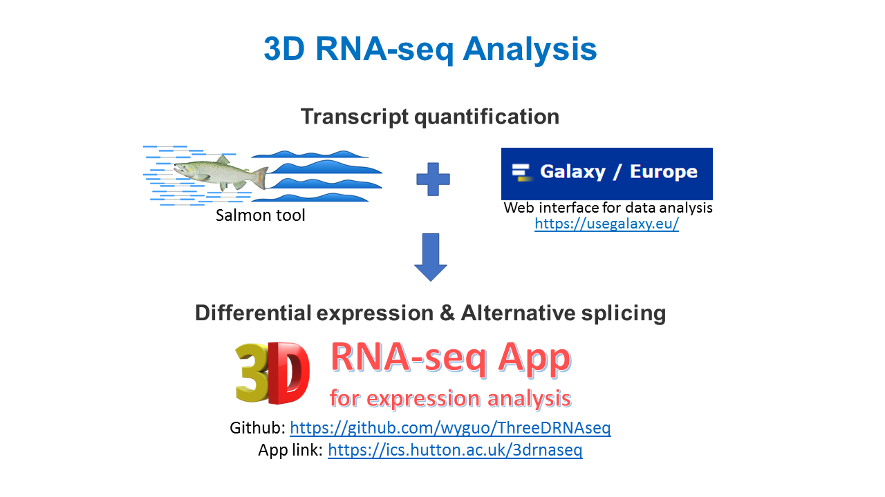](https://youtu.be/rqeXECX1-T4){target="_blank"}


<hr>

## Introduction 

The ThreeDRNAseq (3D RNA-seq) R package is designed for use by biologists to analyze their own RNA-seq data (Guo et al., 2019). It provides an interactive graphical user interface (GUI) for differential expression (DE), differential alternative splicing (DAS) and differential transcript usage (DTU) (3D) and changes of time-series trend analyses of RNA-seq data based on the popular pipeline limma (Ritchie et al., 2015). It also integrated transcript isoform switch tools, such as IsoKtsp (Sebestyen et al., 2015) and TSIS (Guo et al., 2017) for an enhanced alternative splicing analysis. The 3D RNA-seq removes all the unnecessary complexities associated with differential expression analysis and enables a complete RNA-seq analysis to be done quickly (3 Days, thus 3D). It allows complex experimental designs such as time-series, developmental series and multiple conditions. It employs state-of-the-art methods/statistics and generates 3D results quickly and accurately.

<br>
The 3D RNA-seq App was developed by Dr. Wenbin Guo from research into the analysis of time-series RNA-seq data (Calixto et al., 2018) with help from Dr. Cristiane Calixto and Dr. Nikoleta Tzioutziou and guidance from Prof. John W.S. Brown and Dr. Runxuan Zhang from the University of Dundee - School of Life Sciences and the James Hutton Institute - Information and Computational Sciences. We acknowledge Dr. Iain Milne and Gordon Stephen for technical support. 

**3D analysis pipeline**


<a href='#table-of-contents'>Go back to Table of contents</a>

## How to get help

### User manuals
3D RNA-seq App "easy-to-use" manual:

<a href="https://github.com/wyguo/ThreeDRNAseq/blob/master/vignettes/user_manuals/3D_RNA-seq_App_manual.md" target="_blank">https://github.com/wyguo/ThreeDRNAseq/blob/master/vignettes/user_manuals/3D_RNA-seq_App_manual.md</a>

### Tooltips
In the GUI, users can click tooltips  in specific steps for help information.

### Contact us
3D RNA-seq App is developed and maintained by Dr. Wenbin Guo from the Plant Sciences Division, School of Life Sciences, University of Dundee. If you have any questions and suggestions, please contact:

- Dr. Wenbin Guo: wenbin.guo@hutton.ac.uk 
- Dr. Runxuan Zhang: runxuan.zhang@hutton.ac.uk

<a href='#table-of-contents'>Go back to Table of contents</a>

## Run 3D RNA-seq App
### Shiny docker image (no installation)
The 3D RNA-seq App docker image is hosted by the James Hutton Institute server. Open the App by this link: <a href="https://ics.hutton.ac.uk/3drnaseq" target="_blank">https://ics.hutton.ac.uk/3drnaseq </a>


- To perform 3D analysis, no installation is required. Users need to upload input data to our server. All results, reports, figures and intermediate data will be zipped and downloaded in the final step.
- If you are working on RNA-seq data with very big size of transcript quantification ($\geq$ 2GB), it is recommended to remove the redundant files in the Salmon/Kallisto outputs (see <a href='#input-files'>Input files</a>) to reduce data size or run the 3D RNA-seq App through RStudio on a local PC.

### Shiny App through RStudio (R users, installation required)
To run the 3D RNA-seq App through RStudio on a local PC, users do not need to upload the data to our server and all the outputs will be directly saved to the App working directory. Please run the following command to install ThreeDRNAseq R package and the packages of dependencies. If any other R packages are missing in your PC, please install them. 

**_Install dependency packages_**


```r
#####################################################################################
## Install packages of dependency
###---> Install packages from Cran
cran.package.list <- c("shiny","shinydashboard","rhandsontable","shinyFiles",
                       "shinyjs","shinyBS","shinyhelper","shinyWidgets",
                       "magrittr","DT","plotly","ggplot2","eulerr",
                       "gridExtra","grid","fastcluster","rmarkdown",
                       "ggrepel","zoo","gtools")
for(i in cran.package.list){
   if(!(i %in% rownames(installed.packages()))){
     message('Installing package: ',i)
     install.packages(i)
   } else next
}

###---> Install packages from Bioconductor
bioconductor.package.list <- c('tximport','edgeR','limma','RUVSeq',
                               'ComplexHeatmap','rhdf5')
for(i in bioconductor.package.list){
  if (!requireNamespace("BiocManager", quietly = TRUE))
    install.packages("BiocManager")
  if(!(i %in% rownames(installed.packages()))){
    message('Installing package: ',i)
    BiocManager::install(i)
  } else next
}
```

**_Install ThreeDRNAseq R package_**

ThreeDRNAseq R package can be installed from Github by using <a href='https://cran.r-project.org/web/packages/devtools/index.html' target='_blank'>devtools</a> R package


```r
##################################################################################################
## use devtools R package to install ThreeDRNAseq from Github
###---> If devtools is not installed, please install
if(!requireNamespace("devtools", quietly = TRUE))
  install.packages('devtools',dependencies = TRUE)

###---> Install ThreeDRNAseq
if(!requireNamespace("ThreeDRNAseq", quietly = TRUE))
  devtools::install_github('wyguo/ThreeDRNAseq')
```

**_Run 3D RNA-seq App_**


```r
library(ThreeDRNAseq)
run3DApp()
```

### R command line (advanced R users, installation required)
The ThreeDRNAseq R package can be used as a normal R package. The vignette of command line for 3D analysis can be found in:

<a href="https://github.com/wyguo/ThreeDRNAseq/blob/master/vignettes/user_manuals/3D_RNA-seq_command_line_user_manual.md" target="_blank">https://github.com/wyguo/ThreeDRNAseq/blob/master/vignettes/user_manuals/3D_RNA-seq_command_line_user_manual.md</a>

<a href='#table-of-contents'>Go back to Table of contents</a>

## Input files
(1) Gather the meta-data of the experimental design in a csv spreadsheet, the columns of which must include the following information (<a href='#fig_input_csv'>Figure 1A</a>):

    - The first row is the header line of the meta-data table. 
    - A column of the factors or multiple columns of the factors of the experimental design.
    - A column of the biological replicate labels.
    - A column of the sequencing/technical replicate labels if they exist.
    - A column of the file names of transcript quantifications.

    **Note:** In the 3D RNA-seq analysis, users can select the experimental design information according to the column names in the header line. 

(2) A folder that contains the transcript quantification files. Each file contains transcript quantification data of a single sample. Read counts and TPMs for 3D analysis will be generated from (<a href='#fig_input_csv'>Figure 1B</a>): 
    
    - The "quant.sf" objects if these files are generated by Salmon command line (Patro et al., 2017).
    - The "abundance.tsv" objects if these files are generated by Kallisto (Bray et al., 2016).
    - The "xxx.tabular" objects with file extension ".tabular" if these files are generated by Salmon/Kallisto with Galaxy interface. Please go to the "Transcript quantification using Galaxy" manual for details: <a href=' https://github.com/wyguo/ThreeDRNAseq/blob/master/vignettes/user_manuals/Transcript_quantification_using_Galaxy.md' target='_blank'>https://github.com/wyguo/ThreeDRNAseq/blob/master/vignettes/user_manuals/Transcript_quantification_using_Galaxy.md</a>
    
    **Note**: The 3D analysis is executable in a computer with normal memory and CPU size. If the App is running on our server, it is recommended to reduce the data size to upload. Users can exclude all the files in sub-folders of transcript quantifications, except the files of "quant.sf" from Salmon command line. If the transcript quantifications are generated using Kallisto command line, users can keep "abundance.tsv" in the sub-folders and remove the other files (<a href='#fig_input_csv'>Figure 1B</a>). 


(3)	Transcript-gene association table. The file can be one of the following formats:

    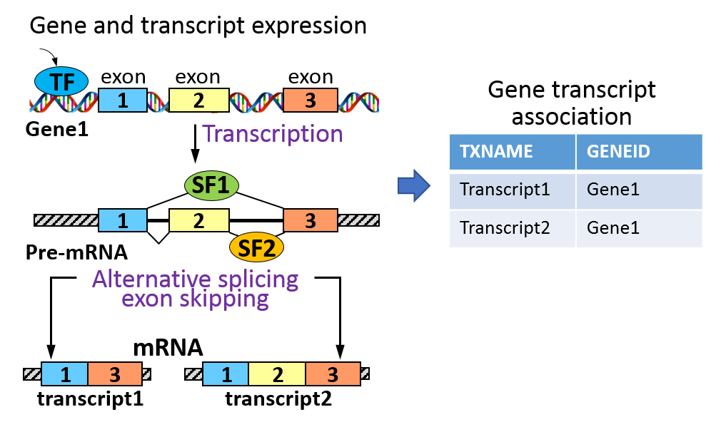{style="display: block; width: 50%; margin: 0 auto"}
    - "csv" spreadsheet with first column of transcript IDs and second column of gene IDs (<a href='#fig_input_csv'>Figure 1C</a>) (recommended).
    - Or the transcriptome sequence "fasta" file that has been used for transcript quantification with Salmon/Kallisto. Transcript names and gene IDs will be extracted the description line starting with ">" in the "fasta" file. However, if the "gene" tag in the discription line is missing, this file is invalid (<a href='#fig_input_csv'>Figure 1D</a>).
    - Or a "gtf" file of the transcriptome. Transcript names and gene IDs will be extracted from the "transcript_id" and "gene_id" tags in the last column, respectively (<a href='#fig_input_csv'>Figure 1E</a>). 


    **Note**: **Transcript-gene mapping in "csv" file is recommended**. Depending on the size, it may take a while to generate the table from a "fasta" or a "gtf" file and any missing tags for transcript name and gene ID extraction in these files may lead to errors.


<p id='fig_input_csv'><strong>Figure 1:</strong> Input files of 3D RNA-seq App. The example is from a RNA-seq study of Arabidopsis in respond to cold (Calixto et al., 2018). (A) Meta-data table of sample information in csv file. (B) The folder contains transcript quantifications. The input of transcript-gene mapping information can be a "csv" spreadsheet with first column of transcript names and second column of gene IDs (C), a ".fa" file (D) or a ".gtf" file (E) of the transcriptome. If a ".fa" or a ".gtf" file is provided, the App will extract transcript-gene association information with specific tags.</p>

<a href='#table-of-contents'>Go back to Table of contents</a>

## Output files
The results of the 3D RNA-seq analysis are saved in the App working directory in four folders:

(1)	"report" folder: the final report in html, pdf and word formats will be saved in the "report" folder.
(2)	"result" folder: the gene lists generated from DE, DAS and DTU analysis will be saved as csv files in the "result" folder.
(3)	"figure" folder: the figures generated and saves through the analysis will be saved in the "figure" folder.
(4)	"data" folder: the intermediate datasets of the analysis will be saved in the "data" folder in R data format (.RData). R users can open and process these objects in R software for a further personalized analysis.
The detailed descriptions of saved files can be found in "Appendix" at the end of the document.

## Example data
**Download link**:
<a href='https://www.dropbox.com/s/8vwuz6u2yl7v9qx/3D%20RNA-seq%20App%20example%20data.zip?dl=0' target='_blank'>https://www.dropbox.com/s/8fsceneq8jlegwi/3D_RNAseq_example_data.zip?dl=0</a>

**Description**:
This example is a sub-dataset from a time-series study of Arabidopsis plants exposed to cold (Calixto et al., 2018). RNA-seq data of 6 time-points were extracted from the whole dataset. The time-points are 3 and 6 hours after dusk at $20^oC$, the first day of transition to $4^oC$ and the fourth day of acclimation to $4^oC$ (red boxes in Figure 2). Each time-point has 3 biological replicates and each biological replicate has 3 sequencing replicates. Transcript quantifications were generated using Salmon (Patro et al., 2017) and AtRTD2-QUASI (Zhang et al., 2017) as the reference transcriptome. To further reduce the data size, the expression of  8,944 transcripts (from 2,000 genes) were extracted from the Salmon quantification to identify the cold response genes and transcripts at both transcriptional and AS level.


<p id='fig_example_exp'><strong>Figure 2:</strong> Experimental design of time-series RNA-seq data from study of Arabidopsis cold response. For this example, a subset of samples, genes and transcripts were extracted from the whole dataset to reduce data size.</p>

<a href='#table-of-contents'>Go back to Table of contents</a>

## Run analysis on 3D App
### Basic Workflow
3D RNA-seq App is made of control widgets that users can interact with and send messages to the underlying R code to perform analysis by simple clicking/dragging of the mouse (<a href='#fig_basic_structure'>Figure 3</a>). 


<p id='fig_basic_structure.png'><strong>Figure 3:</strong> Basic widgets of 3D RNA-seq App. </a>

Running 3D RNA-seq just requires users to follow the steps from Tab panel 1 to 7. 

### Tab panel 1: Data generation
Users can upload input files and experimental design metadata file in this tab panel. Transcript level and gene level read counts and TPMs (transcript per million reads) are generated by using the tximport R package (Soneson et al., 2016).

<u><strong>Step 1: Upload input files to 3D RNA-seq App.</strong></u>


<br>
<u><strong>Step 2: Select the columns of factors, labels of replicates and quantification file names from meta-data table for 3D analysis.</strong></u>

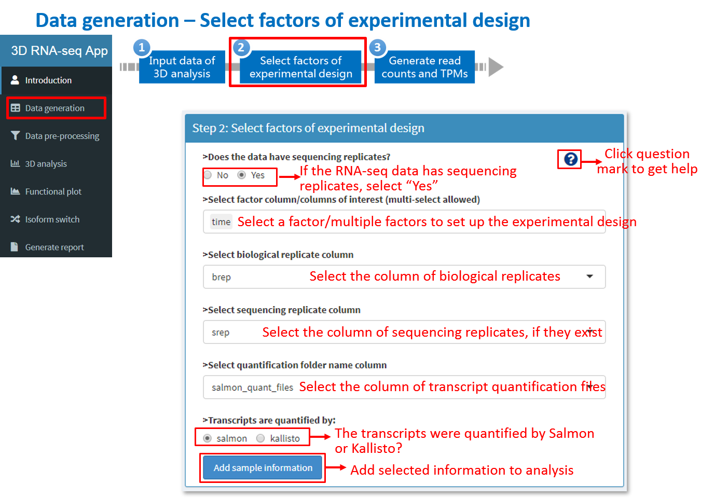

<br>
<u><strong>Step 3: Generate gene and transcript read counts and TPMs.</strong></u>


When the button "Run" is clicked, the process currently running will be shown at the lower right corner of the web browser. Once it is done, you can move to Tab panel 2 using the navigation menu on the left and make sure you roll your page to the very top. 

<a href='#table-of-contents'>Go back to Table of contents</a>

### Tab panel 2: Data pre-processing
Once the read counts and TPMs are generated, the data will go through a number of pre-processing steps. In each step, quality control plots are generated to optimise the parameters for pre-processing. If the RNA-seq data has sequencing replicates (seq-reps), they will be merged before 3D analysis according to the seq-rep labels selected by users in the meta-data table to increase sequencing depth, because seq-reps are generated by sequencing the same biological replicate multiple times (e.g. on different sequencing lanes), but they do not add much variability to the biological replicates. 

<u><strong>Step 4: Filter low expressed transcripts and genes based on expression mean-variance trend.</u></strong>

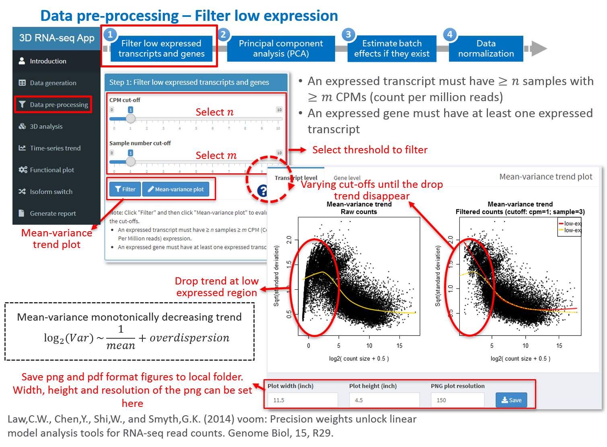

<br>
<u><strong>Step 5: PCA plot and removing batch effects.</u></strong>

The PCA plot can be used to visualise the main variations of the expression data and identify whether the RNA-seq data contains batch effects, which are caused by biological replications being prepared in different, for example, laboratory conditions

In this panel, users can select and visualise different PCs based on transcript level or gene level expression of all samples or the average expression of biological replicates. The scatter points can be grouped and coloured according to different factors. Ellipses or polygons can be added to the plots to highlight the grouped clusters.

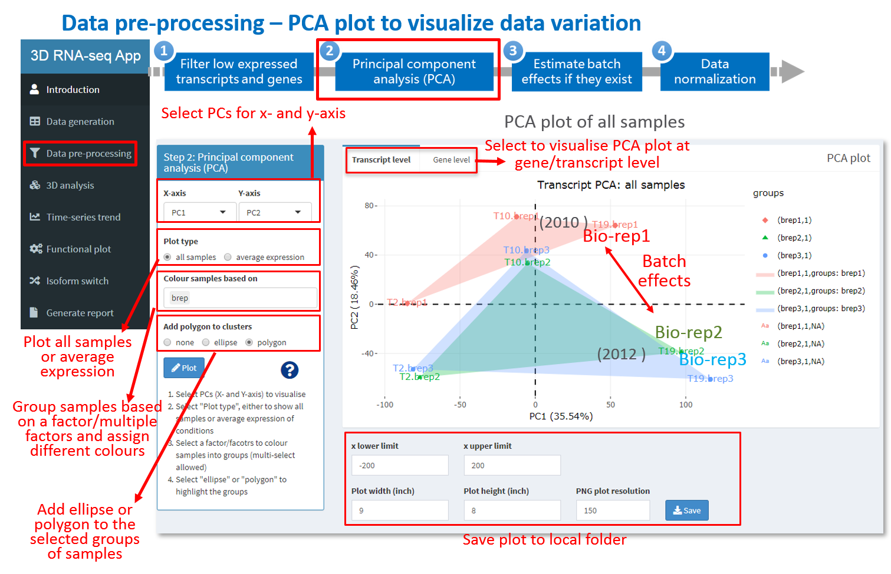
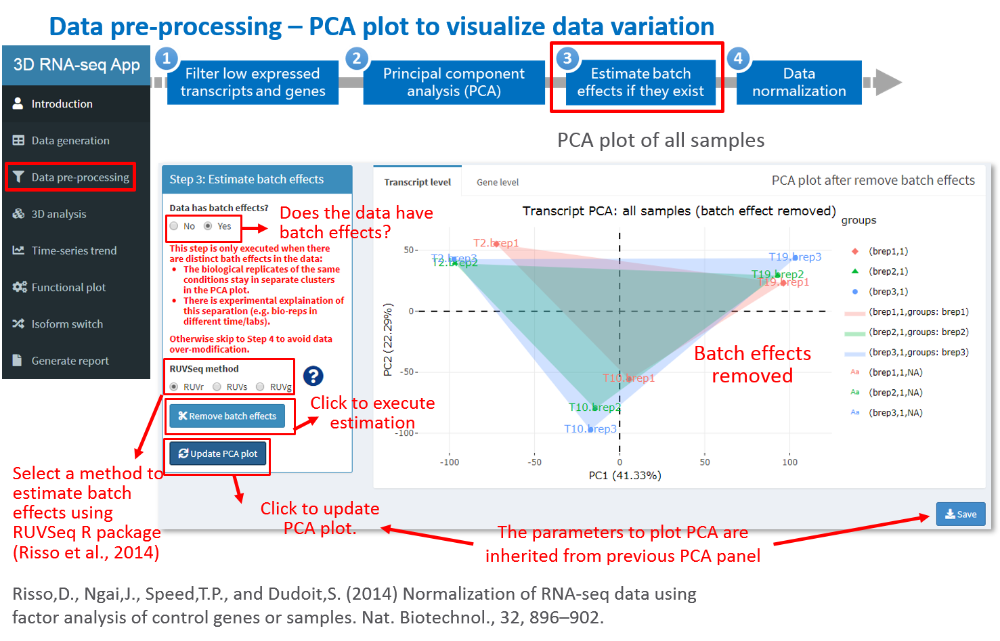

<u><strong>Step 6: Data normalisation.</u></strong>

For unbiased comparisons across samples, read counts must be normalised. Normalisation methods such as Trimmed Mean of M-values (TMM), Relative Log Expression (RLE) and upper-quartile can be used to reduce the effect from the systematic technical biases across samples (Bullard et al., 2010). Box plots are used to visualise the expression distribution of raw read counts and normalised expression across samples.

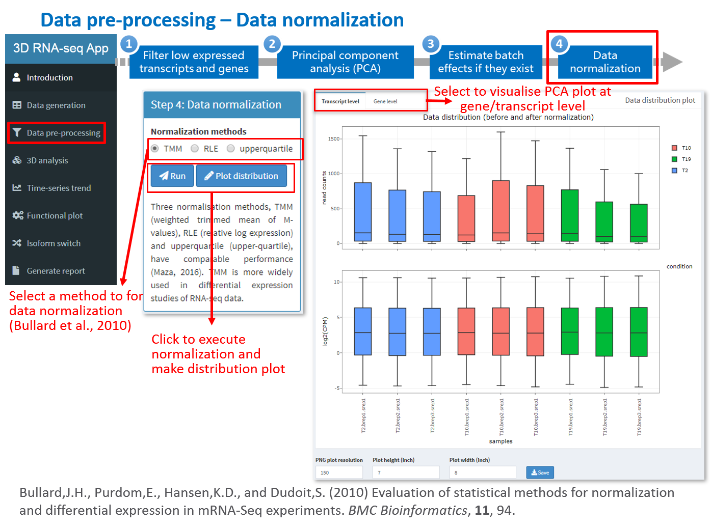

Once the normalization is done as shown at the lower right corner on the browser, please proceed to Tab panel 3. 

<a href='#table-of-contents'>Go back to Table of contents</a>

### Tab panel 3: 3D analysis
<u><strong>Step 7:  Set contrast groups and perform 3D analysis.</u></strong>

A contrast group is a user-defined comparison between two samples or two groups of samples:

(1)	Pair-wise comparison of samples: e.g. B-A compares group B to group A; C-B compares group C to group B (Figure A).
(2)	Compare mean of multiple samples: e.g. (WT.A+WT.B)/2-(MU.A+MU.B)/2 compares the mean of group WT.A and WT.B to the mean of group MU.A and MU.B (Figure B).
(3)	Compare difference of two differences (interactions): e.g. (WT.A-WT.B)-(MU.A-MU.B) compares the difference ($L_2FC$) of group WT.A and WT.B to the difference ($L_2FC$) of group MU.A and MU.B (Figure B).


**NOTE**: if the experimental design involves multiple factor levels, e.g. condition A, B and C are performed in wildtype (WT) and mutant (MU), respectively, these factors will be combined to generate group labels 

<br>
<u><strong>Step 8: Set statistical parameters and perform 3D analysis </u></strong>


**Significant result summary**

After the  the 3D analysis, the following information is summarized and will appear at the bottom of the page:

(1) The test statistics in different contrast groups, e.g. adjusted p-value and $L_2FC$.
(2) The number of genes and transcripts with significant expression changes in contrast groups.
(3) The number of up- and down-regulated DE genes and transcripts.
(4) The numbers of genes/transcripts regulated only by transcription (DE), only by alternative splicing (DAS/DTU) and by both transcription and alternative splicing (DE+DAS/DE+DTU).

These summaries can be filtered, customized and the figures can be generated and saved with specified formats and sizes.


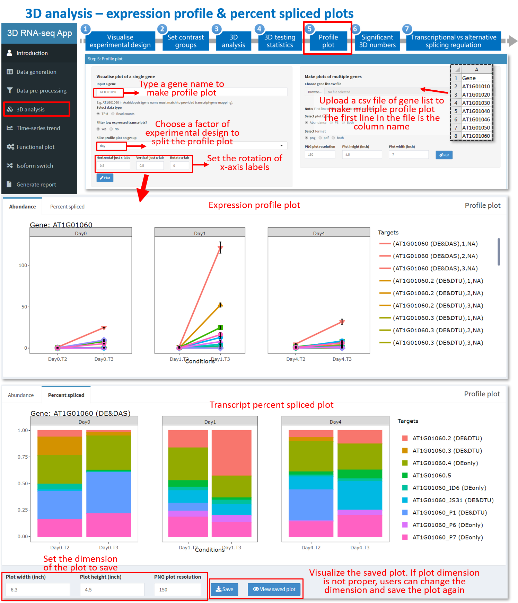


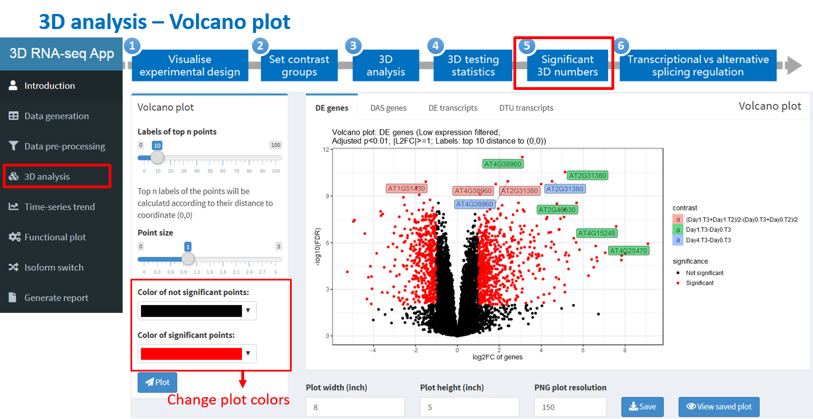


<a href='#table-of-contents'>Go back to Table of contents</a>

### Tab panel 4: Time-series trend analysis
Time-series trend analysis aims to study an experiment with many time-points in each group (see the following table). When there are many time-points, it is recommended to analyse on smoothed expression changes over time instead of discrete comparisons of individual time-points in each group. 

| Day  | Time |
|------|------|
| Day1 | T1   |
| Day1 | T2   |
| Day1 | T3   |
| Day1 | T4   |
| Day2 | T1   |
| Day2 | T2   |
| Day2 | T3   |
| Day2 | T4   |

<u><strong>Step 9: Whether to perform time-series trend analysis.</u></strong>

Select whether to perform time-series trend analysis. If "No", please skip this panel. 


<u><strong>Step 10: Time-series experimental design.</u></strong>

  (1) Select the columns of time-points and grouping of time-points according to the header information of the metadata table. 
  (2) Select whether to use spline method to smooth the expression changes over time-points and the degree to use for the spline (<a href='https://en.wikipedia.org/wiki/Spline_(mathematics)' target='_blank'>https://en.wikipedia.org/wiki/Spline_(mathematics)></a>). . If "No" is selected, trend will be compared in the way of discrete jumping from one to another time-point in each group.

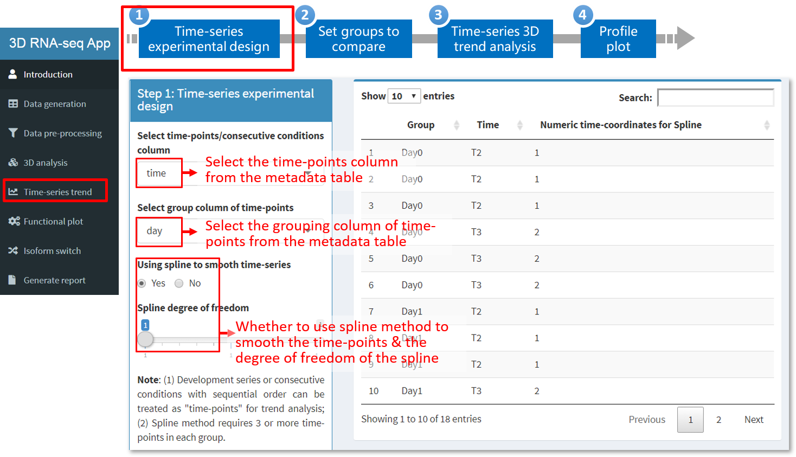

<u><strong>Step 11: Set groups to compare </u></strong>

Select multiple groups for comparisons of time-series expression change trends between these groups. User can add a line to activate a new comparison.


<u><strong>Step 12: 3D analysis of time-series trend </u></strong>

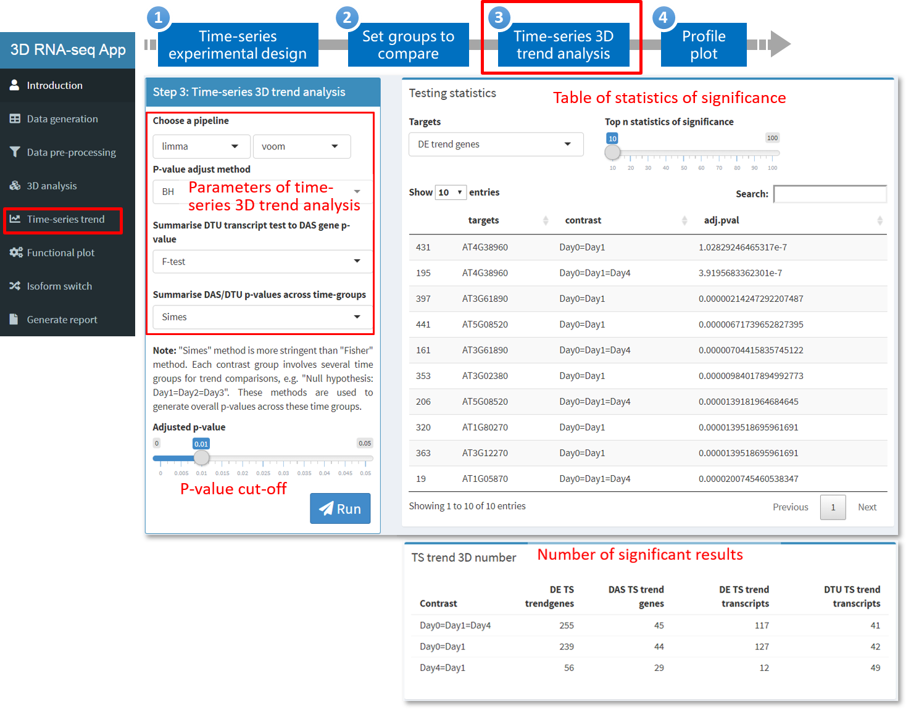

<a href='#table-of-contents'>Go back to Table of contents</a>

### Tab panel 5: Functional plot
<u><strong>Step 13: Generating heat-maps.</u></strong>

Users can make heat-maps of significant DE genes, DAS genes, DE transcripts and DTU transcripts identified from the analysis. The heat-maps and the gene/transcript list in each cluster of the heat-maps can be saved to local folder.


<br>

<u><strong>Step 14: Generating GO enrichment plot.</u></strong>

Users can generate gene lists of DE genes, DAS genes, DE transcripts and DTU transcripts by clicking "Download gene list" button. These gene lists can be uploaded to Gene Ontology (GO) analysis tools/databases (e.g. DAVID and agriGO) to generate GO annotation. A csv file with GO annotation information is required to generate the annotation plot. The file includes a column of "Category" of CC (cellular component), BP (biological process) and MF (molecular function), a column of "Term" of GO annotation and the rest columns of statistics to report the annotation enrichment, e.g. count, -log10(FDR), etc.


<a href='#table-of-contents'>Go back to Table of contents</a>

### Tab panel 6: Isoform switch
Transcript isoform switches (ISs) occur when within a gen a pair of alternatively spliced isoforms reverse the order of their relative expression levels. **IsokTSP** is a method to detect transcript ISs between pair-wise conditions (Sebestyen et al., 2015) while **TSIS** (time-series IS) is used to identify ISs in time-series data (Guo et al., 2017).


<br>
<u><strong>Step 15: Perform isoform switch analysis.</u></strong>


<br>
After the analysis is done, a number of plots will be generated automatically to visualize the results.


### Tab panel 7: Generate report

<u><strong>Step 16: generate report and download all the results.</u></strong>

Publication-quality reports will generated and together with figures, results and statistics of significance can be downloaded in a zipped file.


<a href='#table-of-contents'>Go back to Table of contents</a>

## Appendix
<p id='supplementary_materials'>
### Files in report folder
Reports are saved in report folder.

| File name              | Description                                       |
|------------------------|---------------------------------------------------|
| 3D_report.pdf/html/doc | Report of 3D analysis in pdf, html and doc format |


### Files in figure folder

| File names   (alphabetical)                                 | Description                                                                    |
|-------------------------------------------------------------|--------------------------------------------------------------------------------|
| DAS genes euler plot across   contrast*.pdf/.png            | Euler diagram to compare DAS genes in different contrast groups                |
| DAS genes GO annotation plot.pdf/.png                       | DAS genes GO annotation plot                                                   |
| DE genes euler plot across   contrast*.pdf/.png             | Euler diagram to compare DE genes in different contrast groups                 |
| DE genes GO annotation plot.pdf/.png                        | DE genes GO annotation plot                                                    |
| DE genes up and down regulation   numbers.pdf/.png          | DE genes up and down regulation numbers                                        |
| DE transcripts euler plot across   contrast*.pdf/.png       | Euler diagram to compare DE transcripts in different contrast groups           |
| DE transcripts up and down regulation   numbers.pdf/.png    | DE transcripts up and down regulation numbers                                  |
| DE vs DAS gene euler plot in   contrast*.pdf/.png           | Euler diagram to compare DE and DAS genes in different contrast groups         |
| DE vs DTU transcript euler plot in   contrast*.pdf/.png     | Euler diagram to compare DE and DTU transcripts in different contrast   groups |
| DTU transcripts euler plot across   contrast*.pdf/.png      | Euler diagram to compare DTU transcripts in different contrast groups          |
| Gene expression distribution.pdf/.png                       | Gene expression distribution                                                   |
| Gene mean-variance trend.pdf/.png                           | Gene mean-variance trend plot                                                  |
| Gene PCA all samples*.pdf/.png                              | Gene PCA plot of all samples                                                   |
| Gene PCA average expression.pdf/.png                        | Gene PCA plot of average expression                                            |
| Gene PCA batch effect removed all   samples*.pdf/.png       | Gene PCA plot of all samples after removing batch effects                      |
| Heatmap DAS genes.pdf/.png                                  | Heat-map of DAS genes                                                          |
| Heatmap DE genes.pdf/.png                                   | Heat-map of DE genes                                                           |
| Heatmap DE transcripts.pdf/.png                             | Heat-map of DE transcripts                                                     |
| Heatmap DTU transcripts.pdf/.png                            | Heat-map of DTU transcripts                                                    |
| Isoform   switch number.png/.pdf                            | Number of   significant isoform switch numbers                                 |
| Profile/Abundance/PS plots                                  | Folders contain gene/transcript profile plots                                  |
| Transcript expression   distribution.pdf/.png               | Transcript expression distribution                                             |
| Transcript mean-variance trend.pdf/.png                     | Transcript mean-variance trend plot                                            |
| Transcript PCA all samples*.pdf/.png                        | Transcript PCA plot of all samples                                             |
| Transcript PCA average   expression.pdf/.png                | Transcript PCA plot of average expression                                      |
| Transcript PCA batch effect removed all   samples*.pdf/.png | Transcript PCA plot of all samples after removing batch   effects              |
| Union set DE genes vs DAS genes.pdf/.png                    | Flow chart -Union set DE genes vs DAS genes                                    |
| Union set DE transcripts vs DTU   transcripts.pdf/.png      | Flow chart -Union set DE transcripts vs DTU transcripts                        |

### Files in result folder
Important results are saved in csv (comma delimited) files.

| File names (alphabetical)                                                                                                         
| Description                                                                                                                                                  |
|-------------------------------------------------------------------------------------------------------------------------|--------------------------------------------------------------------------------------------------------------------------------------------------------------|
| contrast.csv                                                                                                            | Contrast   groups used for 3D analysis.                                                                                                                      |
| DDD genes and transcript lists across   all contrast groups.csv                                                         | List   of DE genes, DAS genes, DE transcripts and DTU transcripts, which are the   union sets across all contrast groups.                                    |
| DDD numbers.csv                                                                                                         | DE/DAS/DTU   genes/transcript numbers in each contrast group.                                                                                                |
| DE genes/DAS genes/DE transcripts/DTU   transcripts testing statistics.csv                                              | DAS   genes/DE genes/DE transcripts/DTU transcripts test statistics, including not   significant results.                                                    |
| DEvsDAS/DEvsDTU results.csv                                                                                             | Number of DE vs DAS genes/DE vs DTU transcripts.                                                                                                             |
| Gene read counts.csv                                                                                                    | Raw   read counts of genes before data pre-processing.                                                                                                       |
| Gene TPM.csv                                                                                                            | Raw   TPM of genes before data pre-processing.                                                                                                               |
| Raw isoform switch scores.csv                                                                                           | Statistics   of all possible isoform switches, including not significant results.                                                                            |
| RNAseq info.csv                                                                                                         | RNA-seq   data information before and after pre-processing.                                                                                                  |
| samples.csv                                                                                                             | Meta-data   table of sample information.                                                                                                                     |
| Significant DE genes/DAS genes/DE   transcripts/DTU transcripts list and statistics.csv                                 | Significant DE genes/DAS genes/DE   transcripts/DTU transcripts test statistics; not significant results are   filtered.                                     |
| Significant isoform switch scores.csv                                                                                   | Statistics   of significant isoform switches.                                                                                                                |
| Significant TS DAS trend gene/DE trend   gene/DE trend transcript/DTU trend transcript list and statistics.csv          | Significant   time-series DE trend genes/DAS trend genes/DE trend transcripts/DTU trend   transcripts test statistics; not significant results are filtered. |
| Target in each cluster heatmap DE   genes.csv                                                                           | DE gene lists of individual clusters of the heatmap                                                                                                          |
| Target in each cluster heatmap DE   transcripts.csv                                                                     | DE transcript  lists of individual   clusters of the heatmap                                                                                                 |
| Target in each cluster heatmap DE+DAS   genes (DAS only are filtered).csv                                               | DE+DAS gene lists of individual clusters of the heatmap; DAS only are   filtered                                                                             |
| Target in each cluster heatmap DE+DTU   transcripts (DTU only are filtered).csv                                         | DE+DTU transcript  lists of   individual clusters of the heatmap; DAS only are filtered                                                                      |
| Target in each cluster heatmap TS DAS   trend genes in contrast All.csv                                                 | TS DAS trend gene lists of individual clusters of the heatmap                                                                                                |
| Target in each cluster heatmap TS DE   trend genes in contrast All.csv                                                  | TS DE trend gene lists of individual clusters of the heatmap                                                                                                 |
| Target in each cluster heatmap TS DE   trend transcripts in contrast All.csv                                            | TS DE trend transcript lists of individual clusters of the heatmap                                                                                           |
| Target in each cluster heatmap TS DTU   trend transcripts in contrast All.csv                                           | TS DTU trend transcript lists of individual clusters of the heatmap                                                                                          |
| Transcript and gene mapping.csv                                                                                         | Transcript-gene   association table.                                                                                                                         |
| Transcript read counts.csv                                                                                              | Raw   read counts of transcripts before data pre-processing.                                                                                                 |
| Transcript TPM.csv                                                                                                      | Raw   TPM of transcripts before data pre-processing.                                                                                                         |
| TS DE trend genes/TS DAS   trend genes/TS DE trend transcripts/TS DTU trend transcripts testing adjusted   p-values.csv | Adjusted p-values of time-series 3D trend   testing, including not significant results.                                                                      |

### Files in data folder
Intermediate data in .RData for 3D RAN-seq analysis are saved in the data folder. There are three .RData objects: 1) txi_trans.RData and 2) txi_genes.RData are transcript and gene level read count and TPM outputs from the tximport R package (Soneson et al., 2016). All the intermediate data generated in the process of 3D analysis is saved in the list object intermediate_data.RData. R users can access to the data using command line. 

| List   object                       | Elements in list object | Element type | Description                                                                                                                                                                                                                                                                                               |
|-------------------------------------|-------------------------|--------------|-----------------------------------------------------------------------------------------------------------------------------------------------------------------------------------------------------------------------------------------------------------------------------------------------------------|
| intermediate_data.RData             | conditions              | character    | Labels of   conditions to study                                                                                                                                                                                                                                                                           |
|                                     | contrast                | character    | Contrast   groups                                                                                                                                                                                                                                                                                         |
|                                     | DAS_genes               | data.frame   | Statistics of   significant DTU transcripts                                                                                                                                                                                                                                                               |
|                                     | DDD_numbers             | data.frame   | Number of   DE/DAS/DTU genes/transcripts in contrast groups                                                                                                                                                                                                                                               |
|                                     | DE_genes                | data.frame   | Statistics of   significant DE genes                                                                                                                                                                                                                                                                      |
|                                     | DE_trans                | data.frame   | Statistics of   significant DE transcripts                                                                                                                                                                                                                                                                |
|                                     | deltaPS                 | data.frame   | Delta PS   based on contrast groups                                                                                                                                                                                                                                                                       |
|                                     | DEvsDAS_results         | data.frame   | Number of DE   vs DAS genes                                                                                                                                                                                                                                                                               |
|                                     | DEvsDTU_results         | data.frame   | Number of DE   vs DTU transcripts                                                                                                                                                                                                                                                                         |
|                                     | DTU_trans               | data.frame   | Statistics of   significant DTU transcripts                                                                                                                                                                                                                                                               |
|                                     | genes_3D_stat           | list         | All the raw   results of linear regression and statistics of DE genes                                                                                                                                                                                                                                     |
|                                     | genes_batch             | list         | Estimated   gene level batch effects, if they exist. 1) W: matrix, estimated batch effect   term, which can be added to design matrix of linear regression; 2)   normalizedCounts: matrix, read counts where batch effects are removed; 3)   method: a string, method used to estimate batch effects.     |
|                                     | genes_counts            | data.frame   | Read counts   of genes. Seq-reps are merged if exist.                                                                                                                                                                                                                                                     |
|                                     | genes_log2FC            | matrix       | log2-CPM of   genes                                                                                                                                                                                                                                                                                       |
|                                     | genes_TPM               | matrix       | TPMs of genes                                                                                                                                                                                                                                                                                             |
|                                     | mapping                 | data.frame   | Transcript-gene   mapping                                                                                                                                                                                                                                                                                 |
|                                     | params_list             | list         | Parameters   used for the 3D analysis                                                                                                                                                                                                                                                                     |
|                                     | PS                      | matrix       | Percent   spliced (PS) of expressed transcripts                                                                                                                                                                                                                                                           |
|                                     | RNAseq_info             | data.frame   | RNA-seq data   information before and after pre-processing                                                                                                                                                                                                                                                |
|                                     | samples                 | data.frame   | Sample   information.                                                                                                                                                                                                                                                                                     |
|                                     | samples_new             | data.frame   | Sample   information after merging sequencing replicates (seq-reps, if exist).                                                                                                                                                                                                                            |
|                                     | scores                  | data.frame   | Statistics of   isoform switches                                                                                                                                                                                                                                                                          |
|                                     | scores_filtered         | data.frame   | Statistics of   significant isoform switches                                                                                                                                                                                                                                                              |
|                                     | target_high             | list         | 1)   trans_high: character, expressed transcripts; 2) genes_high: character,   expressed genes; 3) mapping_high: data.frame, expressed transcript-gene   mapping                                                                                                                                          |
|                                     | trans_3D_stat           | list         | All the raw   results of linear regression and statistics of DAS genes, DE and DTU   transcripts                                                                                                                                                                                                          |
|                                     | trans_batch             | list         | Estimated   transcript level batch effects, if they exist. 1) W: matrix, estimated batch   effect term, which can be added to design matrix of linear regression; 2)   normalizedCounts: matrix, read counts where batch effects are removed; 3)   method: string, method used to estimate batch effects. |
|                                     | trans_counts            | data.frame   | Read counts   of transcripts. Seq-reps are merged if exist.                                                                                                                                                                                                                                               |
|                                     | trans_log2FC            | matrix       | log2-CPM of   transcripts.                                                                                                                                                                                                                                                                                |
|                                     | trans_TPM               | matrix       | TPMs of   transcripts.                                                                                                                                                                                                                                                                                    |
|                                     | Other   elements        |              | The list   object may include other elements.                                                                                                                                                                                                                                                             |
| txi_genes.Rdata and txi_trans.Rdata | abundance               | matrix       | TPMs of   genes/transcripts                                                                                                                                                                                                                                                                               |
|                                     | counts                  | matrix       | Read counts   of genes/transcripts                                                                                                                                                                                                                                                                        |
|                                     | countsFromAbundance     | character    | Method used   to generate read counts and TPMs                                                                                                                                                                                                                                                            |
|                                     | length                  | matrix       | Length of   genes/transcripts                                                                                                                                                                                                                                                                             |


## References
Benjamini,Y. and Yekutieli,D. (2001) The control of the false discovery rate in multiple testing under dependency. Ann. Stat., 29, 1165–1188.

Bray,N.L., Pimentel,H., Melsted,P., and Pachter,L. (2016) Near-optimal probabilistic RNA-seq quantification. Nat. Biotechnol., 34, 525–527.

Bullard,J.H., Purdom,E., Hansen,K.D., and Dudoit,S. (2010) Evaluation of statistical methods for normalization and differential expression in mRNA-Seq experiments. BMC Bioinformatics, 11, 94.

Calixto,C.P.G., Guo,W., James,A.B., Tzioutziou,N.A., Entizne,J.C., Panter,P.E., Knight,H., Nimmo,H., Zhang,R., and Brown,J.W.S. (2018) Rapid and dynamic alternative splicing impacts the Arabidopsis cold response transcriptome. Plant Cell, tpc.00177.2018.

Gu,Z., Eils,R., and Schlesner,M. (2016) Complex heatmaps reveal patterns and correlations in multidimensional genomic data. Bioinformatics, 32, 2847–2849.

Guo,W., Calixto,C.P.G., Brown,J.W.S., and Zhang,R. (2017) TSIS: An R package to infer alternative splicing isoform switches for time-series data. Bioinformatics, 33, 3308–3310.

Guo,W., Tzioutziou,N., Stephen,G., Milne,I., Calixto,C., Waugh,R., Brown,J.W., and Zhang,R. (2019) 3D RNA-seq - a powerful and flexible tool for rapid and accurate differential expression and alternative splicing analysis of RNA-seq data for biologists. bioRxiv, 656686. doi: https://doi.org/10.1101/656686.

Law,C.W., Chen,Y., Shi,W., and Smyth,G.K. (2014) voom: Precision weights unlock linear model analysis tools for RNA-seq read counts. Genome Biol, 15, R29.

Patro,R., Duggal,G., Love,M.I., Irizarry,R.A., and Kingsford,C. (2017) Salmon provides fast and bias-aware quantification of transcript expression. Nat. Methods, 14, 417–419.

Risso,D., Ngai,J., Speed,T.P., and Dudoit,S. (2014) Normalization of RNA-seq data using factor analysis of control genes or samples. Nat. Biotechnol., 32, 896–902.

Ritchie,M.E., Phipson,B., Wu,D., Hu,Y., Law,C.W., Shi,W., and Smyth,G.K. (2015) limma powers differential expression analyses for RNA-sequencing and microarray studies. Nucleic Acids Res, 43, e47.

Rokach,L. and Maimon,O. (2005) Clustering Methods. In, Data Mining and Knowledge Discovery Handbook. Springer-Verlag, New York, pp. 321–352.

Saracli,S., Dogan,N., and Dogan,I. (2013) Comparison of hierarchical cluster analysis methods by cophenetic correlation. J. Inequalities Appl.

Soneson,C., Love,M.I., and Robinson,M.D. (2016) Differential analyses for RNA-seq: transcript-level estimates improve gene-level inferences. F1000Research, 4, 1521.

Zhang,R., Calixto,C.P.G., Marquez,Y., Venhuizen,P., Tzioutziou,N.A., Guo,W., Spensley,M., Entizne,J.C., Lewandowska,D., Have,S. Ten, Frey,N.F., Hirt,H., James,A.B., Nimmo,H.G., Barta,A., Kalyna,M., and Brown,J.W.S. (2017) A high quality Arabidopsis transcriptome for accurate transcript-level analysis of alternative splicing. Nucleic Acids Res., 45, 5061-5073.

## Session information


```
## R version 3.5.1 (2018-07-02)
## Platform: x86_64-w64-mingw32/x64 (64-bit)
## Running under: Windows >= 8 x64 (build 9200)
## 
## Matrix products: default
## 
## locale:
## [1] LC_COLLATE=English_United Kingdom.1252 
## [2] LC_CTYPE=English_United Kingdom.1252   
## [3] LC_MONETARY=English_United Kingdom.1252
## [4] LC_NUMERIC=C                           
## [5] LC_TIME=English_United Kingdom.1252    
## 
## attached base packages:
##  [1] stats4    parallel  grid      stats     graphics  grDevices utils    
##  [8] datasets  methods   base     
## 
## other attached packages:
##  [1] ggrepel_0.8.1               base64enc_0.1-3            
##  [3] ComplexHeatmap_2.1.0        RUVSeq_1.16.1              
##  [5] EDASeq_2.16.3               ShortRead_1.40.0           
##  [7] GenomicAlignments_1.18.1    SummarizedExperiment_1.12.0
##  [9] DelayedArray_0.8.0          matrixStats_0.55.0         
## [11] Rsamtools_1.34.1            GenomicRanges_1.34.0       
## [13] GenomeInfoDb_1.18.2         Biostrings_2.50.2          
## [15] XVector_0.22.0              IRanges_2.16.0             
## [17] S4Vectors_0.20.1            BiocParallel_1.16.6        
## [19] Biobase_2.42.0              BiocGenerics_0.28.0        
## [21] edgeR_3.24.3                limma_3.38.3               
## [23] tximport_1.10.1             rmarkdown_1.15             
## [25] fastcluster_1.1.25          gridExtra_2.3              
## [27] eulerr_5.1.0                plotly_4.9.0               
## [29] ggplot2_3.2.1               DT_0.9                     
## [31] magrittr_1.5                shinyWidgets_0.4.9         
## [33] shinyhelper_0.3.1           shinyBS_0.61               
## [35] shinyjs_1.0                 shinyFiles_0.7.3           
## [37] rhandsontable_0.3.7         shinydashboard_0.7.1       
## [39] shiny_1.3.2                
## 
## loaded via a namespace (and not attached):
##   [1] backports_1.1.4        circlize_0.4.8         aroma.light_3.12.0    
##   [4] plyr_1.8.4             lazyeval_0.2.2         polylabelr_0.1.0      
##   [7] splines_3.5.1          crosstalk_1.0.0        digest_0.6.20         
##  [10] htmltools_0.3.6        rsconnect_0.8.15       memoise_1.1.0         
##  [13] cluster_2.1.0          readr_1.3.1            annotate_1.60.1       
##  [16] R.utils_2.9.0          prettyunits_1.0.2      colorspace_1.4-1      
##  [19] blob_1.2.0             xfun_0.9               dplyr_0.8.3           
##  [22] crayon_1.3.4           RCurl_1.95-4.12        jsonlite_1.6          
##  [25] genefilter_1.64.0      zeallot_0.1.0          zoo_1.8-6             
##  [28] survival_2.44-1.1      glue_1.3.1             polyclip_1.10-0       
##  [31] gtable_0.3.0           zlibbioc_1.28.0        GetoptLong_0.1.7      
##  [34] shape_1.4.4            scales_1.0.0           DESeq_1.34.1          
##  [37] DBI_1.0.0              Rcpp_1.0.2             viridisLite_0.3.0     
##  [40] xtable_1.8-4           progress_1.2.2         clue_0.3-57           
##  [43] bit_1.1-14             htmlwidgets_1.3        httr_1.4.1            
##  [46] RColorBrewer_1.1-2     pkgconfig_2.0.2        XML_3.98-1.20         
##  [49] R.methodsS3_1.7.1      locfit_1.5-9.1         labeling_0.3          
##  [52] tidyselect_0.2.5       rlang_0.4.0            reshape2_1.4.3        
##  [55] later_0.8.0            AnnotationDbi_1.44.0   munsell_0.5.0         
##  [58] tools_3.5.1            RSQLite_2.1.2          evaluate_0.14         
##  [61] stringr_1.4.0          yaml_2.2.0             knitr_1.25            
##  [64] bit64_0.9-7            fs_1.3.1               purrr_0.3.2           
##  [67] mime_0.7               R.oo_1.22.0            biomaRt_2.38.0        
##  [70] compiler_3.5.1         rstudioapi_0.10        png_0.1-7             
##  [73] tibble_2.1.3           geneplotter_1.60.0     stringi_1.4.3         
##  [76] highr_0.8              GenomicFeatures_1.34.8 lattice_0.20-38       
##  [79] Matrix_1.2-17          vctrs_0.2.0            pillar_1.4.2          
##  [82] lifecycle_0.1.0        GlobalOptions_0.1.0    data.table_1.12.2     
##  [85] bitops_1.0-6           httpuv_1.5.2           rtracklayer_1.42.2    
##  [88] R6_2.4.0               latticeExtra_0.6-28    hwriter_1.3.2         
##  [91] promises_1.0.1         gtools_3.8.1           MASS_7.3-51.4         
##  [94] assertthat_0.2.1       rjson_0.2.20           withr_2.1.2           
##  [97] GenomeInfoDbData_1.2.0 hms_0.5.1              tidyr_1.0.0           
## [100] Cairo_1.5-10
```

</div>
