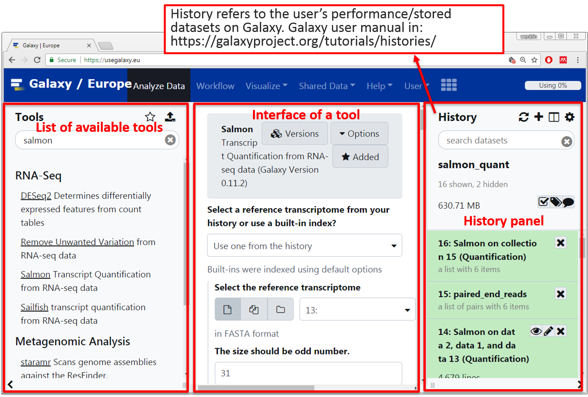
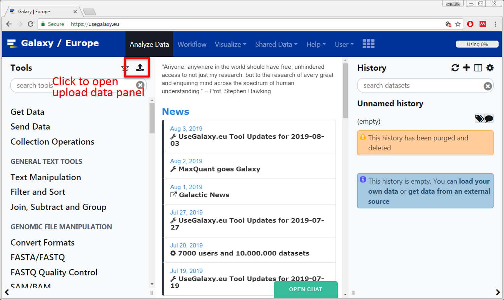
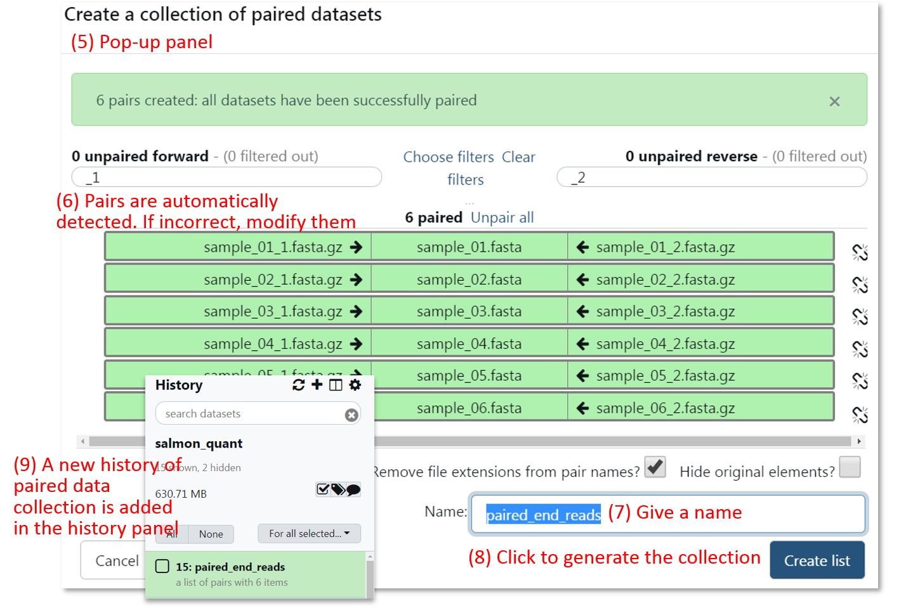
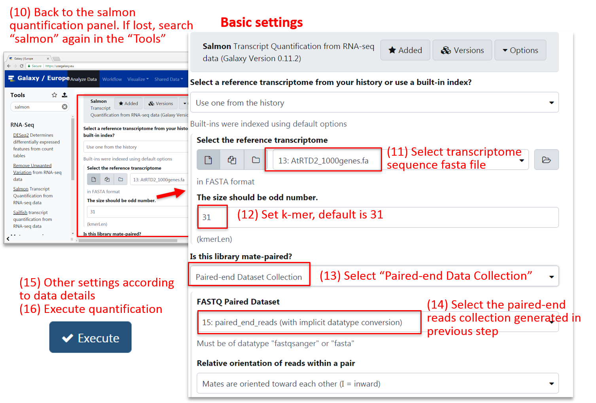
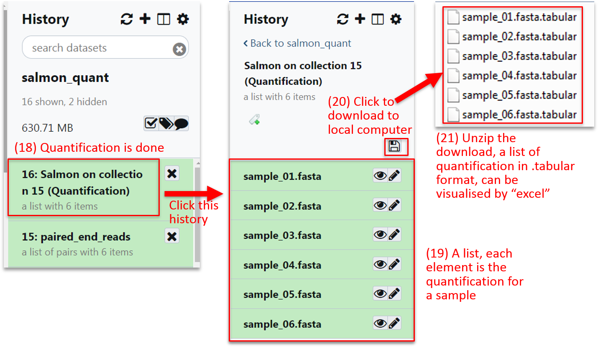
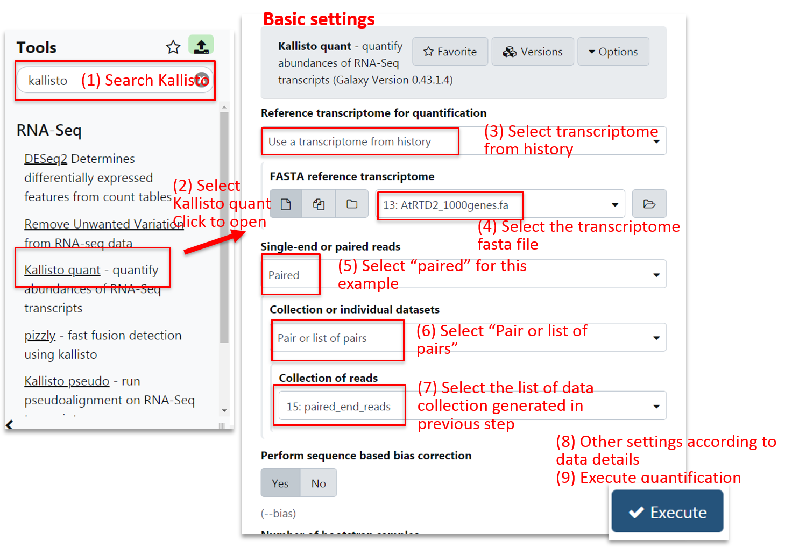
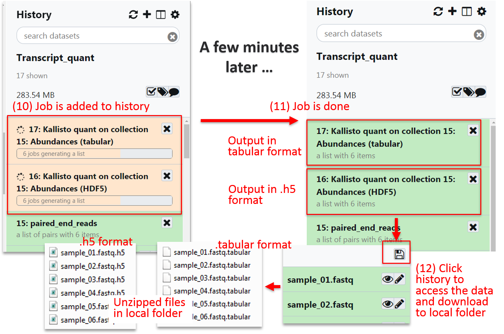

## Introduction 
The 3D RNA-seq App takes transcript quantifications from Salmon (Patro et al., 2017) or Kallisto (Bray et al., 2016) as input for 3D analysis. The user manuals of command lines to generate quantifications can be found in: 

- Salmon: <a href='https://combine-lab.github.io/salmon/' target='_blank'>https://combine-lab.github.io/salmon/</a>
- Kallisto: <a href='https://pachterlab.github.io/kallisto/about' target='_blank'>https://pachterlab.github.io/kallisto/about</a>

For biologists, we recommend to use the Salmon/Kallisto tool in web-based graphical user interface **Galaxy Europe** (<a href='https://usegalaxy.eu/' target='_blank'>https://usegalaxy.eu/</a>) or other Galaxy resources (<a href='https://galaxyproject.org/use/' target='_blank'>https://galaxyproject.org/use/</a>), in which users can perform transcript quantification and download results by "clicking mouse".

## Example data

**Download link**:

<a href='https://www.dropbox.com/s/k42kvxw9adrrcgp/Galaxy_example_data.zip?dl=0' target='_blank'>https://www.dropbox.com/s/k42kvxw9adrrcgp/Galaxy_example_data.zip?dl=0</a>

**Transcriptome**: 

- A subset of AtRTD2 Arabidopsis transcriptome (Zhang et al, 2017) with 4679 transcripts from 1000 genes.

**RNA-seq reads**:

- Two conditions, $20^oC$ vs $4^oC$.
- Each has 3 biological replicates.
- 150 bp paired-end reads.

|    Samples    |    Temperature   |    Bio-reps    |    Read1          |    Read2          |
|---------------|------------------|----------------|-------------------|-------------------|
|    Sample1    |    20            |    Brep1       |    sample_01_1    |    sample_01_2    |
|    Sample2    |    20            |    Brep2       |    sample_02_1    |    sample_02_2    |
|    Sample3    |    20            |    Brep3       |    sample_03_1    |    sample_03_2    |
|    Sample4    |    4             |    Brep1       |    sample_04_1    |    sample_04_2    |
|    Sample5    |    4             |    Brep2       |    sample_05_1    |    sample_05_2    |
|    Sample6    |    4             |    Brep3       |    sample_06_1    |    sample_06_2    |

## Registration of Galaxy Europe
<a href='https://usegalaxy.eu/' target='_blank'>https://usegalaxy.eu/</a>

 
**Note**: The account needs email activation.

## Galaxy user manual
Galaxy user manual can be found in:
<a href='https://galaxyproject.org/learn/' target='_blank'>https://galaxyproject.org/learn/</a>

## Structure of Galaxy interface

## Upload data to Galaxy
Galaxy user manual: <a href='https://galaxyproject.org/tutorials/upload/' target='_blank'>https://galaxyproject.org/tutorials/upload/</a>

Two types of input files are required for transcript quantification using Salmon:

- RNA-seq reads in fasta/fastq format.
- Transcript sequence file in fasta (.fa) format.

 

 

## Salmon quantification
Input files:

- Transcriptome sequence fasta file with estension ".fa".
- RNA-seq reads files of samples with estension ".fastq.gz" or ".fasta.gz"

Salmon documentation:

- Salmon: <a href='https://combine-lab.github.io/salmon/' target='_blank'>https://combine-lab.github.io/salmon/</a>

Im most cases, RNA-sesq data includes many samples and replicates. Galaxy allows users to build a list of data pairs from RNA-seq data. The user manual can be found in: Galaxy user manual can be found in:
<a href='https://galaxyproject.org/tutorials/collections/' target='_blank'>https://galaxyproject.org/tutorials/collections/</a>

 

 

 

 

 

 

## Kallisto quantification

Input files:

- Transcriptome sequence fasta file with estension ".fa".
- RNA-seq reads files of samples with estension ".fastq.gz" (Kallisto in Galaxy does not take ".fasta.gz" format). 

Kallisto documentation:

- Kallisto: <a href='https://pachterlab.github.io/kallisto/about' target='_blank'>https://pachterlab.github.io/kallisto/about</a>

 

 

## Prepare input files for 3D RNA-seq App
The 3D RNA-seq App reads transcript quantifications in ".tabular" files from Galaxy outputs.

 

## References
Bray,N.L., Pimentel,H., Melsted,P., and Pachter,L. (2016) Near-optimal probabilistic RNA-seq quantification. Nat. Biotechnol., 34, 525–527.

Calixto,C.P.G., Guo,W., James,A.B., Tzioutziou,N.A., Entizne,J.C., Panter,P.E., Knight,H., Nimmo,H.G., Zhang,R., and Brown,J.W.S. (2018) Rapid and Dynamic Alternative Splicing Impacts the Arabidopsis Cold Response Transcriptome. Plant Cell, 30, 1424–1444.

Guo,W., Tzioutziou,N., Stephen,G., Milne,I., Calixto,C., Waugh,R., Brown,J.W., and Zhang,R. (2019) 3D RNA-seq - a powerful and flexible tool for rapid and accurate differential expression and alternative splicing analysis of RNA-seq data for biologists. bioRxiv, 656686. doi: https://doi.org/10.1101/656686.

Patro,R., Duggal,G., Love,M.I., Irizarry,R.A., and Kingsford,C. (2017) Salmon provides fast and bias-aware quantification of transcript expression. Nat. Methods, 14, 417–419.
